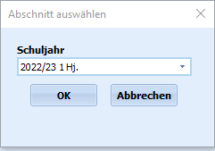

# Alle Fächer bei Schülern löschen (Gruppenprozesse Fächer)

 Bei dem Gruppenprozess **Alle Fächer bei Schülern löschen**
werden alle Fächer der selektierten Schülerinnen und Schüler gelöscht.

::: warning

Es sollte darauf geachtet werden, dass tatsächlich nur
die Schülerinnen und Schüler ausgewählt sind, denen die Fächer entfernt
werden sollen, da die Leistungsdaten im Anschluss nicht mehr
vorliegen.

:::

Der übliche Anwendungsfall ist, dass bei der Zuweisung der Fächer zum

Schuljahreswechsel ein Fehler gemacht wurde und es einfacher und weniger
fehleranfällig ist, etwa die Stundentafeln in Ordnung zu bringen und mit
der Fächerzuweisung neu anzufangen, anstatt sich durch alle
Detailänderungen zu arbeiten.Denkbar wäre dieser Prozess für Schüler, denen schon Unterricht
zugewiesen wurde und die nun nachträglich in eine andere Lerngruppe oder
einen anderen Jahrgang wechseln.Damit in der neuen Klasse der korrekte Unterricht eingetragen werden
kann, könnte eine leere Fächerübersicht sinnvoll sein.