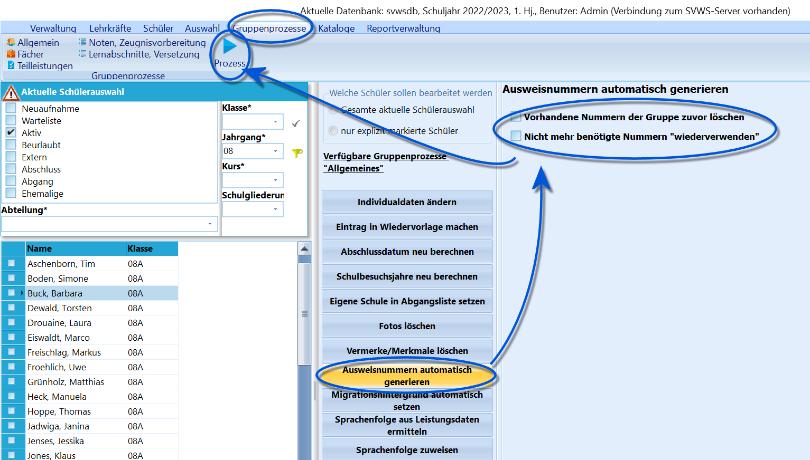

# Ausweisnummern automatisch generieren (Gruppenprozesse Allgemein)

 Um Ausweisnummern für Schüler zu generieren, kann der
Gruppenprozess *Ausweisnummern automatisch generieren* gewählt werden.Ist der Haken bei **Vorhandene Nummern der Gruppe zuvor löschen**
gesetzt, bekommen die Schüler neue Nummern. Ansonsten werden vorhandene
Nummern beibehalten und nur leere Felder werden befüllt.**Nicht mehr benötigte Nummnern "wiederverwenden"** nutzt von nicht mehr
vorhandenen oder abgegangenen Schülern die Nummern erneut, so dass ein
Nummernbereich ausreichend ist, welcher der Schülerzahl entspricht.

::: warning

Beachten Sie hierzu, dass die Startnummer für die
Ausweise über ''Verwaltung ➜ Einstellungen ➜ Allgemeines ➜ Sonstiges"
und dann mit **Beginn Nummernbereich für Ausweisnummern** eingestellt
werden kann.Somit ließen sich zum Beispiel Schülerausweisnummern mit "30000"
beginnen, so dass alle "30.000er-Nummern" klar Schülern zugeordnet
wären.

:::