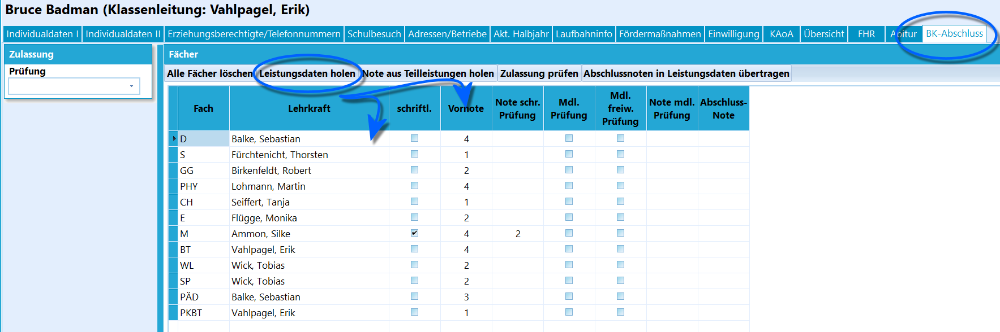
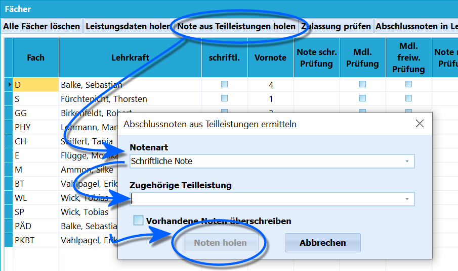
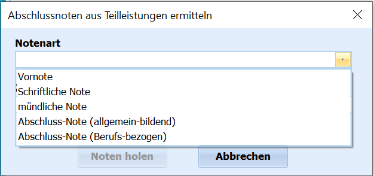
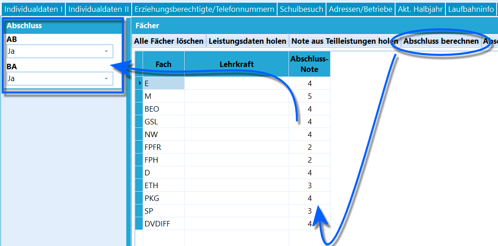
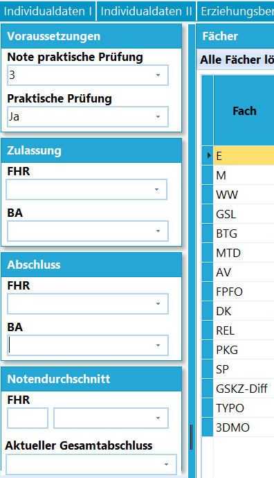
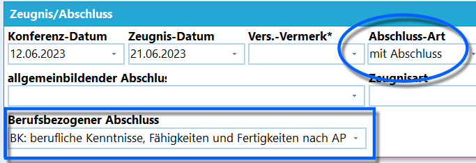

# BK-Abschluss (Schüler)Am BK werden viele Abschlüsse vergeben. Über den Reiter *Schüler ➜*
**BK-Abschluss** können diese berechnet werden.Noch viel mehr als bei anderen Schulformen gilt, dass das Ergebnis von
der ausgewählten Schülergruppe abhängt und die Berechnung nur für
Schülergruppen durchgeführt wird, bei denen die Abschlussberechnung
sinnvoll ist.

::: warning

Am BK wird für eine Klasse des beruflichen Gymnasiums
noch der Reiter *Schüler ➜ FHR* eingeblendet. Über diesen kann im ersten
Jahr der Q-Phase wie in der Oberstufe üblich der "schulische Teil der
FHR" berechnet werden, falls Schüler die Schule vor ihrer Versetzung am
Ende der Q1 verlassen. Die Berechnung bezieht die Kursnoten der Grund-
und Leistungskurse der zwei aufeinander folgenden Halbjahre entsprechend
der Prüfungsordnung ein. Am BK entspricht dies dann dem *FHRs*.Wird die *Allgemeine Hochschulreife* angestrebt, läuft die Berechnung
analog zum Abitur über den Reiter *Schüler ➜ Abitur*.

Die anderen Abschlussberechnungen, auch von der vollen
Fachhochschulreife, finden über den Reiter BK-Abschluss
statt.

:::

Bei der Berechnung des Abschlusses greift SchILD-NRW auf die beim

Schüler eingetragene *Prüfungsordnung* und gegebenenfalls auf den
*Jahrgang* zurück, um die jeweiligen Kriterien zu prüfen.

### Leistungsdaten holen

Klicken Sie im Reiter **BK-Abschluss** auf `Leistungsdaten holen`.Es werden die Leistungsdaten, also Fach, Fachlehrkraft und die Note als
Vornote aus dem aktuellen Lernabschnitt im Reiter *BK-Abschluss*
eingetragen.

::: warning

Hierbei ist zu beachten, ob Prüfungsordnungen vorsehen,
dass die Vornote eine *Ganzjahresnote* ist. Die Note, die geholt wird,
ist die des letzten Halbjahres. Wird die Vornote sinnvoll über eine
Teilleistung erfasst, müssen die geholten Noten noch mit der
Teilleistungs-Vornote überschrieben werden.

:::

### Teilleistungen und Prüfungsnoten

 Wird eine Prüfung abgelegt, können Sie diese in einer
*Teilleistung* hinterlegen.Um diese Note in den Reiter *BK-Abschluss* zu holen, klicken Sie auf
`Note aus Teilleistungen holen`. Hier ist dann anzuwählen, ob es sich
bei der **Notenart** um eine *schriftliche* oder *mündliche* Note
handelt.  

### Zulassung berechnenLiegt nach der Prüfungsordnung eine Prüfung an, kann durch einen Klick
auf `Zulassung prüfen` links unter *Zulassung* das Feld **Prüfung** auf
*Ja* oder *Nein* gesetzt werden.  

 Dann wählen Sie über **zugehörige Teilleistung**, welche
konkrete, in SchILD-NRW hinterlegte Teilleistung die Note beinhaltet.An dieser Stelle werden zum Beispiel die geholten *Halbjahresnoten* mit
der tatsächlichen *Vornote* überschrieben.

Die Einträge *schriftliche Note* und *mündliche Note* beziehen sich hier
auf die entsprechenden Prüfungsnoten.  

### Mündliche Prüfungen festlegenÜber die Haken bei **Mdl. Prüfung** und **Mdl. freiw. Prüfung** können
aufgrund der Prüfungsleistung - nach der jeweiligen Prüfungsordnung
vorgesehene - notwendige Bestehensprüfungen oder erlaubte freiwillige
Prüfungen gesetzt werden.Der Schalter `Mündliche Prüfungen festlegen` setzt bei Bedarf den Haken
bei **Mdl. Prüfung**.Der Haken bei der **Mdl. Prüfung** kann auch per Gruppenprozess durch
eine Prüfung der erbrachten Leistungen für eine Schülergruppe geprüft
und gesetzt werden.

### Abschluss berechnen

Wurden die Abschlussnoten eingetragen, lässt sich mit einem Klick auf
`Abschluss berechnen` die Abschlussberechnung nach Prüfungsordnung und
Jahrgang anstoßen.Unter Umständen kann die Prüfung auch vom zuvor *"höchsten bisher
erreichten Abschluss"* abhängen.Im Bereich *Abschluss* wird da bestehen möglicher schulischer oder
beruflicher Abschlüsse eingetragen.Bei Zutreffen der Kriterien für den Bildungsgang wird hier im Protokoll
eine eventuelle FHR-Note oder ähnlich angezeigt.  

Je nach Bildungsgang kann das Feld links der Leistungsdaten viele Formen
annehmen und Zulassungen, Prüfungen, schulische und berufliche
Abschlüsse und weitere Daten in unterschiedlicher Form und
Ausführlichkeit enthalten.

Die hier im Wiki abgebildeten Varianten können als Beispiele angesehen
werden.  

 Die Abschlüsse finden Sie dann auch unter *Aktueller
Abschnitt ➜ Zeugnis/Abschluss*.  

### Anschlussnoten in Leistungsdaten übertragenHaben Sie alle Leistungsdaten im Reiter hinterlegt und die
**Abschlussnoten** erfasst, klicken Sie auf
`Abschlussnoten in Leistungsdaten übertragen`. Hierüber werden die Noten
aus diesem Reiter zurück in den Bereich *Note* des aktuellen Abschnitts
geschrieben.Hierbei wird die alte Halbjahresnote nun mit der Abschlussnote
überschrieben.

::: warning

Beachten Sie, dass die automatischen Werkzeuge als
Unterstützung ohne Gewähr zu verstehen sind. Die Schule mit ihren
jeweils Verantwortlichen trägt die Verantwortung für die Korrektheit im
Rahmen der geltenden Prüfungsordnung aller Ergebnisse.

:::