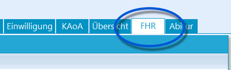
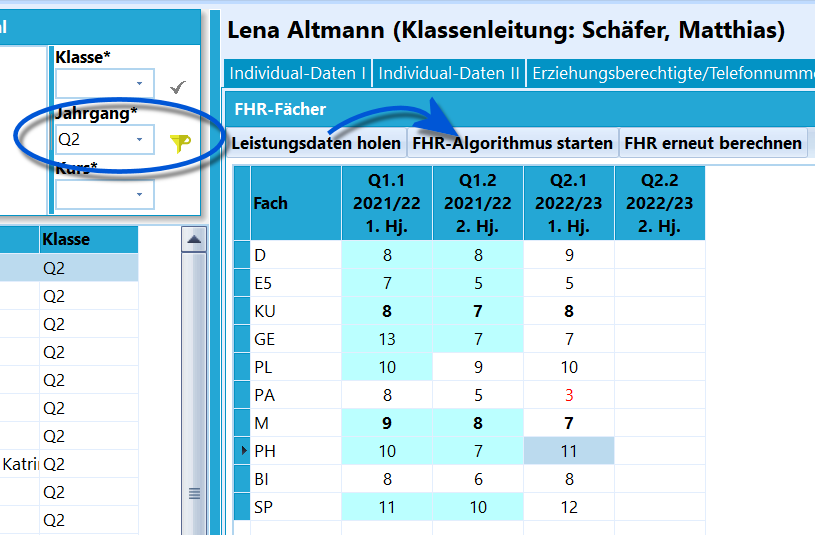
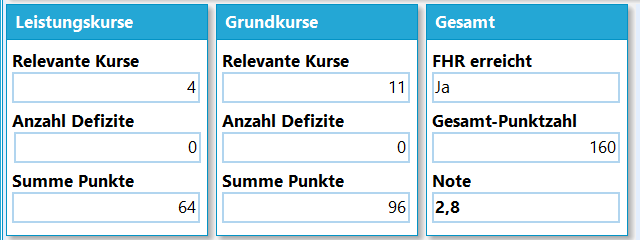

# FHR (Schüler)

 Bei der Auswahl von Jahrgängen im Schülercontainer, in
denen das Erreichen der Fachhochschulreife möglich ist, wird bei
*Schüler* der zusätzliche Reiter **FHR** angezeigt.Über diesen wird individuell berechnet, ob der *schulische Teil der
Fachhochschulreife* erreicht wurde.  

 Mit dem Schalter **Leistungsdaten holen** werden die
Leistungsdaten, soweit schon vorliegend, der Q1 und Q2 geholt.Über **FHR-Algorithmus starten** werden für das Erreichen des FHR und
die Schnittoptimierung günstige zwei aufeinander folgende Halbjahre
markiert und der FHR wird berechnet.  
Hier blendet SchILD-NRW folgenden Hinweis ein

:::

::: warning

*Gegenanzeige: In äußerst seltenen Fällen – Wiederholung
der Jahrgangsstufe 13/Q2 nach nicht bestandener Abiturprüfung, wenn in
der Qualifikationsphase bereits ein Halbjahr der 13/Q2 wiederholt worden
ist – kann es vorkommen, dass SchILD die FHR nicht oder nicht richtig
ermitteln kann. Bei zwei oder mehreren Fremdsprachen,
Gesellschaftswissenschaften oder klassischen Naturwissenschaften kann es
in seltenen Fällen (dann, wenn die Halbjahresnoten extrem
unterschiedlich sind) vorkommen, dass SchILD nicht die für die Schülerin
oder den Schüler optimale Punktzahl der FHR ermittelt. Wir bitten Sie,
in solchen Fällen um eine manuelle Kontrolle des von SchILD gelieferten
Vorschlags.*

:::

Eine Ausgabe könnte so aussehen:` Altmann, Lena`  

` ========================================================================`  
` Prüfungsordnung: APO-GOSt(B)10/G8`  
` Schulischer Teil der Fachhochschulreife erreicht`  

 Im unteren Bereich findet sich anschließend die
Zusammenfassung.  
Wurde ein Jahrgang angewählt, in dem der FHR berechnet werden kann,
steht unter *Gruppenprozesse ➜ Allgemein* der Gruppenprozess
**Fachhochschulreife prüfen** zur Verfügung, über den für die ganze
Gruppe die Leistungsdaten geholt, markiert und geprüft werden.

::: warning

An BKs findet sich der FHR einmal im Reiter **FHR** und
im Reiter **BK-Abschluss**. Über den Reiter FHR wird für Schüler des
*beruflichen Gymnasiums* der "schulische Teil des FHR" berechnet, wenn
sie den Bildungsgang verlassen. Aus Sicht des BK wird hier also ein
*FHRs* vergeben. Bleiben die Schüler, erhalten sie über ihren normalen
BK-Bildungsgang einen "vollen FHR", aus Sicht des BK also den
*FHR*.

:::

::: warning

Die automatische Berechnung durch SchILD-NRW ist als
Unterstützung ohne Gewähr zu verstehen. Die Verantwortung für die
Korrektheit der Berechnungen trägt die Schule.

:::