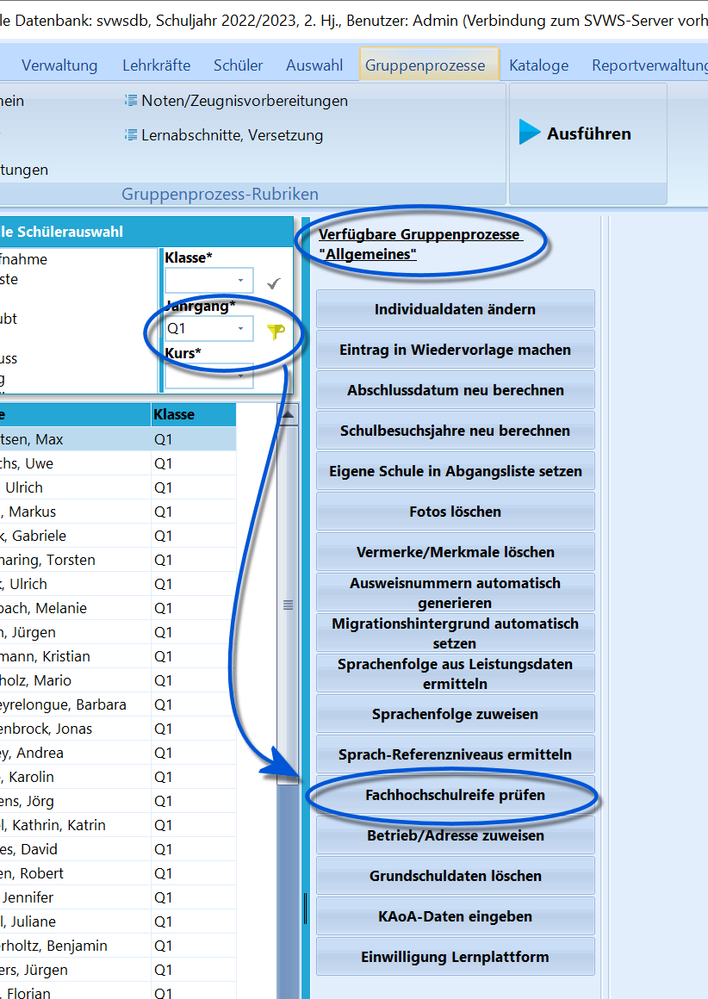

# Fachhochschulreife prüfen (Gruppenprozesse Allgemein)

 Wurde ein Jahrgang angewählt, in dem der FHR berechnet
werden kann, steht unter *Gruppenprozesse ➜ Allgemein* der
Gruppenprozess **Fachhochschulreife prüfen** zur Verfügung, über den für
die ganze Gruppe die Leistungsdaten geholt, markiert und geprüft werden.

::: warning

Kontrollieren Sie zuvor das korrekte Vorliegen der
notwendigen Leistungsdaten.

:::