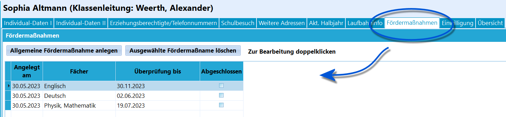
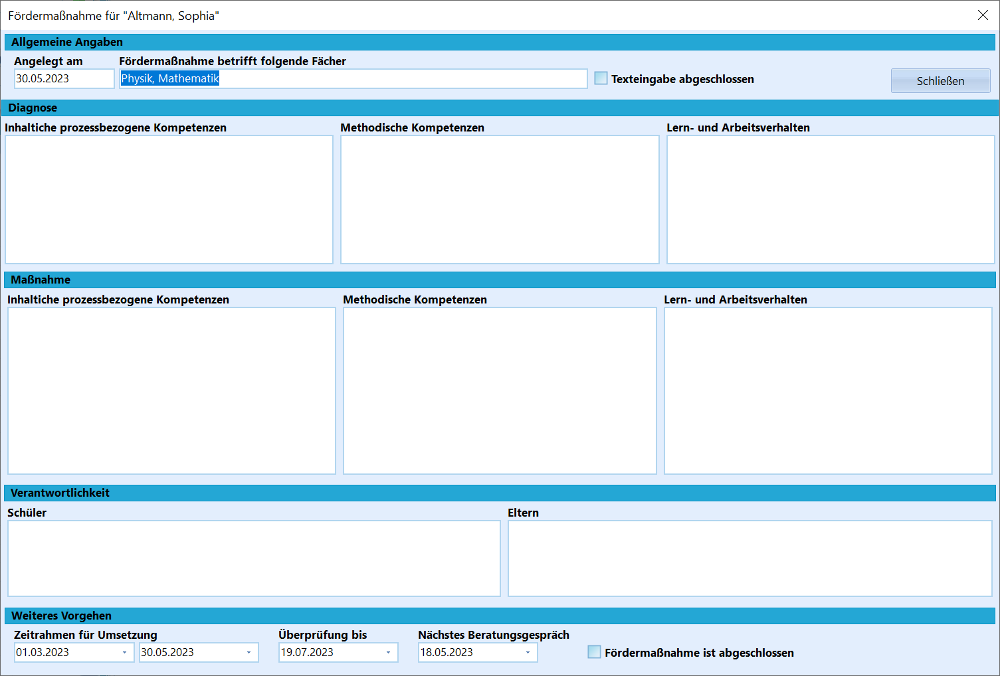
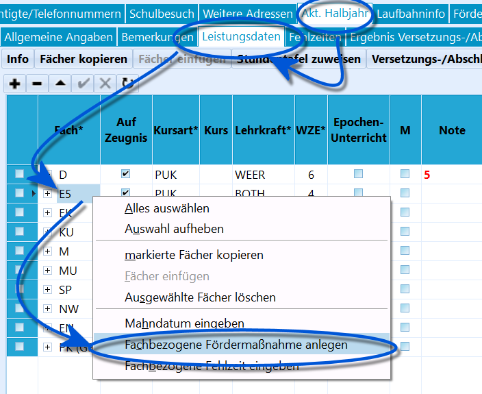

# Fördermaßnahmen (Schüler) 

 Auf dem Karteireiter *Schüler* ➜
**Fördermaßnahmen** kann bei nicht ausreichenden Leistungen in den
Abschnitten eine Dokumentation über die zu erfolgende Förderung angelegt
werden.Es gibt in SchILD-NRW zwei Möglichkeiten, wie die Fördermaßnahmen
verwaltet werden können.-   **Allgemein** zum aktuellen Abschnitt
-   **Fachbezogen** zum aktuellen AbschnittIn beiden Fällen können bestimmte Angaben zu den Problemfeldern und
Förderabsprachen eingegeben werden. Es können zuständige Personen
eingegeben werden. Und es können Zeitrahmen gesetzt werden, in denen die
Fördermaßnahme abgeschlossen werden soll.  

### Allgemeine Fördermaßnahmen

 Eine allgemeine Fördermaßnahme wird über den Button
**Allgemeine Fördermaßnahme anlegen** erzeugt.

Das sich öffnende Fenster gliedert sich nun in Unterfelder.Zuerst ist die **Diagnose** einzugeben und es kann zwischen
*inhaltlichen*, *methodischen* und *Lern- und Arbeitsverhalten*
Diagnosen differenziert werden.Es schließen sich mit der gleichen Untergliederung die den Feldern
zugeordneten **Maßnahmen** an.In der dritten Feldzeile folgen die **Verantwortlichkeiten**, die in der
Hand der *Schüler* und der *Eltern* liegen.Schließlich lassen sich Daten zu *Weiteres Vorgehen*' aufnehmen. Hier
kann die *Dauer der Maßnahme* und die *nächste Überprüfung* wie *das
nächste Beratungsgespräch* erfasst werden.Ebenso lässt sich ein Haken setzen, wenn die *Fördermaßnahme
abgeschlossen*' ist.Bei einem Schließen des Fensters wird nachgefragt, ob die Eingaben
gespeichert werden sollen.  

### Fachbezogene Fördermaßnahmen

 Um eine Fachbezogene Fördermaßnahme anzulegen, ist auf dem
Reiter *Schüler Leistungsdaten* mit der *rechten Maustaste* auf das
betreffende Fach zu klicken.Wählen Sie dort den Eintrag Fachbezogene Fördermaßnahme anlegen aus.
Bestätigen Sie die anschließende Frage mit "**Ja**".Sie gelangen nun in den gleichen Bildschirm, der oben schon gezeigt
wurde. Jedoch ist das Fach zur Fördermaßnahme schon eingetragen.  

### ReportingEs gibt zwei Datenquellen, mit denen auf Fördermaßnahen in Reports
zugegriffen werden kann.-   **Foerdermassnahmen**:

Diese Datenquelle stellt einen eigenen Bezug zu den Fördermaßnahmen her
und ist nicht an die sonstigen Schülerdaten gekoppelt. Beim Aufruf
dieser Datenquelle erscheint ein Auswahlfenster.In diesem Fenster kann gewählt werden, aus welchen Lernabschnitten
gedruckt werden soll. Die Auswahl filtert selbstständig alle Schüler,
die in diesem Abschnitt eine Fördermaßnahme haben.-   **Datenquelle Schueler ➜ Lernabschnitte ➜
    SchuelerFoerdermassnahmen**:

Diese Datenquelle stellt einen Bezug zu den Schülerdaten her. Hier
werden die Fördermaßnahmen für den im Report-Explorer gewählten
Lernabschnitt gedruckt, mit denen von Reports auf Fördermaßnahmen
zugegriffen werden kann.