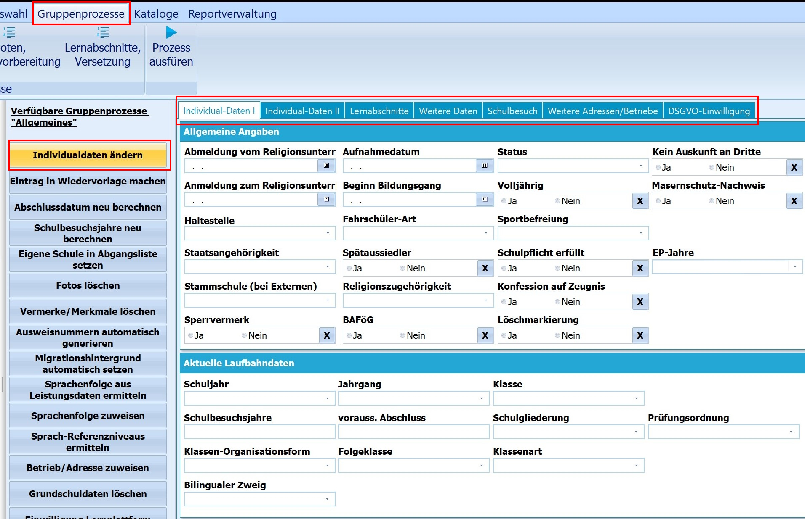
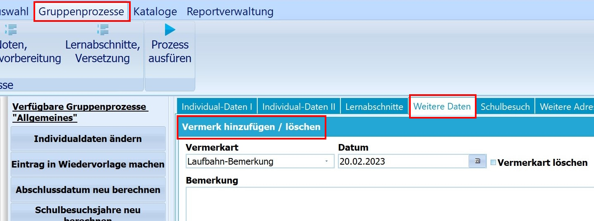
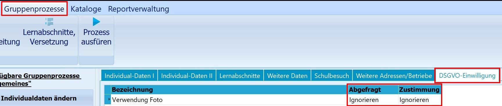
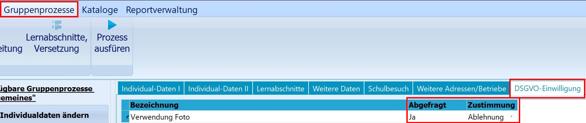
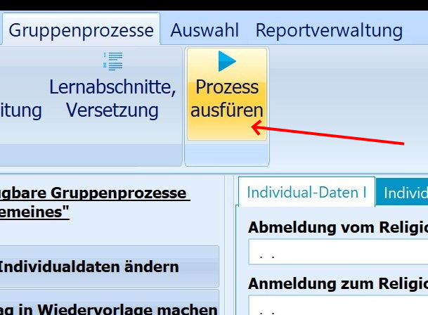

# Individualdaten ändern (Gruppenprozesse Allgemein)Über den *Gruppenprozess* ➜ **Individualdaten ändern** lassen sich die
personenbezogenen Daten mehrerer Schülerinnen und Schüler zugleich
verändern.

 Im Fenster des Gruppenprozesses sehen Sie die Felder, die
sich auch auf den entsprechenden Karteireitern im
Schüler-Hauptbildschirm befinden.So können Sie unter **Individualdaten I** alle Felder auswählen und
verändern, die dort auch beim Schüler oder der Schülerin zur Verfügung
stehen.

::: warning

Lernabschnittsdaten, inklusive der *Versetzungsvermerke*
werden in SchILD-NRW3 über den Reiter *Lernabschnitte* in diesem
Gruppenprozess bearbeitet.

:::  

 Auf dem Karteireiter **Weitere Daten** haben Sie die
Möglichkeit zum Beispiel *Vermerke* gruppenweise einzutragen.  

 

 Auch Angaben zu Datenschutzabfragen können
über den Reiter **DSGVO-Einwilligung** gruppenweise verändert werden.Im Ausgangszustand steht bei *Abgefragt* und *Zustimmung* die Angabe:
*Ignorieren*.Standardmäßig ist hier zunächst nur die Bezeichnung *Verwendung Foto*
eingetragen. Weitere Einträge können über *Kataloge ➜
DSGVO-Einwilligungen* vorgenommen werden.Um einen Eintrag zu verändern, klickt man auf das Feld *Ignorieren* um
es anzuwählen, ein zweiter Klick öffnet ein Dropdownmenü mit den
Einträgen *Ja* und *Nein* zur Auswahl.  

 Der Prozess muss nun durch **Ausführen** angestoßen
werden.  
Angaben und Daten zu den einzelnen **Lernabschnitten** lassen sich auf
dem entsprechenden Reiter auch für zurückliegende Jahre eintragen.

::: warning

Bitte beachten Sie, dass alle eingetragenen Werte auch
bei *allen* Schüler\*innen, die sich in der Auswahl im Container
befinden, geändert werden.Eine gruppenweise Änderung der Individualdaten lässt sich nicht mehr
rückgängig machen! Sie sollten also vor größeren Arbeiten innhalten und
nachdenken und im Zweifel eine Datensicherung anlegen.

:::