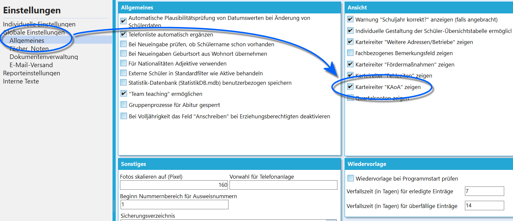
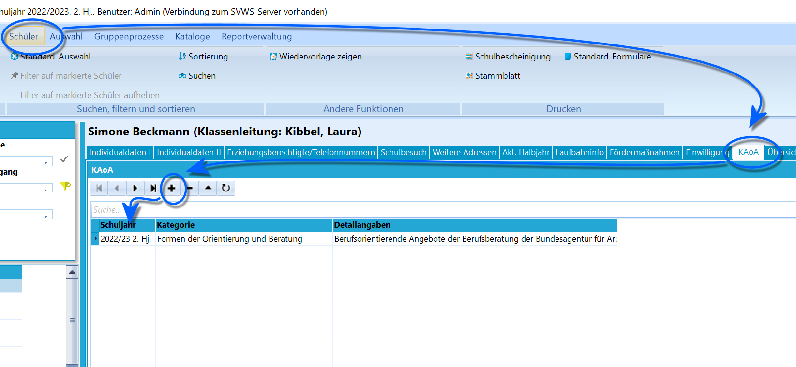
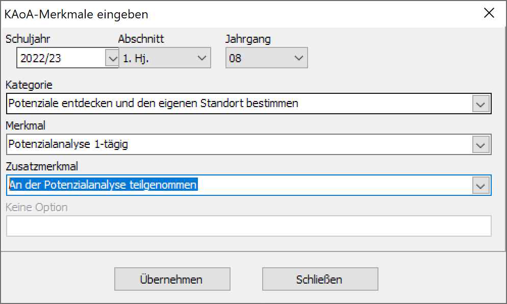
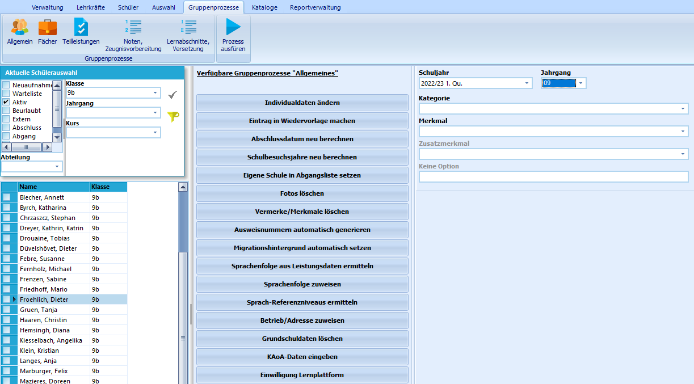

# KAoA (Schüler)In diesem Reiter können für den ausgewählten Schüler Module der
beruflichen Orientierung von *"Kein Abschluss ohne Anschluss - Übergang
Schule-Beruf NRW"*, KAoA, verwaltet und archiviert werden.

Die Module sind einheitlich vorgegeben und sind in SchILD-NRW bereits
hinterlegt. Die zur Verfügung stehenden Module richten sich nach dem
jeweils ausgewählten Jahrgang.

::: warning

Maßnahmen der beruflichen Orientierung im Rahmen von
KAoA beginngen an den weiterführenden Schulen mit dem Jahrgang
8.

:::

## Anzeigen des KAoA-Reiters

 Damit der in der Schülerübersicht erscheint, muss in der
Schulverwaltung diese Option angewählt werden.Der Reiter kann über *Verwaltung ➜ Einstellungen ➜ Globale
Einstellungen* und dann in *Allgemeines ➜ Ansicht* ➜ **Karteireiter
'KAoA" zeigen** per Haken aktiviert und deaktiviert werden.  

## Anlegen von absolvierten Modulen

 Im entsprechenden Reiter können für ausgewählten Schüler
absolvierte Module angelegt und so archiviert werden.  

 Durch Klick auf das "**+**" erscheint ein Auswahlfenster,
das die jahrgangsspezifische Auswahl der *Kategorie*, des *Merkmal*s und
des *Zusatzmerkmals* erlauben.

Die auswählbaren weiteren Merkmale hängen vom jeweils vorherigen ab, so
dass nur zulässige Kombinationen eingeben werden können.Ein Klick auf das "**-**" löscht ein fälschlich zugeordnetes Merkmal.  

## Gruppenprozesse

 Da häufig Klassen oder Jahrgangsstufen zusammen die Module
von KAoA absolvieren, bietet es sich an, die Merkmale wie im Beispiel
dargestellt per Gruppenprozess zuzuweisen.