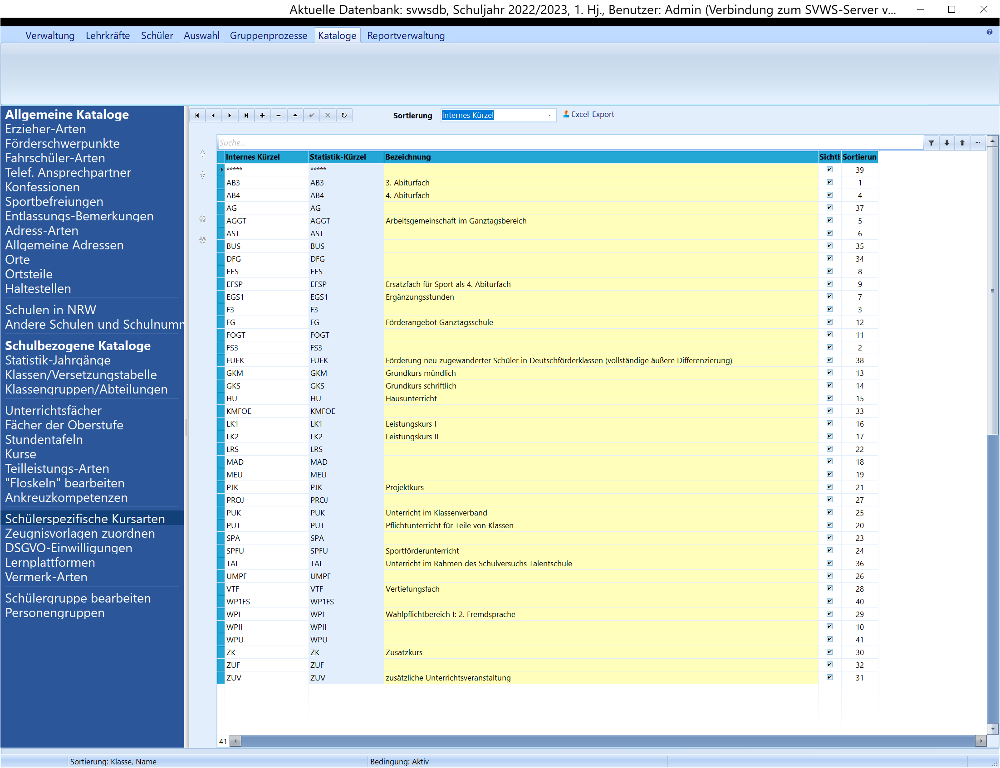
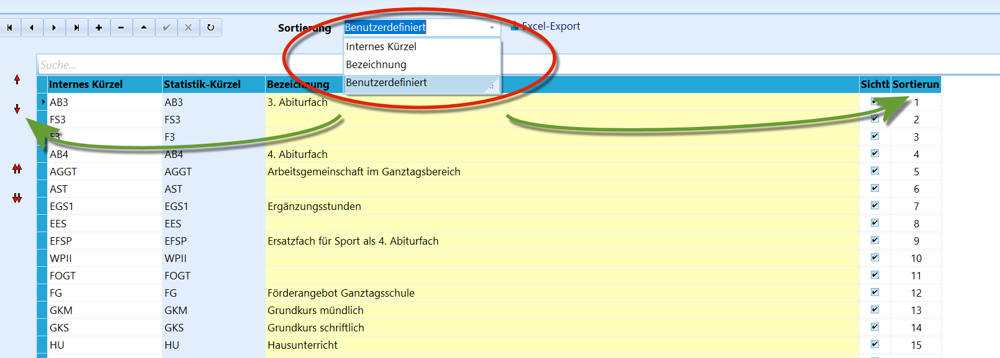

# Schülerspezifische Kursarten (Schulbezogene Kataloge)

 Die schülerspezifischen Kursarten sind die Eintragungen,
die bei den *"Leistungsdaten"* im ''"Akt. Habljahr"' zu den Fächern
individuell als Kursarten gewählt werden können.Der Katalog der zur Verfügung stehenden Kursarten wird aus der
Statistik-Datenbank geladen, die mit neuen Updates von SchILD-NRW
aktuell verteilt wird.

Die Kursarten sind deshalb schülerspezifisch, weil es unter Umständen
eine übergeordnete Kursart zum Kurs geben kann, die dann beim
Schülerdatensatz nochmals unterschieden werden muss.

::: warning

Bitte informieren Sie sich über das Schlüsselverzeichnis
von IT.NRW zu den an Ihrer Schulform benötigten Kursarten!

:::  

 Die Kursarten können nach ihrem *internen Kürzel*, ihrer
*Bezeichnung* oder *benutzerdefiniert* sortiert werden. Bei letzter Wahl
ist wie üblich über die roten Pfeile links oder die Indizes rechts die
Sortierreihenfolge festlegbar.Neue Kursarten können ebenfalls wie üblich mit dem "**+**'" und "**-**'"
hinzugefügt und entfernt werden. Unter *"Sichtbar*" wird gesteuert, ob
die Einträge im Katalog zwar vorhanden sind, aber in der
Dropdown-Menü-Auswahl nicht angezeigt werden sollen.