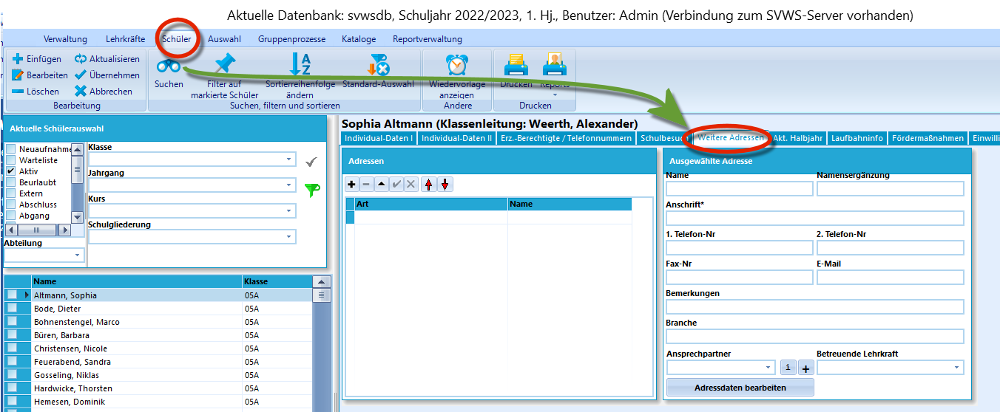
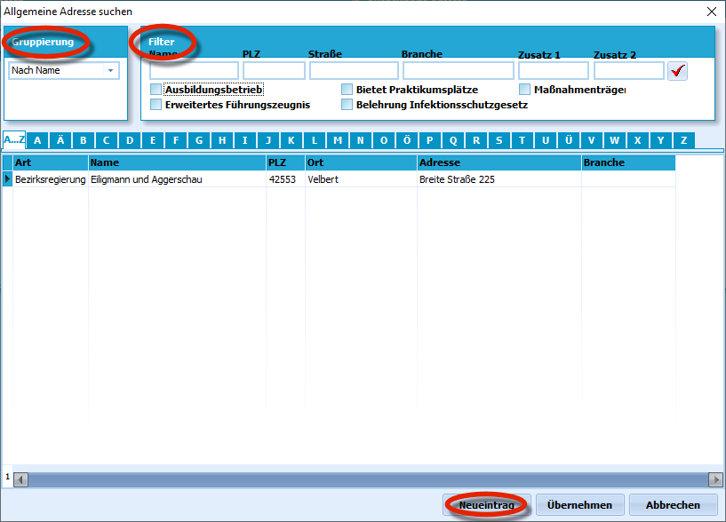
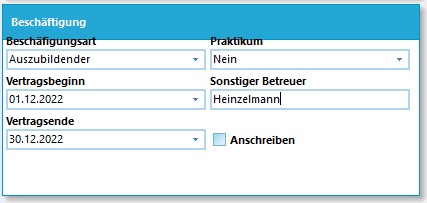
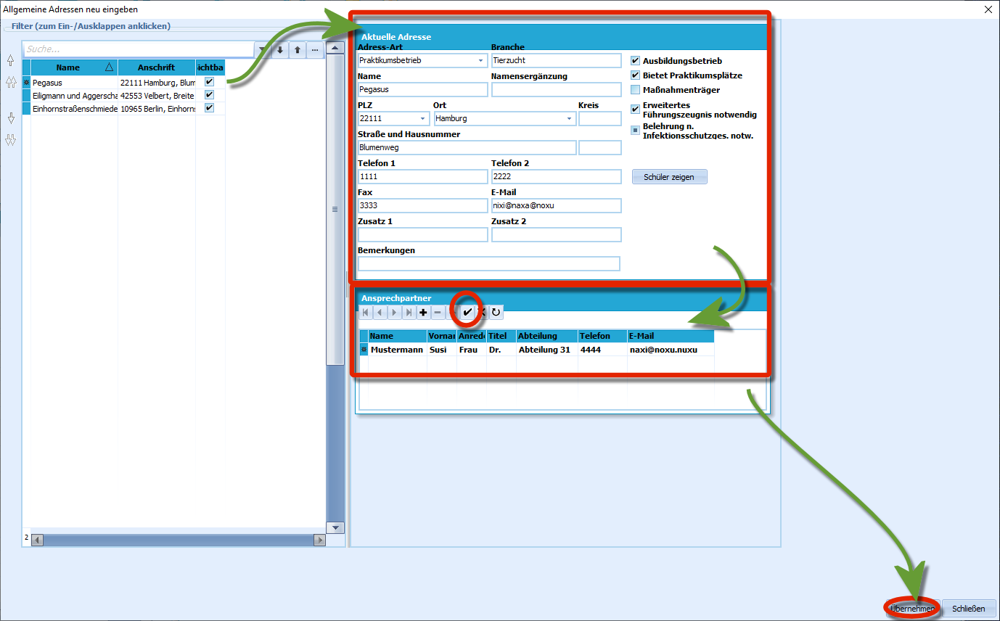

# Weitere Adressen (Schüler)Unter *Schüler* ➜ **Weitere Adressen** lassen sich für den Schüler
relevante Adressen anlegen. Sinnvoll ist dies, um etwa
Ausbildungsbetriebe oder Praktikumsbetriebe zu hinterlegen. Auch andere
für den Schüler relevante Adressen, die nicht unter "Erz. Berechtigte"
passen, können hier angelegt werden.

### Adressen einem Lernenden zuordnen

 In diesem Fenster können die weiteren Adressen verwaltet
werden. Zuerst einem Lernenden keine weitere Adresse zugeordnet.Wie in SchILD üblich kann ein bestehender Eintrag rechts im Detailfeld,
hier die "Ausgewählte Adresse" bearbeitet oder eine neue über das
"**+**" links oben im Feld "Adressen" hinzugefügt werden.Hier bei den Details können eine **Name**, eine **Ergänzung zum Namen**
bei langen Einträgen, die **Anschrift** und **Telefonnummern** wie
**Faxnummer** und **Email**adressen erfasst werden. Weiterhin lassen
sich **Bemerkungen** frei eintragen, die **Branche**, bestimmte
**Ansprechpartner** oder die betreuende Lehrkraft anlegen.Beim Ansprechpartner lassen sich über das "**+**" mehrere Einträge
anlegen.  

 Wurde mit dem "**+**" ausgewählt, dass eine neue Adresse
angelegt wurde, öffnet sich eine Liste mit allen existierenden Adressen.Sofern viele Kontakte im System erfasst sind, kann entweder über den
Namen oder die Adresse gruppiert wurden.Eine weitere Auswahl ist über den *'Filter* möglich, bei dem nach Namen,
die Adresse oder die Branche und auch verschiedene Checkboxen gefiltert
werden kann.Eine Adresse kann per Doppelklick dem Lernenden hinzugefügt werden,
woraufhin sich auch dieses Fenster automatisch schließt.  

 Unterhalb einer Adresse kann nun die *Art* und *Dauer der
Beschäftigung* erfasst werden.Ebenso lässt sich vermerken, ob es sich um ein Praktikum handelt.Über das Feld **Anschreiben** lässt sich steuern, ob an diese Adresse
ein Anschreiben an die hinterlegte Adresse erzeugt wird, wenn ein Report
eine entsprechende Datenquelle verarbeitet.

DEADLINK: `Kategorie: BETA` - Kategorie:_BETA.md

  

### Anlegen einer neuen Adresse

 Soll eine neue Adresse angelegt werden, ist die über das
Feld **Neueintrag** unten möglich.Es öffnet sich ein neues Fenster, in dem auf der rechten Seite alle
Details einer neuen Adresse eingetragen werden kann.

::: warning

Achten Sie darauf, dass als "Adressart" nur Adressarten
eingeben werden können, die in *Kataloge ➜ Adressarten* zuvor schon
angelegt wurden.

:::

Neben den zu erwartenden Daten zu *Name*, *Adresse* und *Kontakten*

lassen sich auf der rechten Seite per *Checkbox noch Eigenschaften* für
diese Adresse setzen.Etwa, ob es sich um einen *Praktikums-* oder *Ausbildungsbetrieb*
handelt oder ob ein *Führungszeugnis* beziehungsweise eine *Belehrung
nach dem Infektionsschutzgesetz* notwendig ist.Unterhalb der Details zum Betrieb lassen sich Zeilenweise
*Ansprechpartner* mit jeweiligem Kontakt erfassen. Eröffnen Sie einen
neuen Eintrag über das "**+**'", tragen Sie die Daten ein. Vergessen Sie
nicht, den Eintrag mit dem Haken auch zu bestätigen.Wurde die Aufnahme der neuen Adresse abgeschlossen, lässt sich dieses
Fenster unten mit `Übernehmen` schließen.