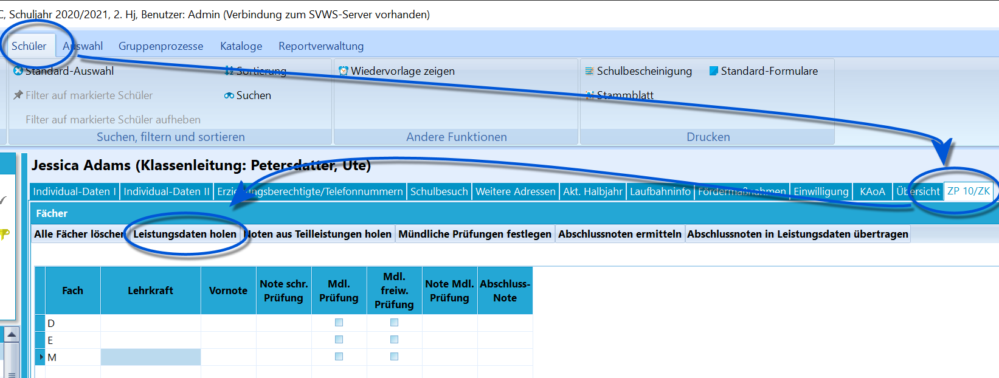
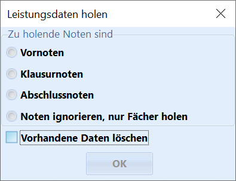
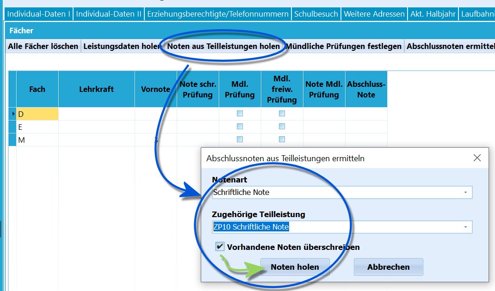
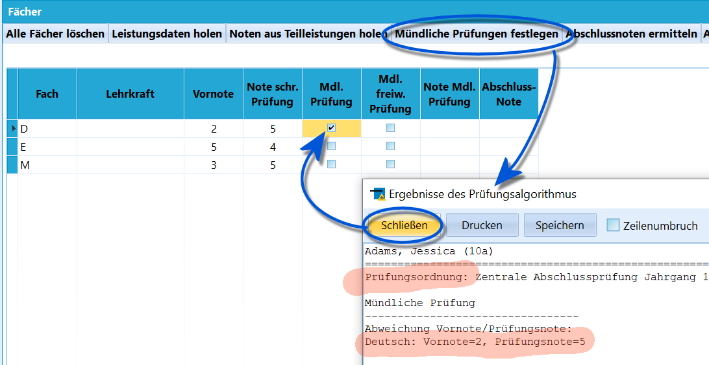
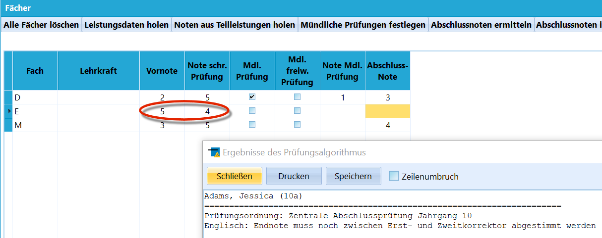
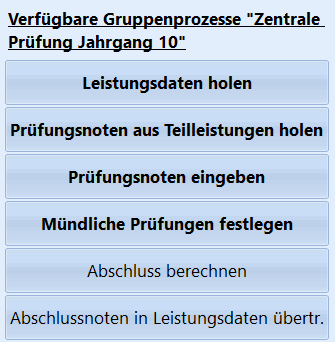

# ZP10 ZK (Schüler)

::: warning

Beachten Sie bitte den Abschnitt zur *Einrichtung von
Teilleistungen für die ZP 10* im *Tutorial zu den
Teilleistungen*.

:::

Wurde ein Schüler ausgewählt, in dessen Jahrgang eine Zentrale Prüfung
stattfindet, steht der Reiter **ZP 10** zur Verfügung.In der Regel bezieht sich diese zentrale Prüfung auf die ZP 10.

Die Zentrale Klausur der EF wird wie eine normale Klausur gehandhabt,
nicht wie die ZP 10.  

Wurden die Fächer korrekt für eine Zentrale Prüfung konfiguriert, lassen
sich die Fächer mit einem Klick auf `Leistungsdaten holen` direkt aus
den Leistungsdaten in diesen Reiter importieren, um dann die passenden
Noten einzutragen.Beim Holen kann über eine Abfragebox angewählt werden, dass bestimmte
Noten zusammen mit den Fächern importiert werden.Bei der *Vornote* würde hier die normale Note aus den Leistungsdaten
eingetragen werden.Weiterhin kann angewählt werden, dass nur die Fächer ohne eventuell
eingetragene Noten geholt werden.Ebenso lässt sich anwählen, ob eventuell *schon vorhandene Einträge
überschrieben* werden sollen.

Die Schaltfläche **Alle Fächer löschen** entfernt alle Einträge in
dieser Liste.  

 Über **Noten aus Teilleistungen holen** werden den Fächern
zugeordnete Teilleistungen ausgelesen und in die jeweiligen Spalten
eingetragen.Hierbei ist die **Notenart** zu wählen, diese entspricht der Spalte hier
im Reiter und die **Zugehörige Teilleistung**, der ein beliebiger Name
gegeben werden konnte.  

 Die Schaltfläche **Mündliche Prüfungen festlegen** führt
eine automatische Prüfung aus, nach der aufgrund der zugeordneten
*Prüfungsordnung* und der *Noten* der Haken bei **Mdl. Prüfung** bei
Bedarf gesetzt wird.Ein Klick auf `Schließen` schließt das Zusammenfassungsfenster und setzt
im Anschluss den Haken.

::: warning

Beachten Sie bitte, dass der Algorithmus keine Prüfung
auf ein (vollständiges) Vorliegen der Noten vornimmt. Liegen keine Noten
vor, gibt es keinen Fehler, der hierauf Aufmerksam macht, sondern die
Anzeige, es wäre keine Nachprüfung notwendig.

:::  

In der Spalte **Mdl. freiw. Prüfung** wird angehakt, wenn sich ein
Schüler zu einer freiwilligen Mündlichen Prüfung meldet.

 Über den Reiter **Abschlussnoten ermitteln** werden die
Noten automatisch berechnet.Hier im Screenshot ist zu sehen, dass der Algorithmus im Fall von
Englisch keine automatische Übernahme vornehmen kann und auf die
Notwendigkeit der händischen Eingabe hinweist.

::: warning

Beachten Sie, dass die automatischen Werkzeuge in
SchILD-NRW wie die Festlegung der mündlichen Prüfungen oder automatische
Notenberechnungen lediglich als Unterstützung ohne Gewähr dienen. Die
Prüfung auf Korrektheit obliegt den Fachlehrern und/oder anderen
Verantwortlichen der Schule.

:::  

Wurden die Noten der Zentralen Prüfung erfasst und die Abschlussnote
festgelegt, wird diese über **Abschlussnoten in Leistungsdaten** im
aktuellen Lernabschnitt bei den jeweiligen Fächern als *Note*
eingetragen.

::: warning

Beachten Sie, dass damit die alte Vornote überschrieben
dort wird und nicht mehr vorliegt, falls sie nicht als *Teilleistung*
gesondert erfasst wurde.

:::  

