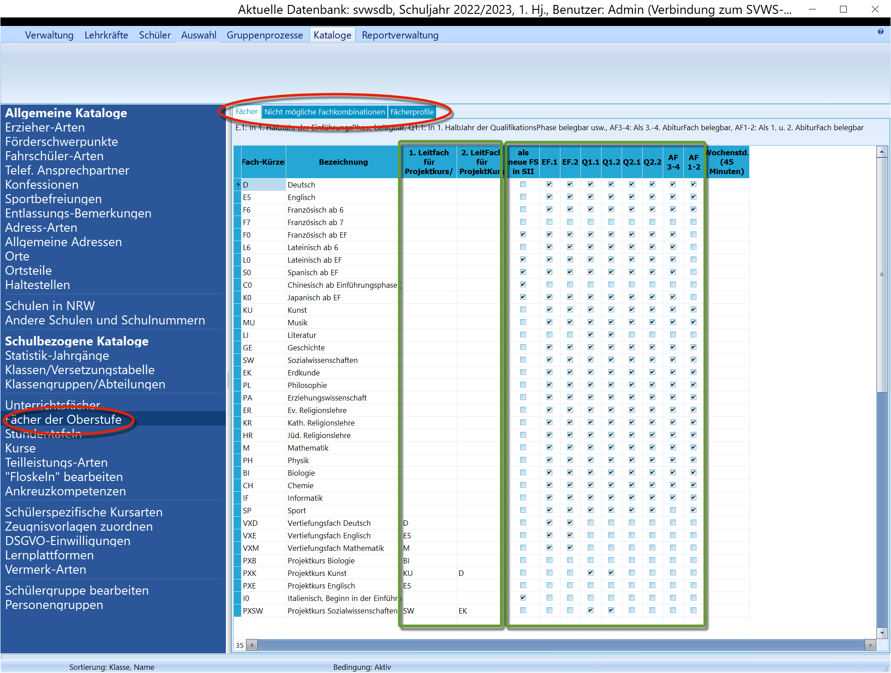
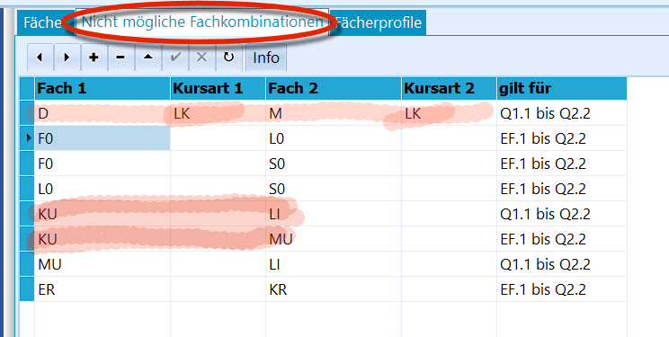
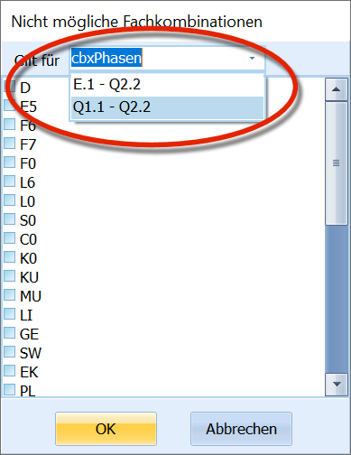
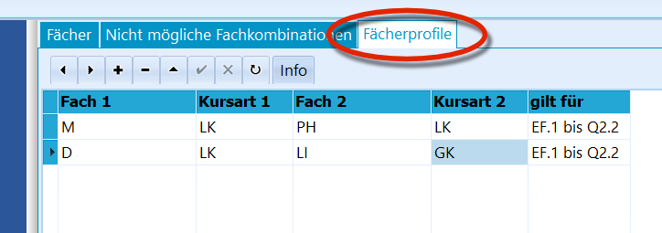

# Fächer der Oberstufe (Schulbezogene Kataloge) ´ DEPRICATED ! REMOVE!
Werden über den SVWS-Webclient verwaltet

## Übersicht

 In diesem Katalog erscheinen alle Fächer, die im Katalog
"Unterrichtsfächer" als "Fächer der Oberstufe" markiert sind.Im markierten Kasten auf der rechten Seite wird das komplette Angebot
durch die Oberstufe hindurch abgebildet: Welches Fach ist eine *neue
Fremdsprache in der SII*, welches Fach wird in welchen Halbjahren
angeboten, welche Fächer werden als mögliche *schriftliche oder
mündliche Abiturfächer A3 und A4* angeboten. Schließlich wird durch
passende Haken eingestellt, welche Fächer als *Leistungskurse A1 und A2*
anwählbar sind.

Die Spalten für das *1. und 2. Leitfach* werden genutzt, um
Vertiefungskursen "Vxx" und Projektkursen "PXyy" *verpflichtend* ein
oder zwei Leitfächer zuzuordnen.

Die zeitliche Beschränkung erlaubt es zum Beispiel, Projektkurse und
Vertiefungskurse eines jeweiligen Faches auf die Halbjahre festzulegen,
in denen sie angeboten werden.Einstellungen, die hier vorgenommen werden, werden beim Export etwa zum
Beratungstool LuPO berücksichtigt.  
----

## Nicht mögliche Fächerkombinationen

Es ist möglich, jeweils zwei Fächer entweder komplett, oder
nur bezogen auf jeweilige *Kursarten* gegenseitig auszuschließen. Wird
die Kursart frei gelassen, gilt der Ausschluss komplett für das jeweilig
andere Fach.Hier im Beispiel wurde ausgeschlossen, dass "Deutsch im LK" zusammen mit
"Mathe im LK" belegt werden kann. Weiterhin wurden Kunst (KU), Musik
(MU) und Literatur (LI) über die beiden Zeilen gegenseitig blockiert.  

Um Fächer anzuwählen, wird nach dem Klick auf das "**+**"
ein Menü geöffnet, in dem zum einen der Zeitraum gewählt werden muss, in
welchem der Ausschluss gilt und zum zweiten müssen *zwei* Fächer per
Haken gewählt werden.Für den Zeitraum kann EF.1 bis Q2.2 oder nur die Q-Phase Q1.1 bis Q2.2
gewählt werden. Letzterer ist sinnvoll, um nicht mögliche LK-LK oder
LK-GK Kombinationen für die Abiturfächer zu blockieren.Im Anschluss an die Fachwahl können die Kursarten 1 und 2 nach Wunsch
eingetragen werden.  

## Fächerprofile

 In diesem Fenster lassen sich Profile definieren, nach
denen bei Belegung eines der Fächer zwingend auch das andere belegt
werden muss. Wieder lässt sich für jedes Fach auch eine Kursart
festlegen, für welche das Profil gilt.Für dieses Beispiel wurden zwei Profile angelegt. Zum einen bedingen
sich der LK in Mathe und der LK in Physik gegenseitig. Zum anderen muss
zusammen mit einem Deutsch LK auch ein Literatur GK belegt werden, bzw.
wer Literatur belegen möchte, muss auch den Deutsch LK wählen.

Bei den "Nicht möglichen Fächerkombinationen" und den
"Fächerprofilen" ist zu beachten, dass in ihnen *so wenig wie möglich*
definiert werden soll. In SchILD-NRW sind die zu beachtenden Vorgaben
der APO GoST hinterlegt. Die beiden hier besprochenen Reiter erlauben es
Schulen, *so knapp wie möglich* eine weitere Ausdifferenzierung in Bezug
auf das spezifische Angebot vorzunehmen.

