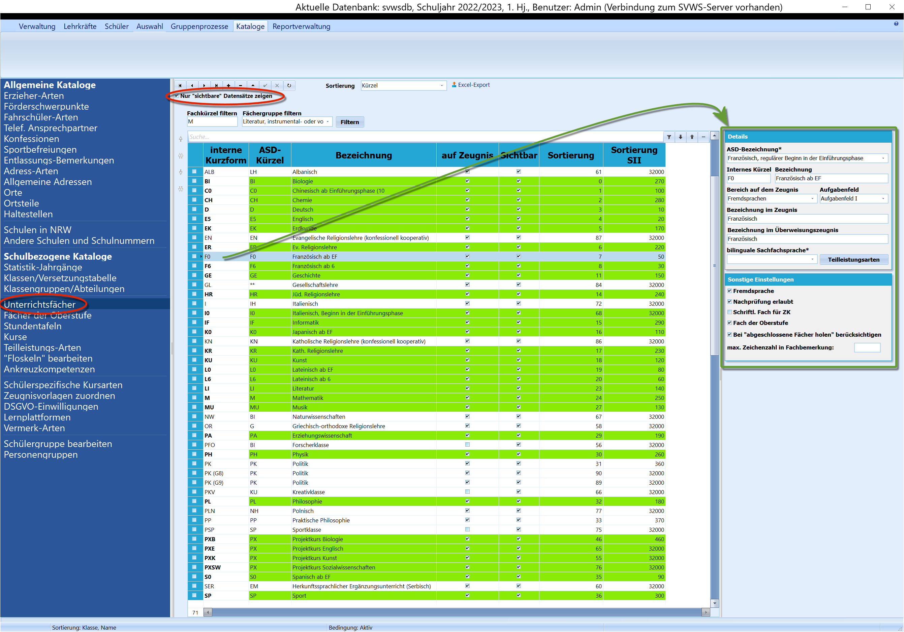
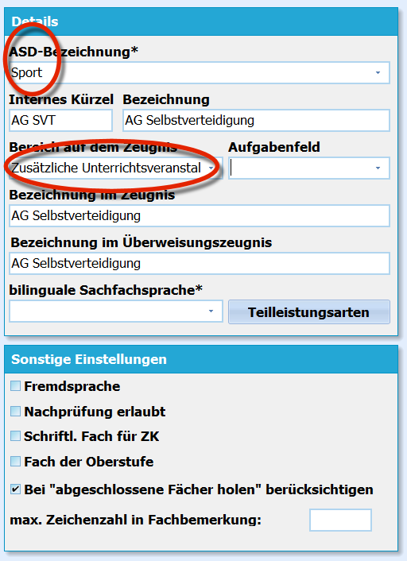
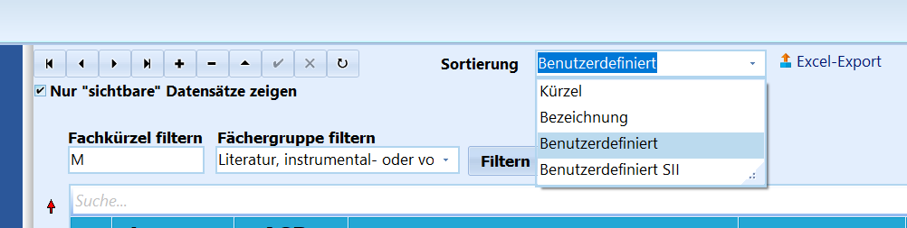
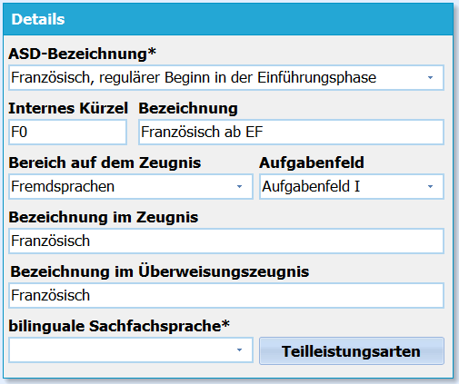
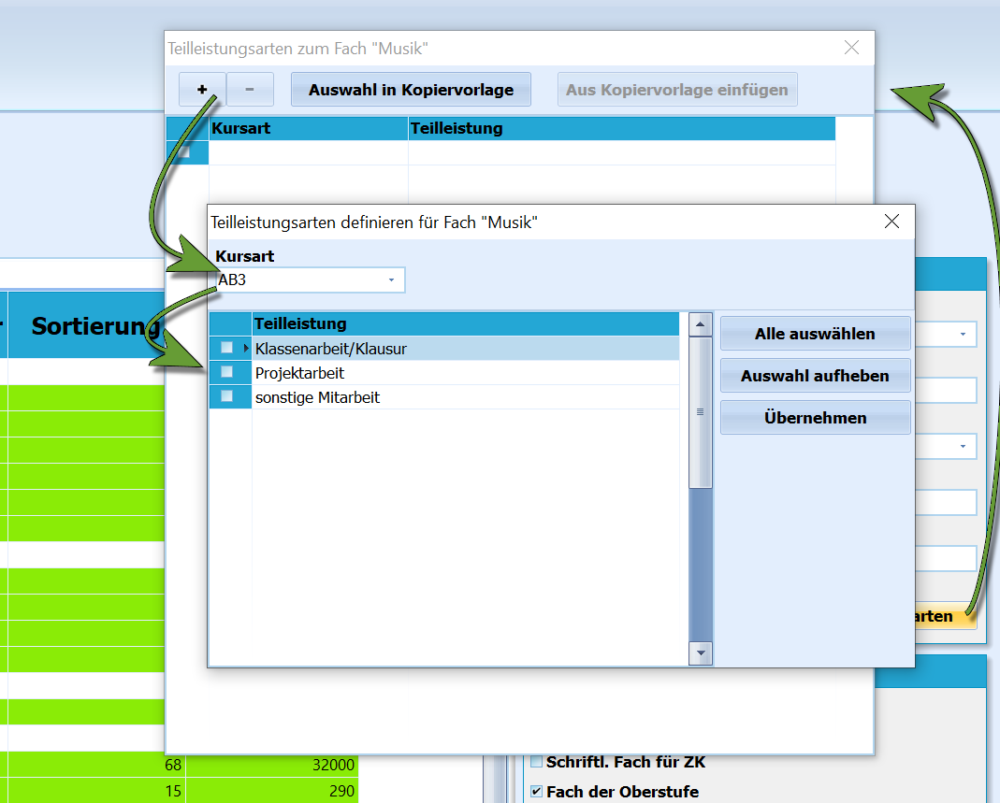
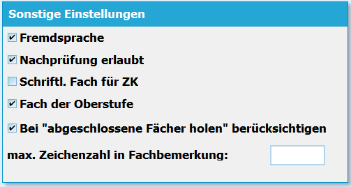
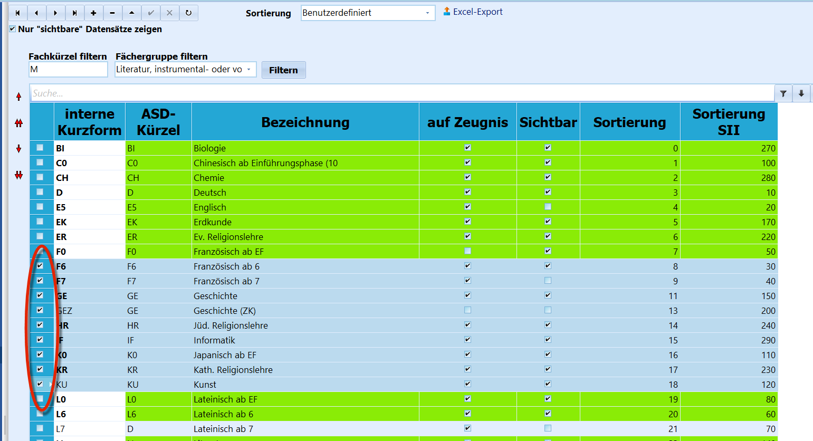
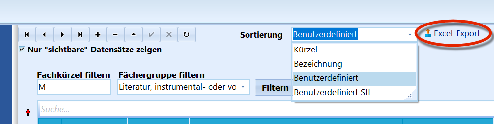
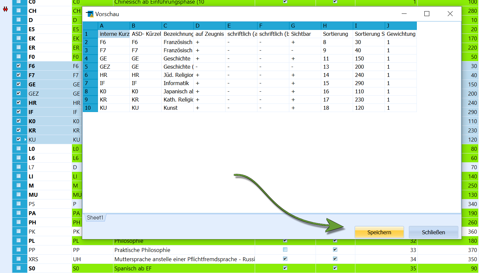

# Unterrichtsfächer (Schulbezogene Kataloge)

### Die Übersichtsliste

Unter "Schulbezogenene Kataloge" ➜ "Unterrichtsfächer" findet sich eine
Liste aller Unterrichtsfächer. Dieser Katalog verhält sich wie die
anderen Kataloge, d.h. es können Einträge mit "**+**" und "**-**"
angelegt beziehungsweise entfernt werden. Weiterhin kann die Sortierung
in den Dropdown-Menüs in SchILD über die Indizes oder die roten Pfeile
links festgelegt werden.Weiterhin kann mit "**auf Zeugnis**" angewählt werden, ob ein Fach auf
Zeugnisse gedruckt werden soll.

In der Liste werden lediglich die auf "*Sichtbar*"
gestellten Fächer angezeigt. Sollten Sie aktuell nicht sichtbare Fächer
bearbeiten wollen, etwa, um diese in Ihren Katalog aufzunehmen, müssen
sie den Haken oben links bei "*Nur sichtbare Datensätze anzeigen*"
entfernen.

Fächer, die grün hinterlegt sind, wurden als "*Fach der Oberstufe*"
angewählt. Zu jedem Eintrag eines Faches gehören rechts die *Detailansicht*, in der
die konkreten Einstellungen zu diesem Fach vorgenommen werden. Weitere
Einstellungen werden in "*Sonstige Einstellungen*" vorgenommen.

Bei den Sprachen ist zu beachten, dass die Fachkennung
aus Buchstaben und einer Zahl besteht, wobei die Zahl den Beginn dieser
Sprache kodiert. "F6" wäre also "*Französisch ab Klasse 6*". Die "0"
steht für eine in der EF neu einsetzende Fremdsprache: "S0" steht somit
"*Spanisch ab der EF*". Dieses Format ist auch für die Berechnung der
Sprachenfolge für Abschlusszeugnisse relevant.

---

### Zusätzliche Unterrichtsveranstaltungen und andere Fächer

Es können hier auch Fächer angelegt werden, die kein
Fach im klassischen Sinne sind, wie zum Beispiel
Arbeitsgemeinschaften.

 Soll zum Beispiel eine "*AG Selbstverteidigung*" angelegt
werden, müsste das Fach über das "**+**" hinzugefügt werden. Jetzt
können im Detailbereich die eigenen Bezeichnungen sinnvoll gewählt
werden. Beachtet werden müssen jedoch die **ASD-Bezeichnung**" und die
Zuordnung zur Fachgruppe.Bei einer derartigen AG bietet es sich an, sie statistisch "*Sport*"
über die **ASD-Bezeichnung** "*Sport*" zuzuordnen. Es handelt sich um
eine "*Zusätzliche Unterrichtsveranstaltung*", also sollte diese unter
"**Bereich auf dem Zeugnis**" gewählt werden.

Diese AG ist natürlich keine Fremdsprache und sie wird nicht als Fach
der Oberstufe angeboten.  

---

#### Filtern, Sortieren und Fächer global ersetzen

 Es kann über "*Fachkürzel filtern*" ein beliebiges Zeichen
eingeben werden, das dann als Filterbedingung gilt.Über *Fächergruppe filtern* kann eine in SchILD-NRW hinterlegte
Fächergruppe per Dropdown-Menü ausgewählt werden, auf welche die Liste
gefiltert wird.Wurde bei der Sortierung eine der beiden *benutzerdefinierten
Sortierungen* gewählt, entweder nach Sek I oder nach der zweiten
Sortierreihenfolge Sek II, können die Fächer hier nach einer eigenen
Maßgabe sortiert werden.

Die Sortierung kann durch Veränderung der Indizes, über die roten Pfeile
links oder durch einen Klick auf die rechte Maustaste mit einer Wahl, ob
das Fach um "1" oder "10" verschoben werden soll, verändert werden.

 In dem sich mit dem Rechtsklick öffnenden Menü gibt es die
Möglichkeit, ein "**Fach global \[zu\] ändern**".Mit dieser Funktion können Sie ein bestimmtes Fach in allen (!)
Leistungsdatensätzen der Schüler durch ein anderes Fach ersetzen lassen.

Dies gilt inklusive der Tabellen "*Abitur*", "*Sprachenfolgen*", "*FHR*"
usw. Wenn Sie diese Funktion ausgeführt haben, sollte sich das geänderte
Fach danach löschen lassen, weil es bei den Schülern nicht mehr
vorkommt.

Diese Funktion ist zur Bereinigung der Datenbank zum
Beispiel nach einem Import aus Fremddaten gedacht.

----

### Details zu den Fächern

Wie immer in SchILD sind per "**\***" gekennzeichnete Felder
statistikrelevant und müssen mit Sorgfalt befüllt werden.-   Bei "**ASD-Bezeichnung**" können von der Statistik vorgesehene
    Fachbezeichnungen gewählt werden.
-   Unter "**Internes Kürzel**" kann ein beliebiges Kürzel genutzt
    werden, achten Sie aber wegen des Listendrucks darauf, dieses kurz
    zu halten.
-   Die "**Bezeichnung**" eines Faches ist frei wählbar.
-   Mit "**Bereich auf dem Zeugnis**" wird festgelegt, unter welcher
    Kategorie dieses Fach von den Zeugnisformularen gedruckt wird.
    Achten Sie hier bitte auf eine korrekte Zuordnung.
-   Ebenfalls wichtig ist die Zuordnung eines Faches zum richtigen
    "**Aufgabenfeld**": AFI ist das
    "*sprachlich-literarisch-künstlerische*", AFII das
    "*gesellschaftswissenschaftliche*" und AFIII der
    "*mathematisch-naturwissenschaftlich-technische Bereich*".
-   Die Felder "**Bezeichnung auf dem Zeugnis**" und "**Bezeichnung auf
    dem Überweisungszeugnis**" stellen eben genau diese ein.
-   Sofern das Fach biligunal unterrichtet wird, muss die zugehörige
    Sachfachsprache unter "**bilunguale Sachfachsprache** eingestellt
    werden.  

#### Teilleistungen

 Unter "**Teilleistungsarten**" können schon in SchILD
hinterlegte Teilleistungen diesem Fach zugeordnet werden. Hierzu wird
nach einem Klick auf das Feld mit dem "**+**" ein weiteres Fenster
geöffnet, in welchem sich eine Kursart wählen lässt. Dann lassen sich
entsprechend schon eingestellte Teilleistungen anwählen.Klicken Sie bei den gewünschten Teilleistungen den Haken vor der
jeweiligen Bezeichnung an und klicken Sie dann auf "*Übernehmen*". Die
Teilleistungen sind nun dem Fach zugeordnet und Sie können das
Teilleistungs-Auswahlfenster schließen.Wurden Teilleistungen für konfiguriert, können diese bei der Benotung
durch die Fachlehrkräfte gesondert eingetragen werden.

Je nach Schulform, zum Beispiel BKs, können weitere
Einstellungen in Details vorgenommen werden.

---

### Sonstige Einstellungen

Hier kann und muss eingestellt werden, ob es sich bei einem Fach um eine
"**Fremdsprache**" handelt.Für Abschlüsse und Versetzungen ist relevant, ob in dem Fach
grundsätzlich eine "**Nachprüfung**" durchgeführt werden kann oder
nicht.Damit Fächer, in denen schriftliche zentrale Klausuren geschrieben
werden entsprechend in den Leistungsdaten verarbeitet werden können,
muss bei diesen Fächern hier der Haken bei "**Schriftl. Fach für ZK**"
gesetzt worden sein.Ebenso wird über "**Fach der Oberstufe**" gesteuert, ob ein Fach in der
gymnasialen Oberstufe angeboten wird. Die Fächer der Oberstufe selbst
werden über den SVWS-Webclient verwaltet. Die Einstellungen hierzu
finden sich auf doku.svws-nrw.de"**Bei "abgeschlossene Fächer holen" berücksichtigen**" wird gesteuert,
ob das Fach auf einem Abschlusszeugnis berücksichtigt werden soll,
obwohl es im Abschluss-Lernabschnitt nicht mehr belegt ist und schon in
einem vorherigen Lernabschnitt abgeschlossen wurde.

Vertiefungskurse und Projektkurse in der gymnasialen
Oberstufe werden entsprechend mit den Fachkürzeln "VX.." und "PX.."
angelegt und als "*Fach der Oberstufe*" markiert. Abschließend muss
jeweils ein Leitfach angegeben werden.

----

### Export nach Excel

 Um die Fächeransicht nach Excel zu exportieren, klicken Sie
ein Fach an und setzen Sie den Haken links. Dann klicken Sie mit
gedrückter *Shift*-Taste die letzte Zeile an, die Sie exportieren
möchten.  

 Klicken Sie auf `Excel-Export` und es öffnet sich ein
Fenster, in dem Sie eine Vorschau der Excel-Tabelle sehen. Sind Sie mit
der Auswahl zufrieden...  

 ... klicken Sie auf `Speichern`. Es öffnet sich der
Windows-Dialog, in dem Sie den Speicherort wählen.