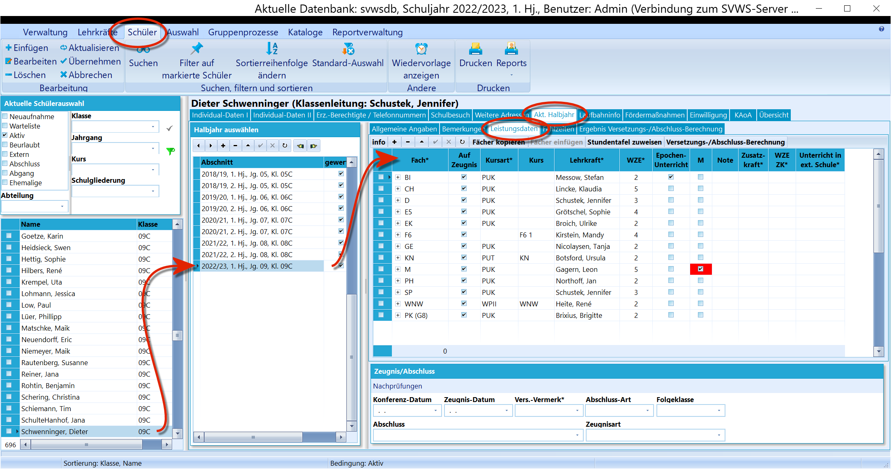
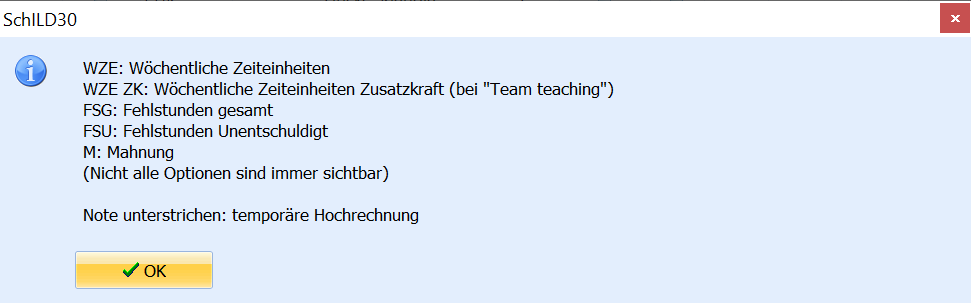
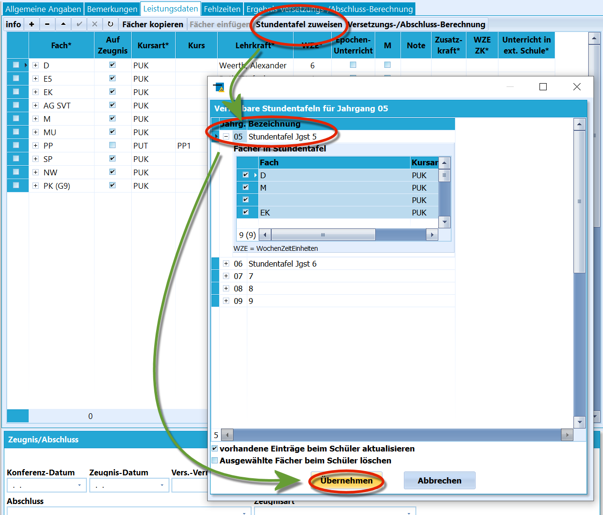
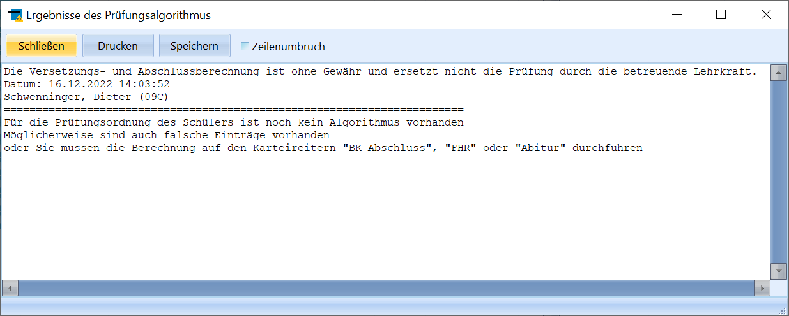
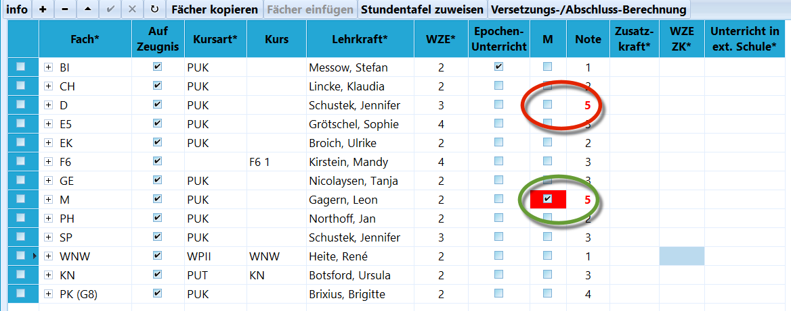
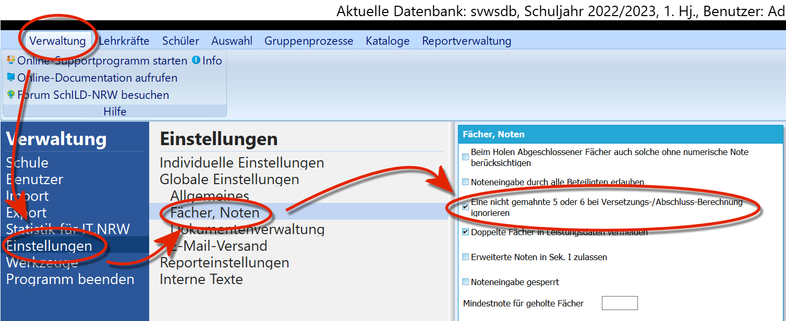
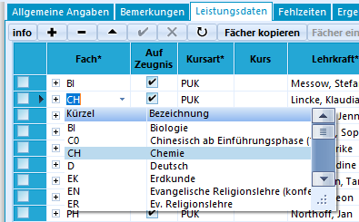
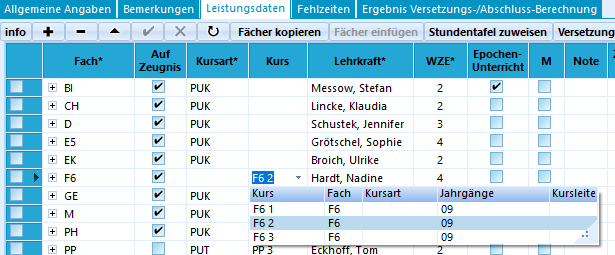
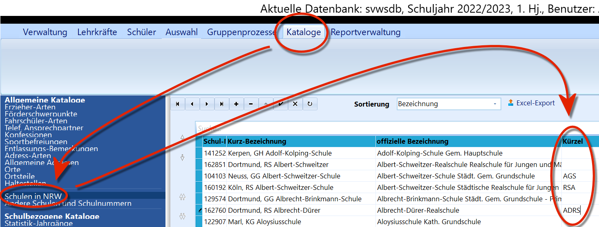
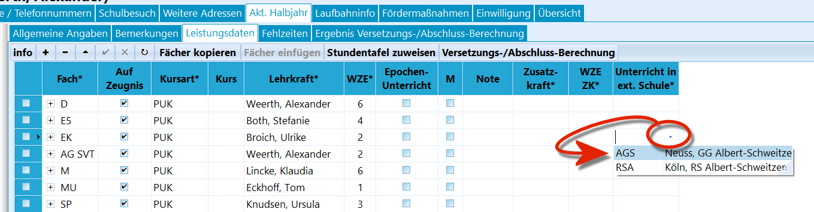

# Leistungsdaten (Aktuelles Halbjahr / Aktueller Abschnitt

 Im Fenster *Leistungsdaten* werden die Leistungen des
aktuellen Abschnitts erfasst. Im Fußbereich dieser Übersicht findet sich
auch der Bereich mit den Informationen zu *Zeugnis/Abschluss*, in dem
die übergeordneten Daten zum Lernabschnitt sichtbar sind beziehungsweise
gesetzt werden können.  

## Fächer/Kurse einstellen und Leistungsdaten auswerten

 Im Bereich der Leistungsdaten wird jedes Fach
beziehungsweise jeder Kurs in einer Zeile erfasst. Die Abkürzungen
können über das Schaltfeld "**Info**" oben links abgerufen werden.Dann folgen oberhalb der Kopfzeile die üblichen Schaltflächen, um Zeilen
anzulegen "**+**" und zu entfernen "**-**".Dann können ganze Fächer, auch welche, die mit den Häkchen zu Beginn
einer Zeile markiert wurden, mittels "**Fächer kopieren**" kopiert
werden, um diese bei einer anderen Person mit "**Fächer einfügen**" dort
einzufügen.  

 Als nächstes kann eine schon vorher unter *"Kataloge"* ➜
''"Stundentafeln'"" definierte Stundentafel individuell dieser Person
zugeordnet werden.Klicken Sie auf "**Stundentafel zuweisen**" und wählen Sie dann eine zum
Jahrgang passende Stundentafel aus. Bestätigen Sie mit "**Übernehmen**".Über den Haken bei "**vorhandene Einträge beim Schüler aktualisieren**"
kann bestimmt werden, dass schon existierende Fächer nicht neu angelegt,
sondern aktualisiert werden.Darunter findet sich die Möglichkeit, Fächer zu löschen: "**ausgewählte
Fächer beim Schüler löschen**".  

### Versetzungs- und Abschlussberechnung

 Ganz rechts kann eine
"**Versetzungs-/Abschluss-Berechnung**" angestoßen werden, in der
algorithmisch basierend auf der eingestellten Prüfungsordnung, dem
Jahrgang/Lernabschnitt und den konkreten Leistungsdaten berechnet wird,
ob eine Versetzung beziehungsweise welcher Abschluss erreicht wurde.  

::: warning

In der Standardeinstellung werden nicht gemahnte
Minderleistungen ignoriert. Ob dies zu tun ist oder nicht, hängt von der
Prüfungsordnung und mitunter dem Jahrgang der Schüler ab. Prüfen Sie,
was für die aktuelle Zeugnisrunde notwendig ist und setzen oder
entfernen Sie den Haken entsprechend.Ob nicht-gemahnte Minderleistungen bei der Berechnung ignoriert werden,
lässt sich über *Verwaltung* ➜ *Einstellungen* ➜ *Fächer, Noten* und
dann *Eine nicht gemahnte 5 oder 6 bei Versetzungs-/Abschlussberechnung
ignorieren* steuern.

:::  

Mahnungen werden in der Zeile des Faches/Kurses in der Spalte "**M**"
erfasst und können auch über den *Gruppenprozess* *Gruppenprozesse* ➜
*Noten, Zeugnisvorbereitung* ➜ *Noten, Mahnungen und Fehlstd. eingeben*
oder das *externe Notenmodul* durch die Fachlehrkräfte zusammen mit der
Benotung eingetragen werden.  

## Erfassung der Leistungsdaten

 

 Die Leistungsdaten werden zeilenweise erfasst.-   **Fach**: In der ersten Spalte ist das "**Fach**" einzutragen. Aus
    dem Dropdown-Menü können die über *"Kataloge"* ➜
    *"Unterrichtsfächer"* definierten Fächer ausgewählt werden.
-   **Auf Zeugnis**: Mit diesem Wert wird gesteuert ob die Noten dieser
    Zeile durch Zeugnisformulare verarbeitet werden.
-   **Kursart**: Hier wird die Art des Unterrichts eingestellt.
-   **Kurs**: Sofern der Unterricht im Klassenverband stattfindet,
    bleibt dieses Feld frei. Ansonsten wird der konkret belegte Kurs
    eingetragen. Im Dropdown-Menü stehen *die für diesen Jahrgang und
    für dieses Fach* im *"Katalog"* ➜ *"Kurse"* definierten Kurse zur
    Verfügung.
-   **Lehrkraft** und **WZE**: Hier wird die Lehrkräfte mit den WZE des
    Kurses einzutragen.
-   **Epochenunterricht**: Handelt es sich um Epochenunterricht, ist
    dies mit einem Haken hier zu kennzeichnen.
-   **Mahnung**: Damit Minderleistungen bei Versetzungen und Abschlüssen
    gewertet werden, sind sie zu mahnen.
-   **Note**: Die Note.
-   **Zusatzkraft** und **WZE ZK**: Hier kann eine zusätzliche Lehrkraft
    mit den entsprechenden Wochenzeiteinheiten zugeordnet werden.
-   **Unterricht in ex. Schule**: Wurde eine externe Schule angelegt,
    kann hier vermerkt werden, dass der Unterricht dort stattfindet.  

 

