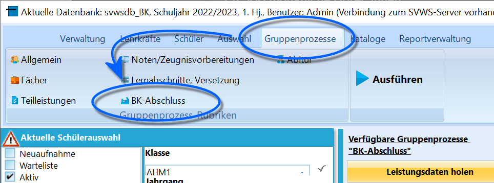
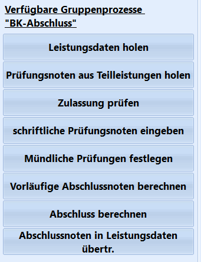
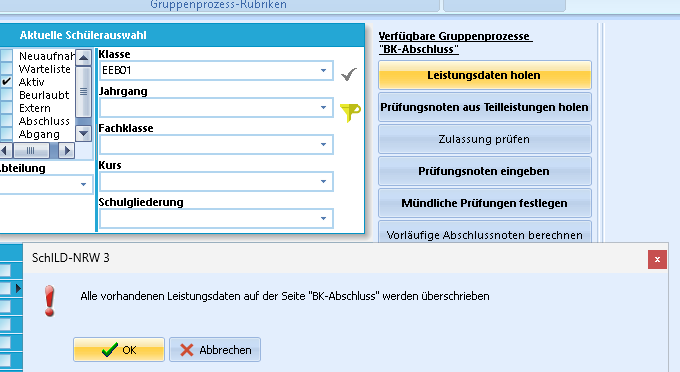

# Leistungsdaten holen (Gruppenprozesse BK-Abschluss)

::: warning

Für das Vorgehen und Ablauf zum den BK-Abschluss
beachten Sie bitte den ausführlicheren Artikel zum Reiter *Schüler ➜
BK-Abschluss*. Die Anmerkungen in den Artikeln zu den Gruppenprozessen
fallen knapper aus.Wird in einem Bildungsgang die allgemeine Hochschulreife angestrebt, ist
entsprechen der Ausführungen zum Abitur in *Schüler ➜ Abitur* und den
Abitur-Gruppenprozessen zu verfahren.

:::

Die Gruppenprozesse in der Gruppe *BK-Abschluss* sind eingeblendet, wenn
im Schülercontainer exklusiv Schülergruppen angewählt wurden, für die
eine Abschlussberechnung in Frage kommt.  

::: warning

Am BK ist es aufgrund der hohen Zahl der angebotenen
Bildungsgänge und Abschlüsse sehr relevant, die für die beabsichtigte
Arbeit korrekte Gruppe/Klasse auszuwählen.

Das Abitur wird über den Reiter *Schüler ➜ Abitur* berechnet. Verlässt
ein Schüler des beruflichen Gymnasiums die Schule, ohne Jahrgang 12
abzuschließen, wird der "schulische Teil der Fachhochschulreifen"", der
*FHRs*, wie in einer Gymnasialen Oberstufe an Gymnasium oder
Gesamtschule mit den Noten der beiden Halbjahre 12 über den Reiter
*Schüler ➜ FHR* berechnet.

:::  

Gruppenprozess **Leistungsdaten holen** bildet die Grundlage für die
weiteren Gruppenprozesse rund um den BK-Abschluss und muss deshalb als
Erstes durchgeführt werden.Er bildet mit den Gruppenprozessen-   **Prüfungsnoten aus Teilleistungen holen** und
-   **Zulassung prüfen**eine Einheit, die zur Berechnung der Zulassung durchgeführt werden.Der Gruppenprozess *Leistungsdaten holen* entspricht hierbei dem gleich
benannten Schalter im Reiter *Schüler ➜ BK-Abschluss*.Mit ihm werden für ganze Schülergruppen die Leistungsdaten aus *Schüler
➜ Aktuelles Halbjahr* in den Reiter *BK-Abschluss* geholt, so dass dies
nicht individuell bei jedem Schüler über den Reiter vorgenommen werden
muss.Wählen Sie als die Schülergruppe in den Container, für welche die
Leistungsdaten geholt werden sollen. Im Screenshot wurde die Klasse
*EEB01* ausgewählt.Nehmen Sie die Warnung bezüglich der im Reiter *Schüler ➜ BK-Abschluss*
überschriebenen Leistungsdaten zur Kenntnis und klicken Sie auf `OK`, um
den Prozess zu starten.

::: warning

Über den Gruppenprozess *Prüfungsnoten aus
Teilleistungen holen* können auch andere Teilleistungen, die Vornoten!,
in den Reiter BK-Abschluss übertragen werden.

:::