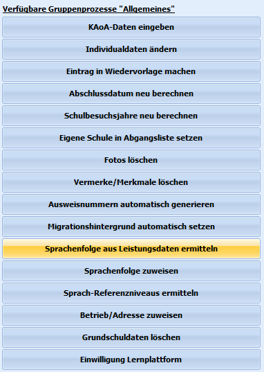
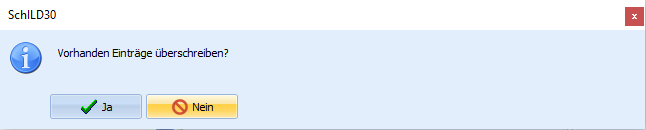
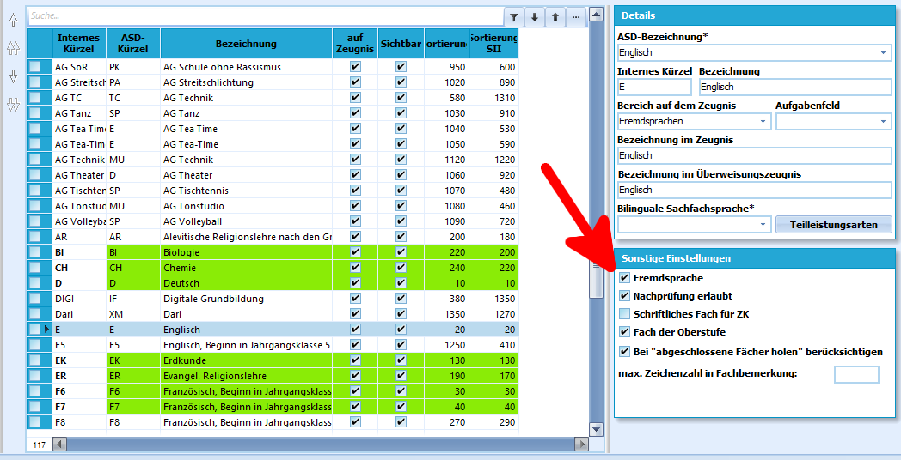

# Sprachenfolge aus Leistungsdaten ermitteln (Gruppenprozesse Allgemein) 

 Der Gruppenprozess **Sprachenfolgen aus
Leistungsdaten ermitteln** dient dazu, die Einträge in der Sprachenfolge
unter *Schüler ➜ Laufbahninfo* zu vervollständigen.Wird dieser Prozess ausgeführt, werden die Einträge auf Basis der
Unterrichtsdaten für das jeweilige aktuelle Halbjahr aktualisiert.Hat der Schüler oder die Schülerin inzwischen eine neue Fremdsprache in
den Leistungsdaten, wird diese mit der passenden Reihenfolge und dem
Beginn des Sprachenlernens in der Laufbahninfo neu eingetragen.  

 Dabei fragt der Gruppenprozess, ob vorhandene Einträge
überschrieben werden sollen.  

 Damit Unterrichtsfächer in die Sprachenfolge eingetragen
werden können, müssen sie als *Fremdsprache* markiert sein.Dazu muss unter *Kataloge ➜ Unterrichtsfächer ➜ Sonstige Einstellungen*
der Haken bei **Fremdsprache** gesetzt sein.  

## Mit Überschreiben vorhandener DatenHierbei werden alle vorhandenen Einträge ignoriert und die Sprachenfolge
so übernommen, wie sie in den Leistungsdaten vorhanden sind.

Dieses kann bei Schülerinnen und Schülern, die später auf die Schule
gewechselt sind, problematisch sein. Kommt zum Beispiel ein Schüler oder
eine Schülerin durch Umzug erst zur 8. Klasse an die Schule, sind in
SchILD-NRW die Leistungsdaten der Klassen 5 - 7 nicht vorhanden.

Dieser Schüler würde dann in der Sprachenfolge zum Beispiel Franzöisch
erst ab Klasse 8 vorliegen haben.

## Ohne Überschreiben vorhandener DatenWählt man diese Option, werden vorhandene Einträge nicht gelöscht,
sondern nur ergänzt.So wird der Abschluss einer Fremdsprache mit dem richtigen Halbjahr
eingetragen, wenn dort vorher keine Angabe war.Fremdspracheneinträge, die nicht in den Leistungsdaten auftauchen,
werden nicht verändert.