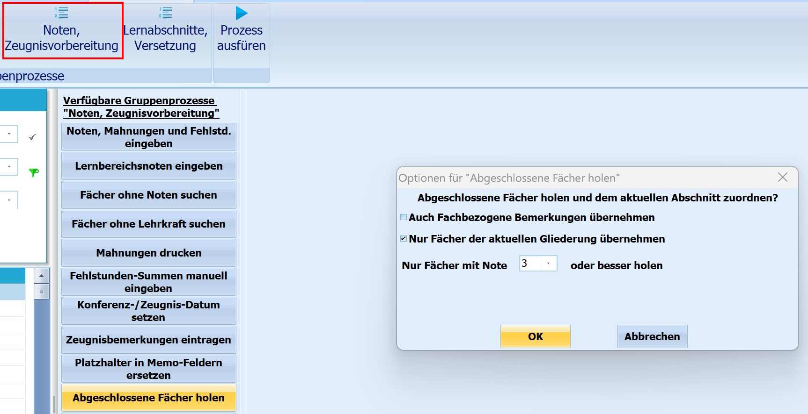
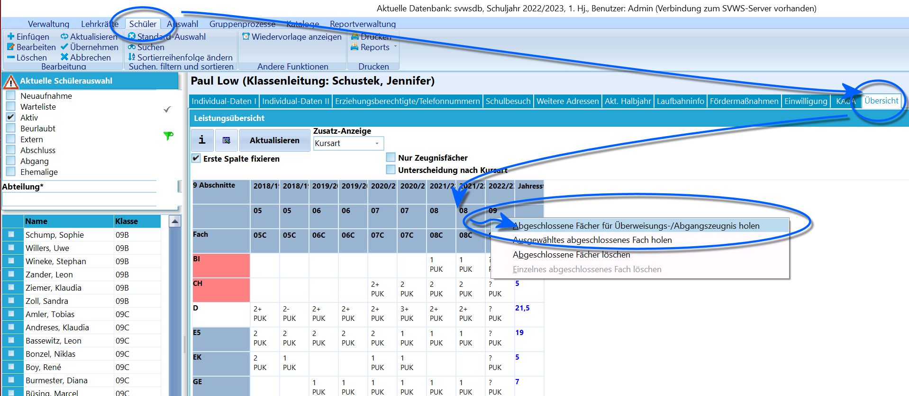

# Abgeschlossene Fächer holen (Gruppenprozesse Noten, Zeugnisvorbereitung)Mithilfe des Gruppenprozesses **Abgeschlossene Fächer holen** aus dem
Bereich *Gruppenprozesse ➜ Noten, Zeugnisvorbereitung* ist es möglich,
die abgeschlossenen Fächer für eine ganze Schülergruppe zu holen.Mit *Abgeschlossene Fächer* sind solche Fächer gemeint, die ein/e
Schülerin in vergangenen Schuljahren belegt hatte und in denen er/sie
benotet wurde, die im aktuellen Schuljahr aber nicht unterrichtet
werden.Unter *Schulverwaltung ➜ Unterrichtsfächer ➜ Details* müssen alle
Fächer, die als abgeschlossene Fächer berücksichtigt werden sollen,
entsprechend durch Setzen des Häkchens markiert werden.

 Sollen entsprechende Zeugnisse für einen ganzen Jahrgang
erstellt werden, eignet sich auf jeden Fall die Verwendung des
Gruppenprozesses.Wird der Prozess gestartet, öffnet sich ein Fenster, in dem man
auswählen kann, ob auch fachbezogene Bemerkungen bzw. nur Fächer der
aktuellen Gliederung übernommen werden sollen.Außerdem kann man vorgeben, welche Noten geholt werden sollen, hier kann
gewählt werden, auf "Nur Fächer mit Note xx oder besser holen" limitiert
wird.Da Schüler gegebenenfalls die Möglichkeit haben, "schlechte" Noten aus
vergangenen Abschnitten nicht mit auf dem Abschlusszeugnis aufgeführt zu
bekommen, ist es sinnvoll, nur Noten "befriedigend" und besser zu holen.
Die Fächer mit Note werden dann zusätzlich im aktuellen Abschnitt
eingetragen.

 Muss nur für einen einzelnen Schüler ein Überweisungs- oder
Abschlusszeugnis erstellt werden, bietet es sich an, abgeschlossene
Fächer individuell für holen. Dies geht über *Schüler ➜ Übersicht*
(eventuell *Übersicht SI*) mit der rechten Maustaste in die Spalte des
aktiven Abschnittes/Halbjahres.Im Kontextmenü kann man zwischen zwei Möglichkeiten wählen:-   **Abgeschlossene Fächer für Abgangs-/ Überweisungszeugnis holen**
-   **Ausgewähltes abgeschlossenes Fach holen**

Die Noten aus vorherigen Jahren werden dann mit vor- und nachgestelltem
\* markiert (z.B. \*3\*).