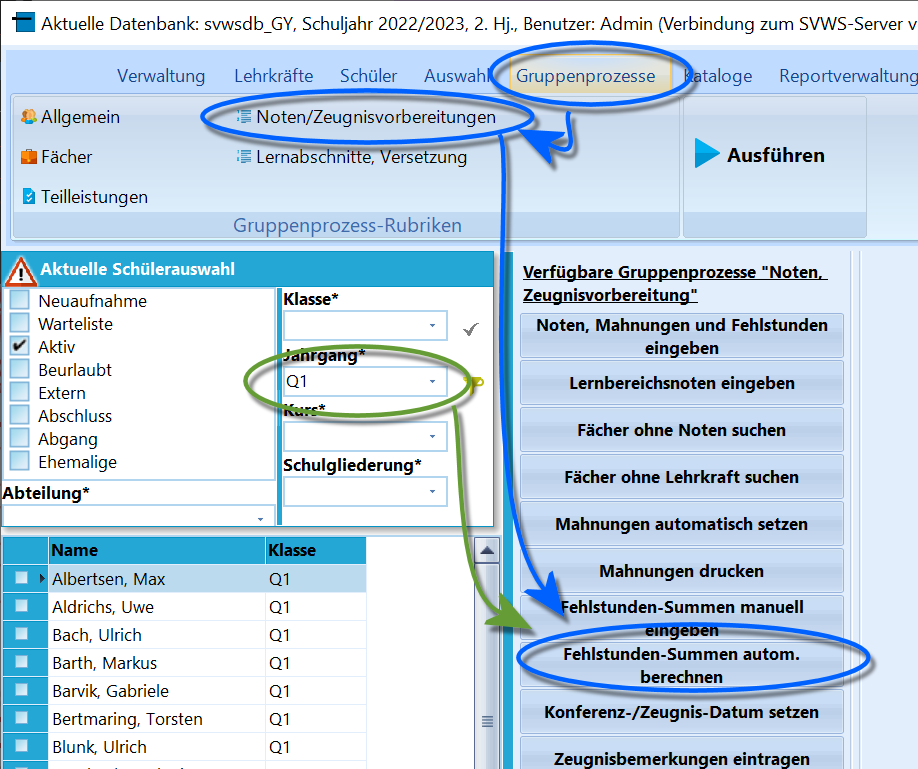
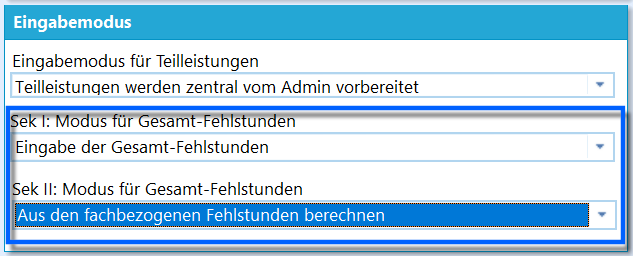

# Fehlstunden-Summen autom. berechnen (Gruppenprozesse Noten, Zeugnisvorbereitung)

 Werden Fehlstunden nicht pauschal direkt unter *Schüler ➜
Akt. Halbjahr ➜ Allgemeine Angaben* ➜ **Ges. Fehlstd.** und
**Unentschuldigt** eingetragen, sondern tagesbezogen oder fachbezogen
erfasst, werden diese über *Gruppenprozesse ➜ Noten/Zeugnisvorbereitung*
➜ **Fehlstundensummen autom. berechnen** schülerweise aufsummiert und
dann in den Feldern zu den gesamten und den unentschuldigten Fehlstunden
hinterlegt.Der Gruppenprozess steht nur zur Verfügung, wenn eine Schülergruppe
ausgewählt wurde, bei der eingestellt ist, dass Fehlstunden tages- oder
fachbezogen erfasst werden.  

 Diese Einstellung wird unter *Verwaltung ➜ Einstellungen ➜
Fächer, Noten* im Feld *Eingabemodus* für Fehlstundenerfassung in
jeweils der Sek I und der Sek II gewählt.

::: warning

Achten Sie darauf, dass1.  eine erneute Ausführung des Gruppenprozesses alle individuell
    vorgenommenen Änderungen bei den Gesamtfehlstunden bei den gewählten
    Schülern überschreibt.
2.  Denken Sie daran, dass nach dem Nachtragen von fachbezogenen
    Fehlstunden die Aufsummierung erneut auszuführen ist, um in
    Zeugniskonferenzen und auf auf den Zeugnissen die korrekten
    Fehlstunden vorliegen zu haben.

:::