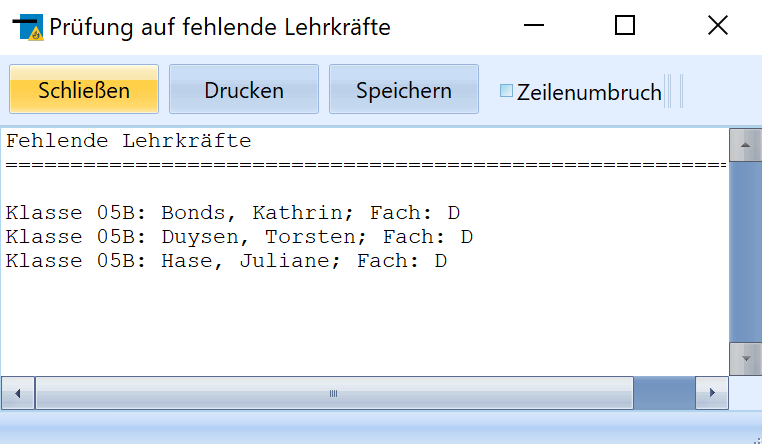

# Fächer ohne Lehrkraft suchen (Gruppenprozesse Noten, Zeugnisvorbereitung)

Dieser Gruppenprozess sucht in der ausgewählten Schülermenge
im aktuellen Abschnitt nach Fächern ohne Lehrkrafteintrag.Wurde bei der Zuweisung von Unterricht die Lehrkraft offen gelassen
(z.B. weil sie noch nicht feststand) oder wird ein Schüler in einer
Kooperationsschule unterrichtet, kann mit diesem Gruppenprozess geprüft
werden, bei welchen Schülern (sortiert nach Klasse, Name und Fach) der
Lehrereintrag in einer Zeile der Leistungsdaten des aktuellen Abschnitts
fehlt.

Diese Angaben werden direkt in einer Liste bereitgestellt. Diese kann
gespeichert oder ausgedruckt werden.

::: warning

Sinnvoll ist dieser Gruppenprozess, bevor Sie die
Dateien für das externe Notenmodul bereitstellen. Fehlt beim Unterricht
eines Schülers der Eintrag des Lehrers, wird dieser Unterricht dem
eigentlich zuständigen Kollegen auch nicht in seine Notendatei
exportiert.

:::