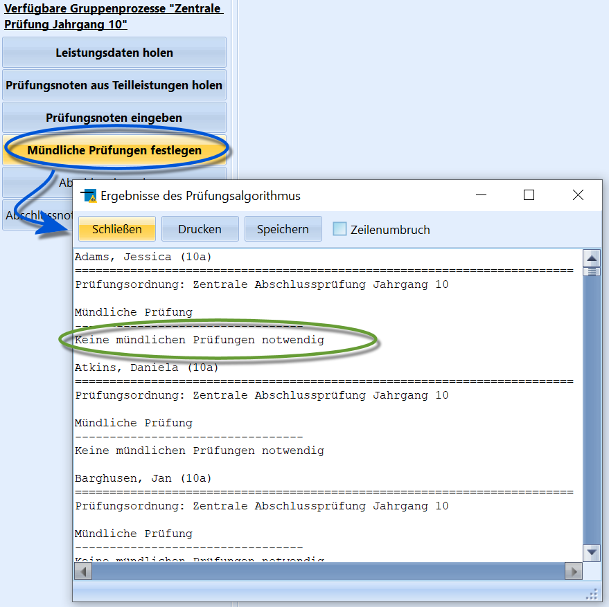

# Mündliche Prüfungen festlegen (Gruppenprozesse Zentrale Klausuren)

Nachdem alle Noten im Reiter *Schüler ➜ ZP 10/ZK* vorliegen, werden dort
mit dem Gruppenprozess **Mündliche Prüfungen festlegen** die Haken für
eventuell notwendige mündliche (Abweichungs-)Prüfungen gesetzt.

Das Protokoll lässt sich mit *Drucken* zu einem der eingerichteten
Drucker senden oder mit *Speichern* als Textdokument mit einem frei
wählbaren Dateinamen als .txt-Datei abspeichern.Ein Klick auf `Schließen` beendet diese Ansicht.

::: warning

Eventuell gewünschte *Freiwillige mündliche Prüfungen*
sind individuell bei den Schülern im Reiter *Schüler ➜ ZP 10/ZK* manuell
anzuhaken.

:::  ::: warning

Beachten Sie bitte, dass der Algorithmus keine Prüfung
auf ein (vollständiges) Vorliegen der Noten vornimmt.Liegen ganz oder teilweise keine Noten vor, gibt es hier keinen Fehler,
der darauf Aufmerksam macht. Es wird die Meldung ausgegeben, es sei
*keine Nachprüfung notwendig*, da es ohne Noten auch keine Abweichungen
zu berechnen gibt.Somit kann dieses *Prüfungsprotokoll* nicht dazu dienen, auf die
Schnelle zu überprüfen, ob es "alles in Ordnung" sei oder ob noch
einzelne Fehler mit den Noten vorliegen.

:::