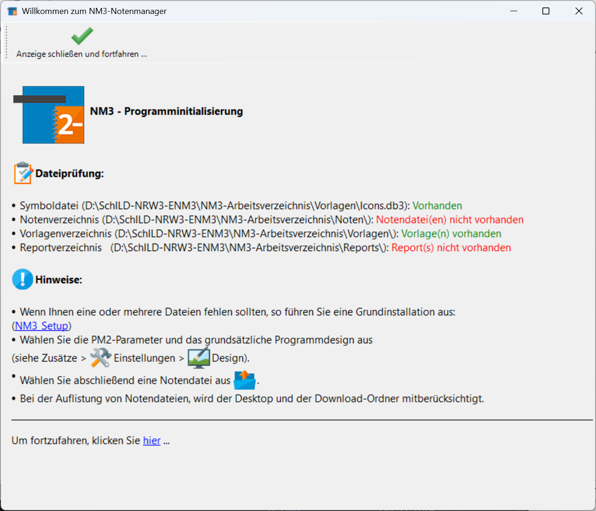
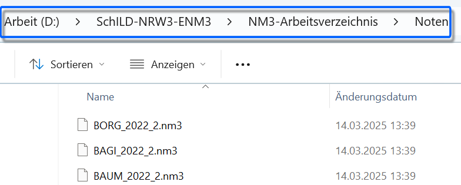
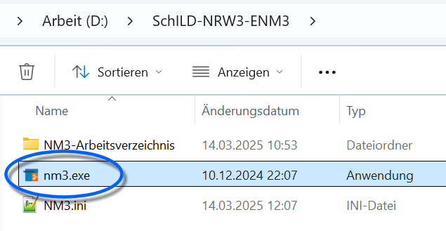
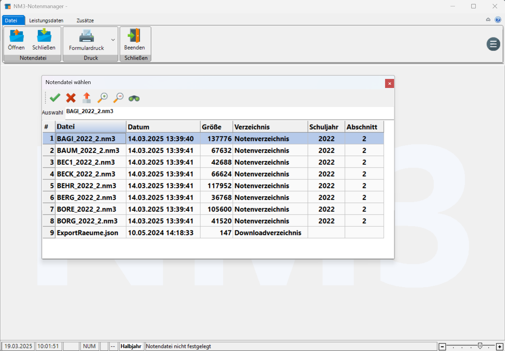
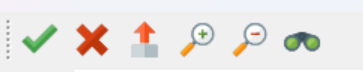

# Verwendung des Externen Notenmoduls (Tutorial)

## Starten nach einer InstallationZum ersten Start sieht das Notenmodul wie folgt aus:Hier bemerken wir, dass natürlich noch keine **Notendateien** im
Arbeitsverzeichnis liegen.

::: warning

Wird in einem Folgejahr eine neue Version des
Notenmoduls verteilt, installieren Sie dieses **Update** genauso wie

WIKILINK: Installation_des_Externen_Notenmoduls_(Tutorial)
vorgenommen wurde.

:::  

## Ablegen der Notendatei im Notenverzeichnis

::: warning

Bevor Sie die Notendateien aus SchILD-NRW exportieren
sollte die Korrektheit der Leistungsdaten - also Lehrkraftzuordnungen,
Schülerbelegungen und so weiter -kontrolliert werden, da alle Fehler
hier in die Notendateien exportiert werden und auch Lerngruppen bei
nicht mehr aktuellen Lehrkräften in die Datei geschrieben
werden.

:::

Die Notendateien, die zu bearbeiten sind, werden im "Notenmodul 3
Arbeitsverzeichnis" im Unterordner *"Noten"* gespeichert.Exportieren Sie die Dateien, wie der Vorgang im 

WIKILINK: Externes_Notenmodul_(Verwaltung_Export)
beschrieben ist.

Dieses liegt in dem Ordner, in den Sie das Notenmodul 3 installiert
beziehungsweise entpackt haben.Hier im Beispiel ist dies`D:\SchILD-NRW3-ENM3\NM3-Arbeitsverzeichnis\Noten`und entsprechend wurde die .nm3-Notendateien dorthin gelegt, die aus dem
Kürzel der Lehrkraft, dann dem Schuljahr und schließlich aus dem
Lernabschnitt bestehen. Hier im Beispiel führt also das Schuljahr 2022
im 2. Halbjahr zur Datei *"BORG_2022_2.nm3"*.Arbeiten Sie in der Schule mit dem Notenmodul, öffnen Sie einfach die
Datei mit Ihrem Kürzel. Arbeiten Sie woanders, legen Sie die Notendatei
im Ordner `NM3-Arbeitsverzeichnis\Noten` ab.  

## Öffnen der Notendatei

::: warning

Eventuell liegen noch alte Notendateien vorheriger
Lernabschnitte in dem Ordner. Achten Sie bitte darauf, dass Sie
tatsächlich die aktuelle Notendatei in den Ordner Noten einkopiert
haben!

:::

Zuerst wird das Notenmodul gestartet. Wurde bei der Installation ein
Icon auf dem Desktop erzeugt, wäre dieses anzuklicken.Alternativ wird die Anwendung "nm3" direkt als nm3.exe im
Installationsordner gestartet.  

 Es öffnet sich nun das Notenmodul und Sie sehen alle im
Unterordner "Noten" eingespielten Notendateien.Hier wählen Sie Ihre Datei aus.Dann klicken Sie auf den Haken ✓, um diese Datei zu öffnen.  

 Sollten Sie Ihre noch nicht sichtbar sein, nutzen Sie den
`Scrollbalken` rechts oder klicken Sie auf das Fernglas, um unterhalb
der Liste das **Suchfeld** zu öffnen, in das Sie einen Teil Ihres
Kürzels eintragen können.An dieser Stelle lassen sich über das Icon, das den roten Pfeil nach
oben zeigt, die Noten auch in andere Formate exportieren (Word, Excel,
csv, pdf, ...).

## Leistungsdaten