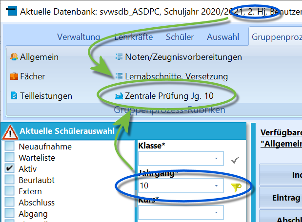

# Zentrale Prüfung Jahrgang 10 (Gruppenprozesse ZP 10/ZK)

Diese Gruppenprozesse stehen zur Verfügung, wenn sich zum einen die
Schule im *2. Halbjahr* befindet und weiterhin *exklusiv* Schüler eines
Jahrgangs ausgewählt wurden, in denen Zentrale Klausuren geschrieben
werden.

::: warning

Der Ablauf einer ZP 10 wird im Wikiartikel zum Reiter
*Schüler ➜ ZP 10/ZK* detailliert erläutert.

Die notwendigen Vorbereitungen, um die ZP 10/Zentrale Klausuren in
SchILD-NRW zu erfassen, finden sich in einem *Tutorial*.

:::  

 Folgende Gruppenprozesse stehen zur Verfügung. Diese bilden
von oben nach unten den im Arbeitsablauf der Prüfungen/Klausuren ab und
werden entsprechend aufeinanderfolgend ausgeführt.-   **Leistungsdaten holen**: Die unter *Unterrichtsfächer* als für die
    zentrale Prüfungen/Klausuren zuvor markierten Fächer werden von dem
    aktuellen Abschnitt (Akt. Halbjahr) geholt.
-   **Prüfungsnoten aus Teilleistungen holen**: Es sind vorher
    *Teilleistungen* zu konfigurieren, in die dann die Noten eingetragen
    werden. Diese werden über den Gruppenprozess hier geholt. Alle für
    die ZP10 relevanten Noten sind zwangsläufig vorher einzutragen.
-   **Mündliche Prüfungen festlegen**: Wenn die Noten der Schriftlichen
    Prüfungen und die Vornote eingegeben sind, kann Schild-NRW die
    mündlichen Prüfungen bei einer Abweichung von mehr als 2 Notenstufen
    festsetzen. Freiwillige mdl. Prüfungen müssen per Hand gesetzt
    werden. Die Ergebnisse der Prüfungen müssen wieder eingetragen
    werden.
-   **Abschlussnoten berechnen**: Sofern die Notenbildung eindeutig ist,
    kann Schild-NRW diese als Abschlussnote eintragen. Steht ein Schüler
    zwischen zwei Notenstufen, ist die Eintragung Hand vorzunehmen.
-   **Abschlussnoten in Leistungsdaten übertragen**: Schreibt nach
    Abschluss der Notenfindung diese als die Note in das aktuelle
    Halbjahr zurück.Nach dem Abschluss des ZP-10-Prozesses sind die Notenmitteilungen zu
drucken. Um dies mit SchILD-NRW durchzuführen, stehen Formulare auf der
Seite des [MSB zu Schulverwaltungssoftware](https://www.svws.nrw.de)
unter der Rubrik Downloads ➜ SchILD-Reports bei den Einzelreports ➜
Sekundarstufe1 ➜ ZP10 zum Download zur Verfügung.