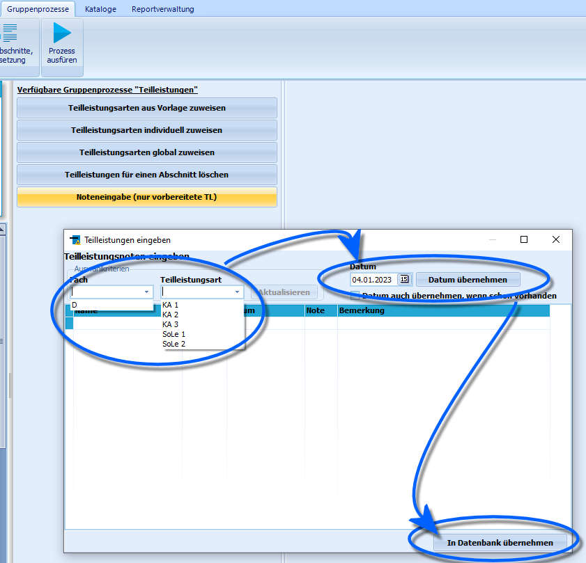
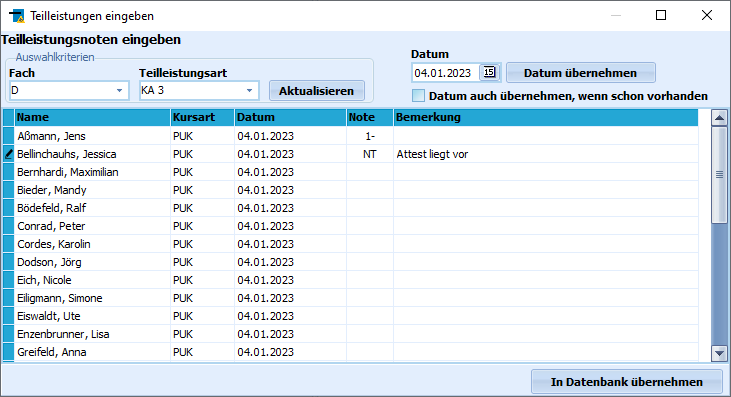
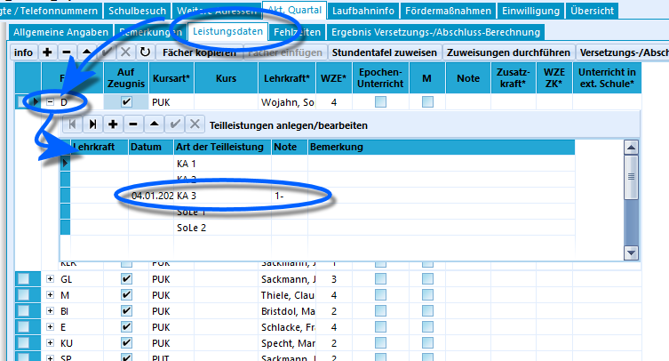

# Noteneingabe (nur vorbereitete TL) (Gruppenprozesse Teilleistungen)

Durch den Gruppenprozess **Noteneingabe (nur vorbereitete TL)** können
für die ausgewählte Schülergruppe Noten für vorhandene Teilleistungen
eingegeben werden.Um die in den vorherigen Gruppenprozessen vorbereiteten und angelegten
Teilleistungen mit Leistungsdaten zu füllen, kann dieser Gruppenprozess
verwendet werden.Im sich öffnenden Fenster kann für die ausgewählte Schülermenge im
Container eine bereits angelegte Teilleistung über die zwei
Dropdown-Menüs ausgewählt werden.Im Beispiel sind für die Lerngruppe nur im Fach Deutsch die angezeigten
fünf Teilleistungsarten angelegt.  

 Durch Klick auf `Aktualisieren` wird die Schüler-Tabelle
geladen, die in der Folge gefüllt werden kann.Ein Klick auf `Datum übernehmen` fügt das oben rechts eingestellte Datum
bei allen Teilleistungen hinzu.Unter **Note** können nur zulässige Werte für Leistungsdaten eingegeben
werden.Über das Feld **Bemerkung** können freie Texte erfasst werden.

Die Noteneingabe wird abgeschlossen durch Klick auf die Schaltfäche
`In Datenbank übernehmen`.  

Als Resultat erscheinen die eingetragenen Teilleistungen im aktuellen
Abschnitt eines ausgewählten Schülers durch Klick auf das **+** beim
entsprechenden **Fach** im Reiter *Schüler ➜ Aktueller Abschnitt* ➜
**Leistungsdaten**.

::: warning

Die Teilleistungen können in SchILD-NRW selbst nur
funktionsbezogen eingegeben werden, das bedeutet, der SchILD-Benutzer
muss über entsprechende Berechtigungen verfügen. Dies ist in vielen
Schulen jedoch häufig nur Lehrkräften in zum Beispiel Verwaltungs- oder
Schulleitungsaufgaben vorbehalten.Allerdings können Teilleistungen von allen Lehrkräften für deren
Schülerschaft auch über entsprechende Schnittstellen-Tools wie das
externe Notenmodul oder SchILDweb erfasst und später in SchILD-NRW
importiert werden.

:::