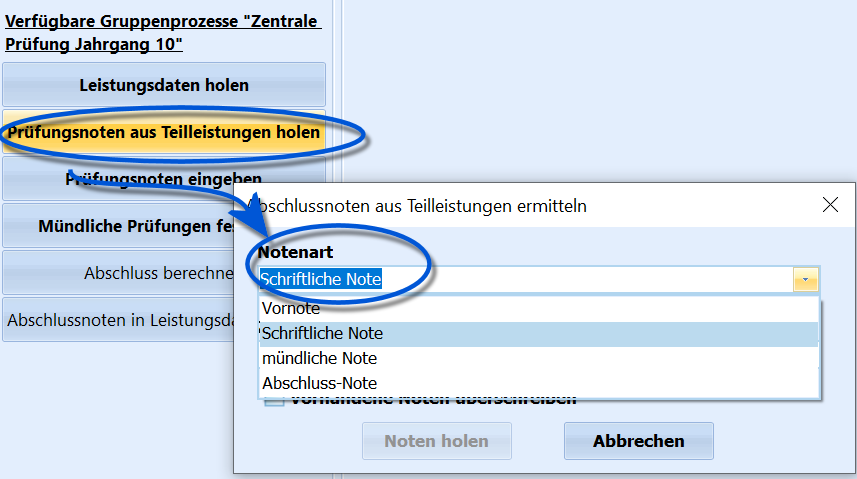
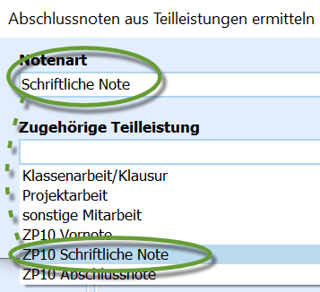

# Prüfungsnoten aus Teilleistungen holen (Gruppenprozesse Zentrale Klausuren)

 Werden die Teil-Noten der ZP/ZK über Teilleistungen erfasst
(*Vornote*, *Schriftliche Note* und die *Abschlussnote*) und wurden in
den *Leistungsdaten* des *aktuellen Halbjahrs* aufgenommen, können diese
Noten in den Reiter *Schüler ➜ ZP 10/ZK* in die entsprechenden Spalten
übernommen werden.

Die Noten können direkt in SchILD-NRW eingetragen oder über zum Beispiel
das Externe Notenmodul durch die Fachlehrkräfte erhoben werden.Im Fenster, dass sich nach dem Anklicken des Gruppenprozesses öffnet,
ist zuerst auszuwählen, um welche *ZP 10/ZK-Teilleistung* es sich
handelt.

Dieses Feld heißt **Notenart** und sein Feld bestimmt, in welcher
*Spalte* die gleich geholte Note eingetragen werden wird.  

 Nachdem die *Notenart* oben gewählt wurde, ist nun die
konkret den Schülern gegebene Teilleistung dieser Notenart zuzuordnen.
Dies wird über das Feld **Zugehörige Teilleistung** vorgenommen.

Die Teilleistungen der Schule können vom Namen der beliebig gewählt
werden, daher ist hier diese Zuordnung manuell vorzunehmen.Hier im Beispiel entspricht die ZP-10-Note *Schriftliche Note* der
eindeutig gewählten Bezeichnung *"ZP 10 Schriftliche Note"*.

::: warning

Hier ist es technisch möglich, falsche Zuordnungen
vorzunehmen, also zum Beispiel die *Vornoten* als die *schriftlichen
Noten* der Prüfung oder direkt als die *Abschlussnoten* zu
importieren.

:::

Es kann der Haken bei **Vorhandene Noten überschreiben** gesetzt werden,

um schon vorgenommene Änderungen bei individuellen Schülern mit den
original eingetragenen Teilleistungen zu überschreiben.Klicken Sie auf `Noten holen`, um den Gruppenprozess zu starten..