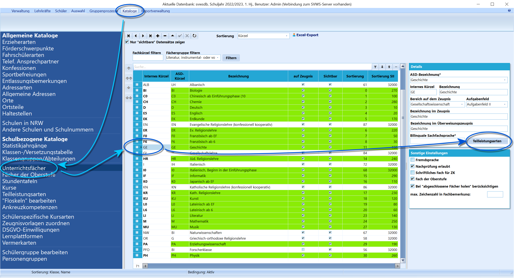
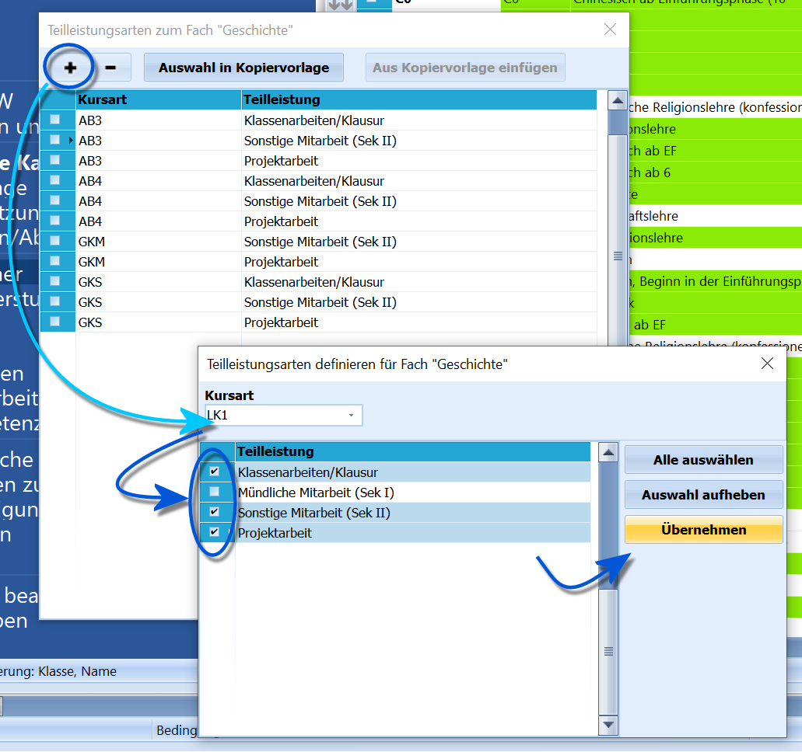
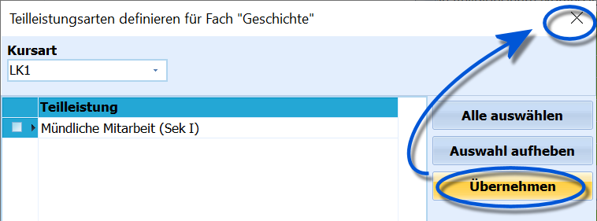
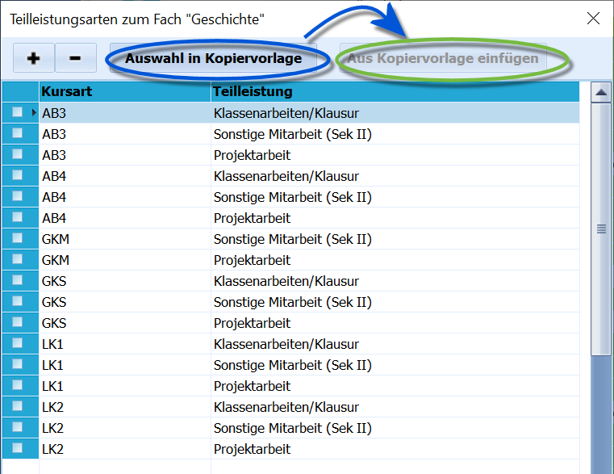
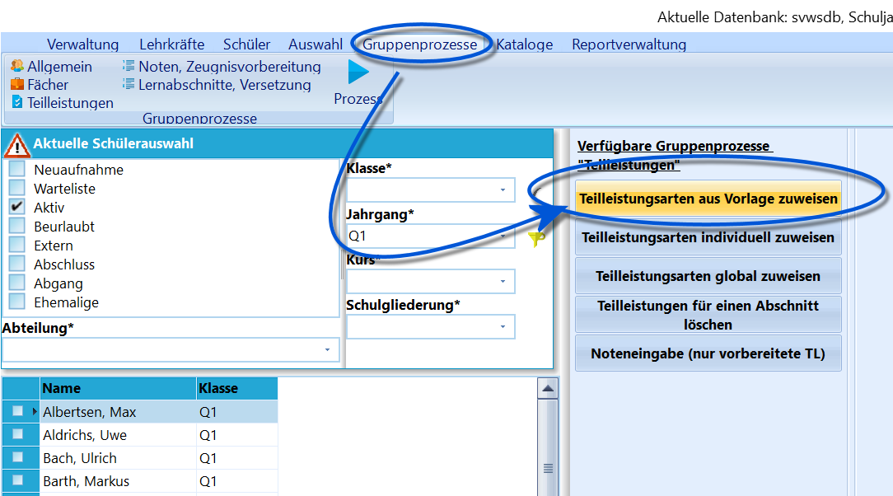
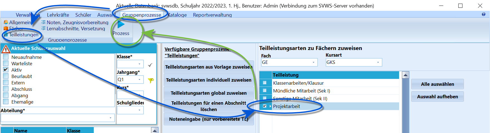
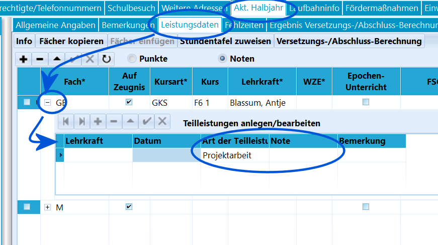
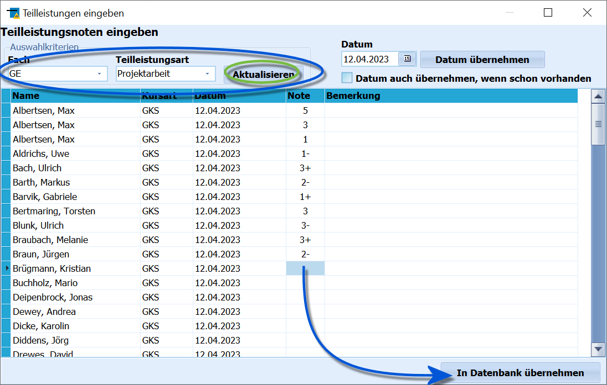

# Teilleistungen einrichten und verwalten (Tutorial)Über die Teilleistungen können zum Beispiel die Noten von einzelnen
Klassen- oder Kursarbeiten, aber auch differenziert mündliche,
schriftliche oder sonstige Leistungen erfasst werden.

## Teilleistungsarten einrichten und den Kursarten der Fächer zuweisen

 Die in diesem Abschnitt beschriebenen Vorbereitungsarbeiten
müssen einmalig in SchILD durchgeführt werden, um die Erfassung von
Teilleistungen vorzubereiten.Unter *Kataloge ➜ Teilleistungsarten* werden alle Teilleistungsarten
eingetragen, die in der Schule benutzt werden sollen.    

 Anschließend muss über *Kataloge ➜ Unterrichtsfächer* für
jedes Fach festgelegt werden, welche Teilleistungen bei welcher Kursart
erfasst werden sollen.  

**Übernehmen** wählt diese Teilleistungen an und sie verschwinden nun
aus der Liste.  

 Wenn wir nun das Fenster mit dem **X** schließen, wurden
die Teilleistungen für diese Kursart übernommen.  

 Wurde ein Fach eingerichtet, lässt sich die
Kurs-Teilleistungs-Liste über **Auswahl in Kopiervorlage** speichern und
bei einem anderen Fach über **Aus Kopiervorlage einfügen**
eintragen.\<    

## Teilleistungsarten den Schülern zuweisen

 Sobald zu Beginn eines Abschnitts allen Schülern ihr
Unterricht zugewiesen wurde, kann allen Schülern über *Gruppenprozesse ➜
Teilleistungen* mittels **Teilleistungsarten aus Vorlage zuweisen** die
Teilleistungsarten zuweisen, die bei den Fächerdetails eingetragen
wurden.  

 Alternativ können Teilleistungsarten auch direkt Schülern
zugewiesen werden. Dies wird über den Gruppenprozess *Gruppenprozesse ➜
Teilleistungen* **Teilleistungsarten individuell zuweisen**
durchgeführt.Zuerst muss ein Fach und eine Kursart gewählt werden, die auch der
Belegung der Schüler entsprechen muss. Mit einem Haken werden die
betreffenden Teilleistungen ausgewählt.Ein Klick auf **Prozess** weist nun die Teilleistungen zu.  

## Teilleistungsnoten eingeben

 **Einzelne Teilleistungen** können in SchILD direkt beim
Schüler im Reiter *Akt. Halbjahr ➜ Leistungsdaten* eingegeben werden.Bei einem Fach lässt sich mit dem kleinen **+** vor dem Fach die Liste
mit den *Teilleistungen* aufklappen, hier kann nun eine **Note**
eingetragen werden.Mit dem **-** lässt sich die Liste wieder zusammenklappen.  

 Um **Teilleistungen für eine Gruppe** einzugeben, filtert
man zunächst auf die Schüler und wählt *Gruppenprozesse ➜ Teilleistungen
➜* **Noteneingabe (nur vorbereitete TL)**.Hier gibt man bei den *Auswahlkriterien* zunächst das *Fach* und die
*Teilleistungsart*. Ein Klick auf **Aktualisieren** zeigt nun alle
Schüler aus der Container-Auswahl an, in diesem Fach die ausgewählte
Teilleistung zugeordnet haben.Bei Bedarf kann man mit der Schaltfläche **Datum übernehmen** ein Datum
setzen, auch kann angewählt werden, dass ein eventuell schon vorhandenes
Datum überschrieben wird.Nun können die **Noten** eingetragen werden.Mit **In Datenbank übernehmen** werden die Teilleistungen gespeichert.  

## Teilleistungen ansehen und druckenIn SchILD gibt es bisher keine Möglichkeit, die Teilleistungen der
Schüler in einer Übersicht angezeigt zu bekommen. Die Liste der
Teilleistungen kann bei jedem Schüler bezüglich der jeweiligen Fächern
aufgeklappt werden.Wenn man eine Übersicht anzeigen möchte, muss man einen passenden
*Report* verwenden, welcher die Teilleistungen ausgibt.