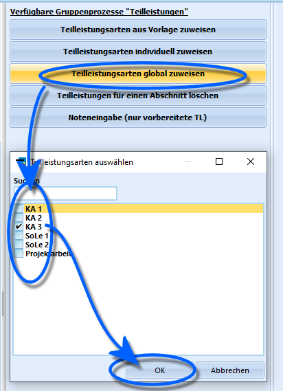

# Teilleistungsarten global zuweisen (Gruppenprozesse Teilleistungen)

 Durch den Gruppenprozess **Teilleistungsarten global
zuweisen** können der ausgewählten Schülergruppe beliebige
Teilleistungsarten global zugewiesen werden, was bedeutet, dass jedem
Fach aller ausgewählten Schüler im gewünschten Lernabschnitt diese
Teilleistungsart zugewiesen wird.Wie im Beispiel rechts dargestellt können der aktuell ausgewählten
Schülermenge im Container jegliche im *Katalog ➜ Teilleistungsarten*
vorbereitete Teilleistungsarten zugeordnet werden.Bei Ausführung des Gruppenprozesses wird die ausgewählte
Teilleistungsart jedem Fach der im Container ausgewählten Schüler
hinzugefügt.Im Beispiel hier wird also die Teilleistungsart "KA 3" (für
"Klassenarbeit 3") auch bei mündlichen Fächern mit angelegt. Eine
hinzugefügte Teilleistung muss nicht ausgefüllt werden.

::: warning

Berücksichtigen Sie, dass bei diesem Gruppenprozess
nicht nach Fächern oder Kursarten unterschieden wird, es wird jedem Fach
in den Leistungsdaten der Schüler die entsprechende Teilleistungsart
zugewiesen. Die Teilleistungen lassen sich global nicht so einfach
wieder entfernen.

:::