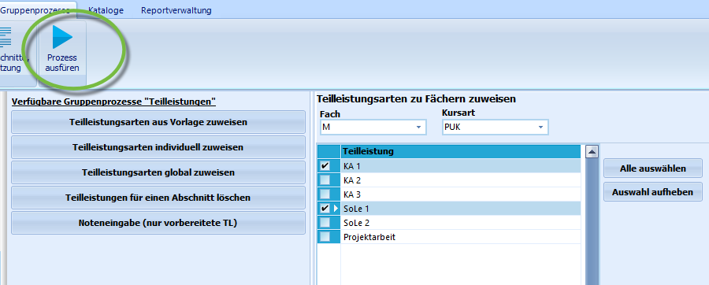
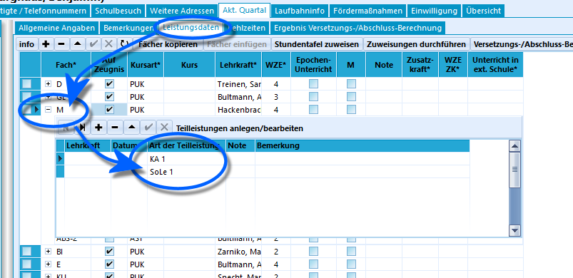

# Teilleistungsarten individuell zuweisen (Gruppenprozesse Teilleistungen)

 Durch den Gruppenprozess **Teilleistungsarten individuell
zuweisen** können der ausgewählten Schülergruppe in den Leistungsdaten
beliebige Teilleistungsarten zu Fächern zugewiesen werden, die zuvor
über *Kataloge* ➜ **Teilleistungsarten** angelegt wurden.Nachdem dieser Schritt durchgeführt wurde, können Noten für die
einzelnen Teilleistungen in den Fächern eingetragen werden.Wie im Screenshot rechts dargestellt können der aktuell ausgewählten
Schülermenge im Container jegliche vorbereiteten Teilleistungsarten
individuellen **Fächern** und **Kursarten** zugeordnet werden.Hier wurde die Kombination aus dem **Fach** Mathematik mit der
**Kursart** PUK ausgewählt.Durch Anhaken der entsprechenden Teilleistungsart wird für diese
Fach-/Kurskombination die entsprechende Teilleistungsart angelegt.Klicken Sie auf `Prozess` um den Gruppenprozess mit den gesetzten Haken
zu starten.

::: warning

Das *Fach* und die *Kursart* müssen bei der
Schülergruppe vorhanden sein. Ist dies nicht der Fall, werden auch keine
Teilleistungen bei den Schülern angelegt.

:::

::: warning

Im Gegensatz zum Gruppenprozess **Teilleistungsarten aus
Vorlage zuweisen** kann hier frei für jede auftretende Kursart eine
Teilleistung zugewiesen werden. In der für den anderen Gruppenprozess
erstellten Vorlage musste dagegen jede an der Schule vorkommende
Kombination aus Fach und Kursart berücksichtigt werden, damit der hier
genannte Gruppenprozess richtige Ergebnisse liefert.

:::

 Im Beispiel sind den Schülern der Klasse 5b zwei
vorbereitete Teilleistungsarten zugewiesen worden, die bei Klick auf das
**+** beim Fach, hier **M**, im Reiter *Schüler ➜ aktueller Abschnitt* ➜
**Leistungsdaten** sichtbar werden.