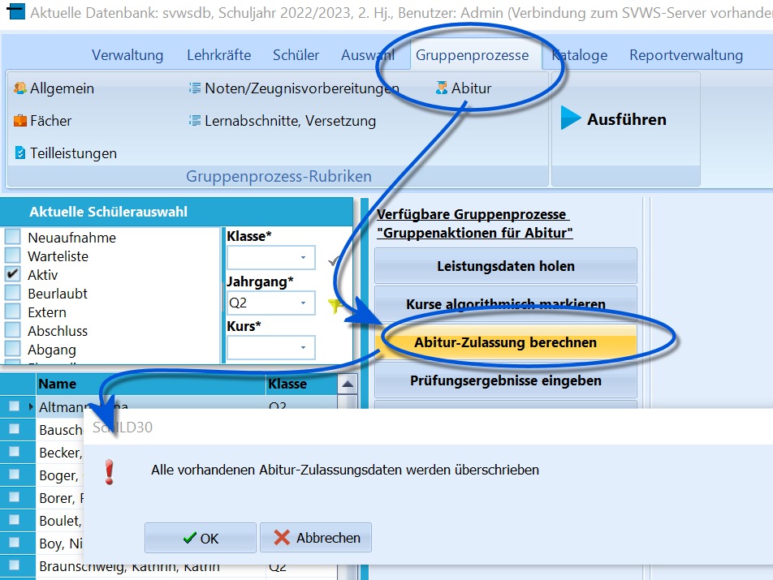
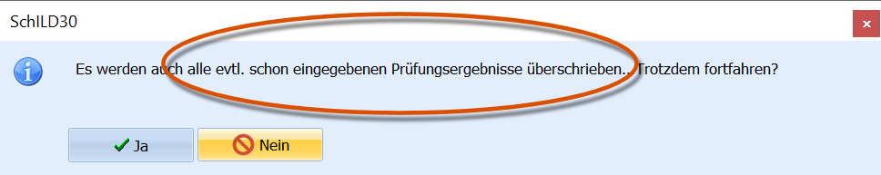
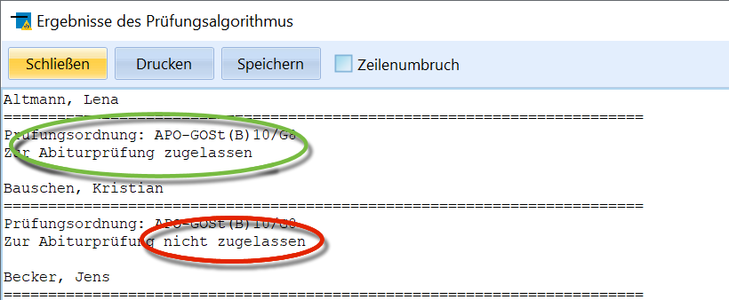
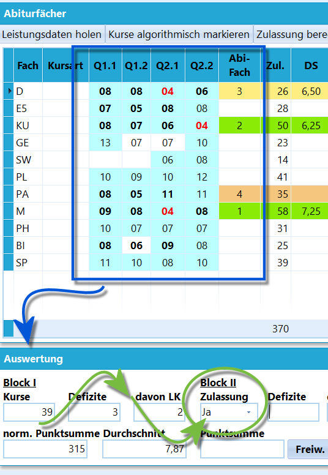

# Abitur-Zulassung berechnen (Gruppenprozesse Abitur)

Dieser Gruppenprozess realisiert die dritte Stufe der
Zulassungsberechnungen.Wurde der Gruppenprozess *Kurse algorithmisch markieren* durchgeführt
und sind damit die für die Zulassung relevanten Kurse markiert und wurde
eine eventuell notwendige manuelle Korrektur vorgenommen, so realisiert
dieser Gruppenprozess die Berechnung der Abiturzulassung.  

::: warning

Schon vorhandene Daten werden überschrieben. Dies gilt
auch für eventuell schon eingetragene Prüfungsergebnisse im späteren
Verlauf des Abiturs.

:::  

 Anschließend wird auch hier wieder in einer Textdatei
angegeben, welche Schüler für die Abiturprüfung zugelassen werden und
welche nicht. Diese Datei kann ausgedruckt oder abgespeichert werden.  

 Die genauen Ergebnisse der Berechnung können dann unter dem
Karteireiter *Schüler ➜ Abitur* unten links unter *Block I* eingesehen
werden.Für einen einzelnen Schüler kann der Prozess auch unter dem Karteireiter
*Schüler ➜ Abitur* durch Klicken auf die Schaltfläche
`Zulassung berechnen` initialisiert werden.