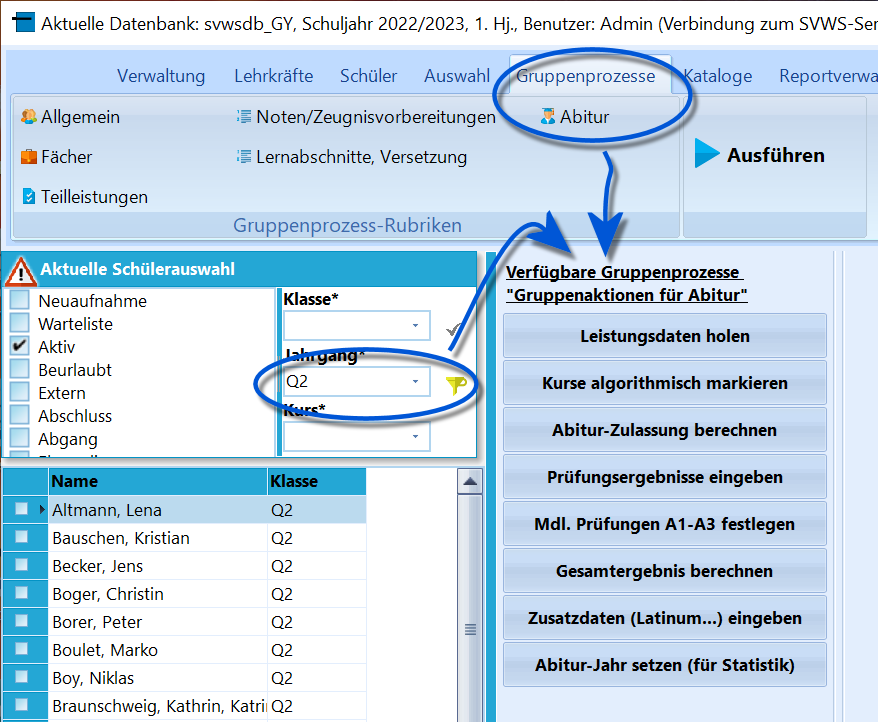

# Abitur (Gruppenprozesse Abitur)

::: warning

Wurde über den Filter nur der **Jahrgang Q2** im
Schülercontainer ausgewählt, stehen unter *Gruppenprozesse* nun über die
Schaltfläche *Abitur* die Prozesse zum Abitur zur
Verfügung.

:::

-   Leistungsdaten holen

-   Kurse algorithmisch markieren
-   Abitur-Zulassung berechnen
-   Prüfungsergebnisse eingeben
-   Mdl. Prüfungen A1-A3 festlegen
-   Gesamtergebnis berechnen
-   Zusatzdaten (Latinum...) eingeben
-   Abitur-Jahr setzen (für Statistik)

Die Gruppenprozesse bilden in ihrer Reihenfolge den Verlauf des
Abiturprozesses ab.