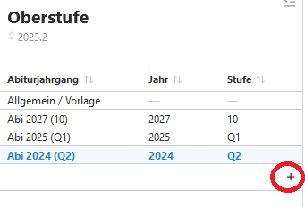
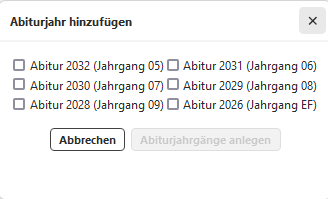

# Abiturjahrgänge einrichten# Einrichtung der JahrgängeDurch "+" können die aktiven Jahrgangsstufen der Oberstufe sowie eine
ggf. neu zu planende EF hinzugefügt werden. 

 

Es können nun die **allgemeine Vorlagen** oder individuell **die
jeweilige Jahrgangsstufe** bearbeitet werden hinsichtlich:1.  Fächereigenschaften
2.  Ausschlussregeln
3.  Weitere Kombinationsbedingungen
4.  Beratungslehrkräfte
5.  ...