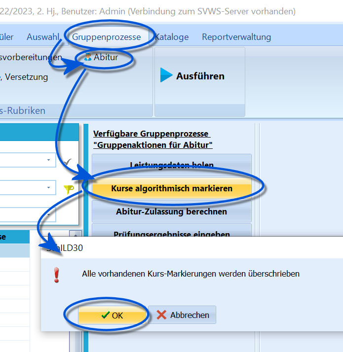
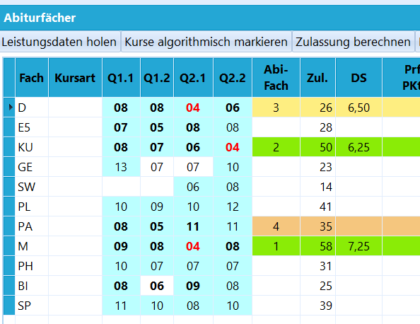

# Kurse algorithmisch markieren (Gruppenprozesse Abitur)

Dieser Gruppenprozess bildet die zweite Stufe für die
Zulassungsberechnung.Wurden die Leistungsdaten bei einem Schüler geholt, individuell im
Reiter *Abitur* oder über den Gruppenprozess *Leistungsdaten holen*,
stehen damit alle Noten für die weitere Berechnung zur Verfügung.Der Gruppenprozess **Kurse algorithmisch markieren** versucht, die für
die Abiturzulassung zu belegenden Kurse im Reiter *Abitur* zu markieren.
Bei Erfolg sind diese türkis hinterlegt, nicht markierte Kurse haben
nach wie vor einen weißen Hintergrund.Sind bei der Markierung, welche Kurse einzubringen sind, Alternativen
möglich, ist der Algorithmus darauf ausgelegt, die für die Schüler
optimalere Variante zu wählen.Fallen bei der Überprüfung Belegungsfehler an, werden diese in einer
Textdatei ausgebeben. Diese Datei kann ausgedruckt oder abgespeichert
werden.

::: warning

Über die Gesamtqualifikation und damit über die
Abiturzulassung entscheidet ausschließlich der zentrale Abiturausschuss
(ZAA). SchILD-NRW liefert lediglich einen Vorschlag ohne Gewähr für die
Beratung des ZAA.Der gleiche Vorschlagcharakter ist bei der Schnitt-Optimierung der
einzubringenden Kurse anzunehmen.

:::

 Sollte es nötig sein, an dieser Stelle den Algorithmus zu
übersteuern, so kann man unter dem Karteireiter *Abitur* einen
Doppelklick auf die Punktzahlen durchführen, um damit zwischen
Markierung des Kurses (türkis hinterlegt) und Nichtmarkierung des Kurses
(weiß hinterlegt) umzuschalten.Für einen einzelnen Schüler kann der Prozess auch unter dem Karteireiter
"Abitur" durch Klicken auf die Schaltfläche
`Kurse algorithmisch markieren` initialisiert werden.Hier kann auch per Haken die *Überprüfung der Fremdsprache in der
Sekundarstufe I* von Hand gesetzt werden.Es schließt sich hier der Gruppenprozess **Abiturzulassung berechnen**
an, der eine korrekte Markierung voraussetzt.