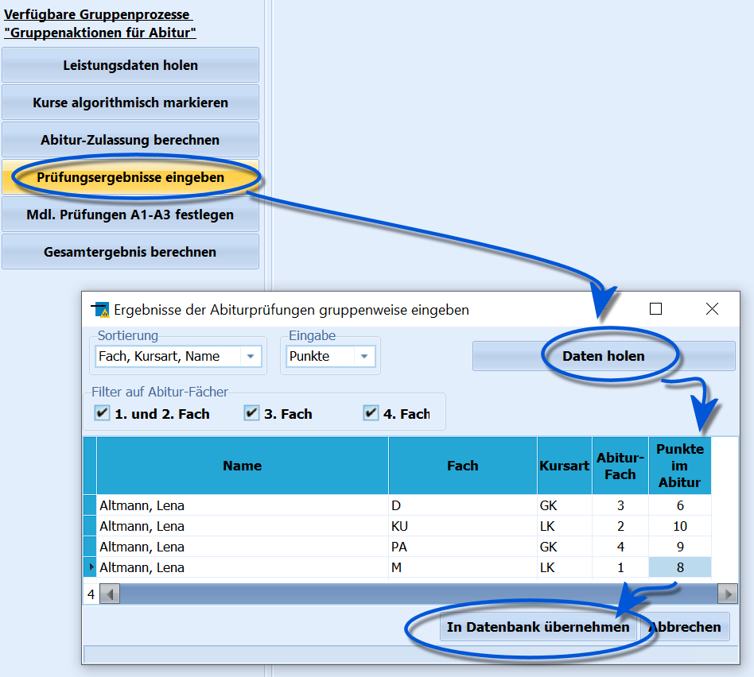

# Prüfungsergebnisse eingeben (Gruppenprozesse Abitur)

Dieser Gruppenprozess ermöglicht eine komfortable Eingabe der
Prüfungsergebnisse.Sobald Prüfungsergebnisse aus den Abiturprüfungen vorliegen, sollte man
diesen Gruppenprozess nutzen, um sie in die Datenbank einzutragen.Startet man den Gruppenprozess `Prüfungsergebnisse eingeben` mit der zu
bearbeitenden Abiturientenauswahl, öffnet sich das Fenster *Ergebnisse
der Abiturprüfungen gruppenweise eingeben*.Dort sollte man zuerst die Schaltfläche `Daten holen` anklicken, um die
Schülerdaten zu laden. Dann kann man sich entscheiden, ob man *Noten*
oder *Punkte* eintragen möchte.Es stehen mehrere Sortierungs- und Filtermöglichkeiten zur Verfügung,
welche die Eingabe erleichtern sollen.-   Folgende Sortiermöglichkeiten stehen zur Verfügung:
    -   **Fach, Kursart, Name**: zu einem Fach werden alle Schüler
        aufgelistet
    -   **Name, Kursart, Fach**: zu einem Schüler werden alle Fächer
        aufgelistet<!-- -->-   Es kann ein Filter festgelegt werden:
    -   1\. und 2. Abiturfach
    -   3\. Abiturfach
    -   4\. Abiturfach  Ein erneuter Klick auf `Daten holen` aktualisiert die Ansicht
entsprechend.

Die Eingabe der Ergebnisse erfolgt durch Eintragung der Punkte (bzw. der
Note) in die Tabelle in die Spalte **Punkte im Abitur**.Ist die Eingabe beendet werden die Daten mit einem Klick auf die
Schaltfläche `In Datenbank übernehmen`.Klickt man stattdessen auf `Abbrechen`, wird beim Schließen des Fensters
noch einmal erfragt, ob die geäderten Daten übernommen (`Ja`) aber
verworfen `Nein` werden sollen.