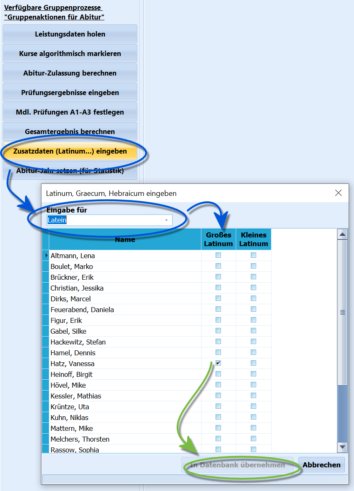

# Zusatzdaten (Latinum...) eingeben (Gruppenprozesse Abitur)

 Der Gruppenprozess **Zusatzdaten (Latinum...) eingeben**
dient dazu, gruppenweise ein erreichtes Latinum, Graecum oder Hebraicum
einzugeben.Selektieren Sie hierzu die gewünschte Schülermenge, üblicherweise die
Q2, und wählen Sie bei *Gruppenprozesse ➜ Abitur* den Gruppenprozess.Nach einem Start ist die gewünschte *Sprache* zu wählen.

::: warning

Damit die Schüler aus der gewählten Schülermenge
angezeigt werden, müssen Sie über das zur Sprache passende Fach in den
Leistungsdaten aufweisen. Hierbei muss das Fach nicht im aktuellen
Abschnitt belegt sein, ein vorheriger Lernabschnitt ist ausreichend.Entsprechend kann auch kein *Latinum* in der falschen Sprache gesetzt
werden.

:::

Wählen Sie nun die Checkboxen entsprechend der aktuell gültigen Vorgaben

zur Erlangen der Sprachqualifikation an und klicnen Sie dann auf
`In Datenbank übernehmen`.Ein Klick auf `Abbrechen` beendet die Operation, ohne Daten zu
verändern.