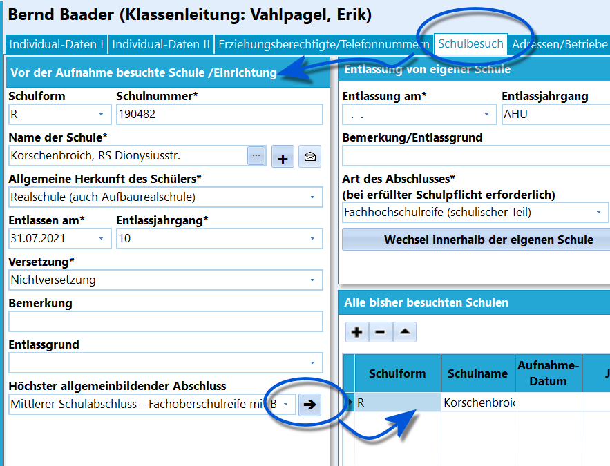
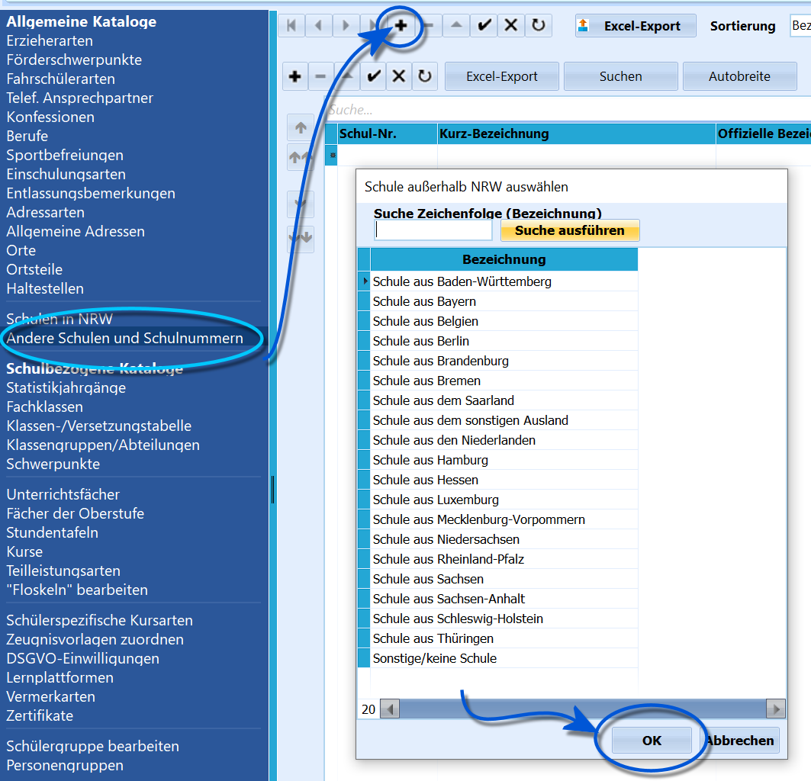

# Eintragung Herkunft am BK/WBK (Tutorial)

 Tragen Sie die Herkunft der Schüler mit den bekannten Daten
unter *Schüler* ➜ **Schulbesuch** ein.

### Schulen aus NRWWenn Sie eine Schule eintragen, wird die Schulnummer automatisch
ausgefüllt.Befindet sich eine Schule nicht im Dropdown-Menü zur Auswahl, lässt sich
über das **+** neben dem Dropdown Menü der Katalog mit den Schulnummern
von Schulen in NRW öffnen.Sie gelangen auf den Katalog, der auch über *Kataloge ➜ Schulen in NRW*
zu erreichen ist. Diese Schulen stehen im Dropwdown-Menü in Ihrem SchILD
zur Verfügung.Klicke Sie auch in diesem Katalog auf das **+** Suchen Sie hier die
fehlende Schule über die Bezeichnung oder die Schulnummer und fügen Sie
dem Katalog hinzu. Nun ist die neue Schule auch unter *Schulbesuch*
auswählbar.Wählen Sie die Schule in **Schulbesuch** an und tragen Sie die Daten
ein.Fügen Sie dann die Schule mit einem Klick auf den Rechtspfeil (➜) der
Liste *Alle bisher besuchten Schulen* ein.  

### Schulen außerhalb von NRW

 Kommt ein Schüler aus einer Schule die nicht in NRW liegt,
öffnen Sie *Kataloge ➜ Andere Schulen und Schulnummern* und fügen Sie
einen passenden Eintrag in Ihre Kataloglist.Zur Auswahl stehen hier die Bundesländer, *Schule aus den Niederlanden*,
*Schule aus dem sonstigen Ausland* und *Sonstige/keine Schule*.

### Unbekannte Herkunft

Die letzte Schulnummer kann auch für *unbekannte Herkunft* verwendet
werden. Füllen Sie hierbei alle bekannten Daten aus und lassen Sie die
Felder mit unbekannten Daten frei.