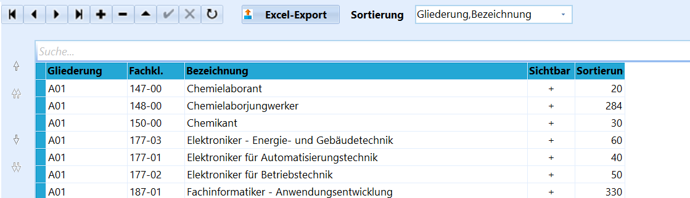
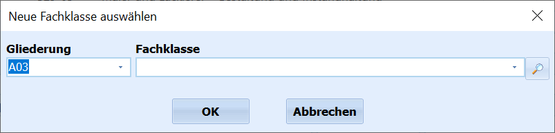
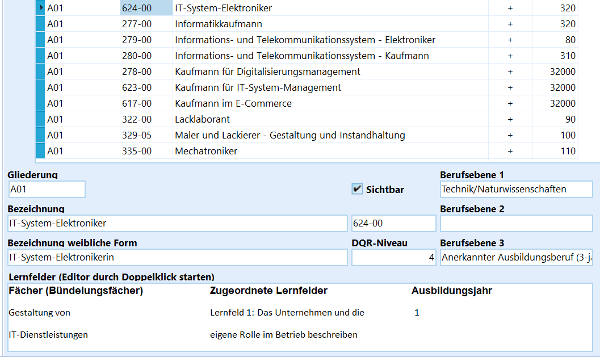
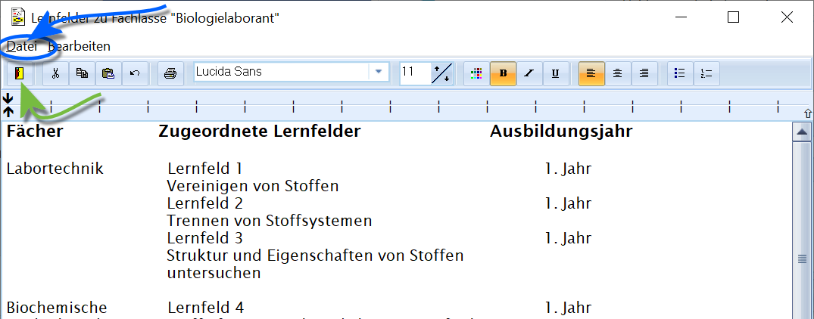

# Fachklassen (Schulbezogene Kataloge)

Über den Katalog **Fachklassen** lassen sich am BK eben diese
Fachklassen anlegen und verwalten. Die Fachklassen werden in der Regel
für die einzelnen Ausbildungsberufe und Ausbildungsjahre gebildet.

Die Fachklassen in folgende Fachbereiche gegliedert: Agrarwirtschaft,
Ernährungs- und Versorgungsmanagement, Gestaltung, Gesundheit/Erziehung
und Soziales, Informatik, Technik/Naturwissenschaften und Wirtschaft und
Verwaltung.Weiterhin kann über **Sortierung** die *benutzerdefinierte Sortierung*
gewählt werden, dann lässt sich die Reihenfolge der Fachklassen über die
Pfeile links verändern.Der Knopf **Excel-Export** lässt den Katalog in eine Excel-Datei
speichern.  

 Die Verwaltung des Katalogs lässt über **+** und **-** das
Anlegen und Löschen von Katalogeinträgen zu.  

Unter den Details zu jeder Fachklasse wird zuerst ihre am BK vorgesehene
**Gliederung** angezeigt.

Die drei Felder zur **Berufsebene** werden beim Zeugnisdruck ausgewertet
und geben *Fachbereich*, *Fachrichtung* und *Schwerpunkt* an. Hierbei
ist die **Berufsebene 1** die *Fachrichtung* und die **Berufsebene 2**
der *Schwerpunkt*, die Eintragungen hier werden auf die Zeugnisse
übernommen.In der bei den Reports mitgelieferten Anleitung der Zeugnisformulare
sind hierfür relevante Informationen enthalten.Weiterhin lässt sich der Katalogeintrag über den Haken auf **sichtbar**
oder unsichtbar schalten. Ein unsichtbarer Eintrag wird in den
Dropdown-Menüs zu Fachklassen nicht aufgeführt, existiert aber noch im
Katalog.Unterhalb des Hakens für *sichtbar* befindet sich der
**Fachklassenschlüssel**, der für die Statistik ausgegeben wird.

Die beiden Einträge zur **Bezeichnung** geben die männliche und
weibliche Form der erreichten Berufsbezeichnung an.

Das Feld **DQR-Niveau** enthält eine Zahl, die eines von acht Niveaus
kenntlich macht. Hier ein Zitat von der Webseite des [deutschenQualifikationsrahmen für lebenslanges Lernen](https://www.dqr.de):`Der DQR beschreibt acht Kompetenzniveaus, denen sich die Qualifikationen des deutschen Bildungssystems zuordnen lassen. Jedem Niveau ist ein kurzer Text vorangestellt, der die Anforderungsstruktur des jeweiligen Niveaus beschreibt. [...] Dabei geht es vor allem darum [...] mit Komplexität und unvorhersehbaren Veränderungen umzugehen, und mit welchem Grad von Selbständigkeit sie in einem beruflichen Tätigkeitsfeld oder in einem wissenschaftlichen Fach agieren können. (Abgerufen 18.06.2024)`Im Bereich **Lernfelder** ist ein frei editierbares Feld enthalten, das
mit Informationen aus den Bildungsplänen ohne konkrete strukturelle
Vorgabe zu befüllen ist. Die Bildungspläne sind auf den einschlägigen
Webseiten, etwa der [QuaLis](https://www.berufsbildung.nrw.de/),
abzurufen.

Dieser erscheint wie hier eingefügt auf der Anlage beziehungsweise bei
A3-Zeugnissen auf der Zeugnisrückseite. Gleichzeitig wird eine Fußnote
mit Verweis auf die Anlage gesetzt.  

 Ein `Doppelklick` öffnet das Feld, dann kann mit einem
Editor ein formatierter Text erstellt werden.In diesem Editor kann auch ein schon bestehendes RichText-File geladen
werden.Der Editor bietet die üblichen Funktionen für einfache formatierte
Texte.Über **Datei** lässt sich ein ein .rtf-Dokument laden.Der grüne Pfeil im Screenshot weist auf die Funktion zum
`Speichern & schließen`.