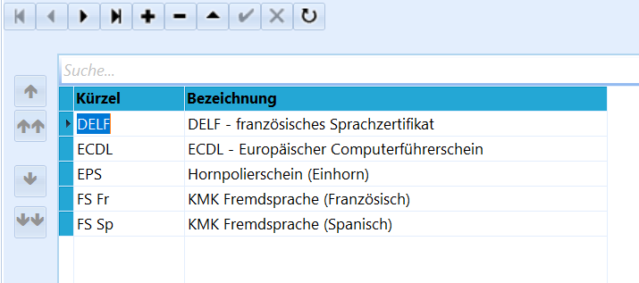
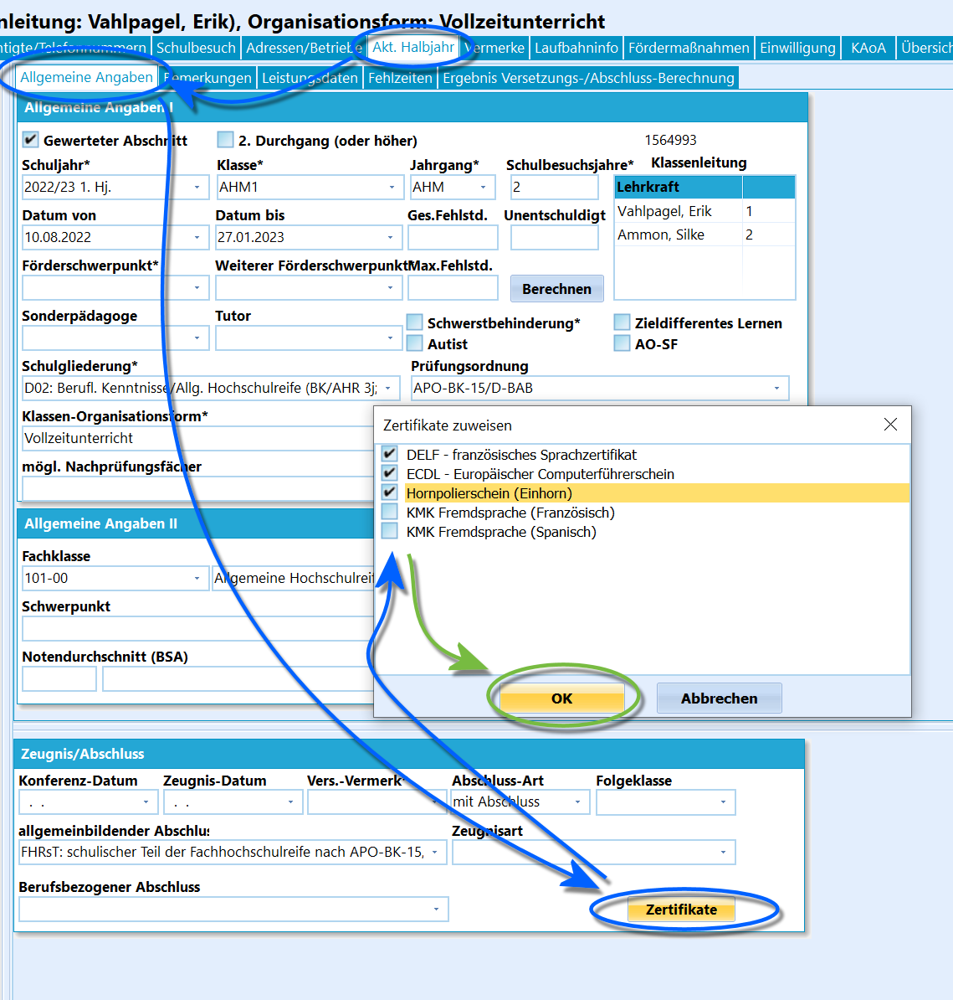

# Zertifikate (Schulbezogene Kataloge)

 Am Berufskolleg werden Nachweise über berufliche
Qualifikationen, die nicht im Abschlusszeugnis bescheinigt werden und
über Zusatzqualifikationen als Zertifikate erteilt.Auf Antrag wird auch ein Zertifikat über nicht weitergeführte
Ausbildungsabschnitte ausgestellt.Ebenso werden Kenntnisse in einer zweiten Fremdsprache entsprechend der
aktuell geltenden Vorgaben zertifiziert.Erfassen Sie zu vergebenden Zertifikate über *Kataloge ➜ Zertifikate*.Einträge lassen sich anlegen, löschen und bearbeiten.  

 Über *Schüler ➜ Akt. Halbjahr ➜ Allgemeine Angaben ➜
Zeugnis/Abschluss* ➜ **Zertifikate** öffnet sich ein Fenster mit den
eingestellten Zertifikaten, die sich hier über Auswahlboxen dem Schüler
zuordnen lassen.Bestätigen Sie mit `OK`

Die für den Schüler vergebenen Zertifikate können über dieses Feld auch
angesehen werden.In Reports können die Zertifikate über die Datenquelle
*SchuelerZertifikate* ausgegeben werden.

::: warning

Der eigentliche Druck der Zertifikate findet in der
Regel nicht über SchILD-NRW statt, sondern über die extern von der
jeweiligen Zertifikatstelle bereitgestellten Vorlagen, die dann in für
Textverarbeitung üblichen Formaten vorliegen.

:::