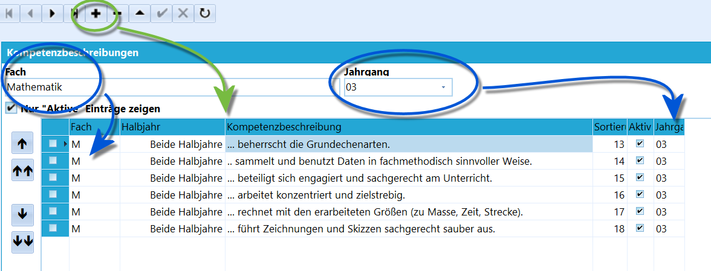
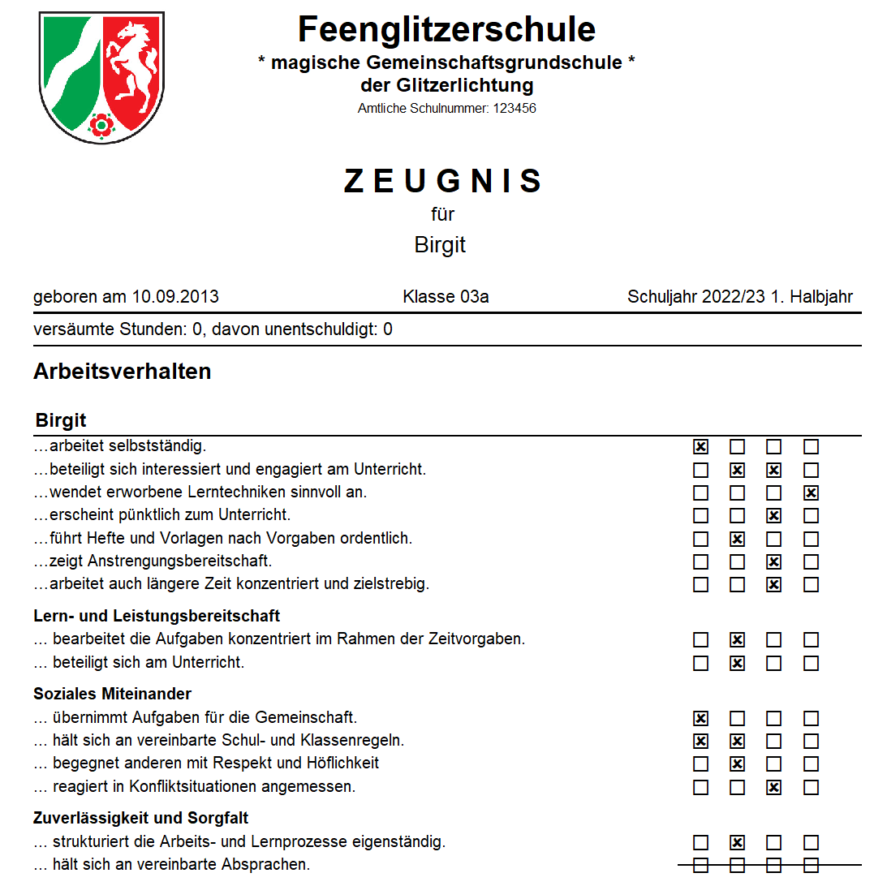
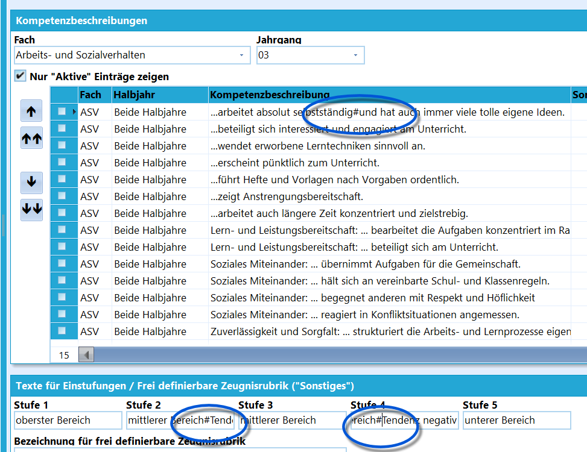
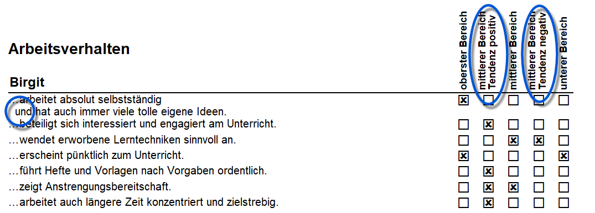
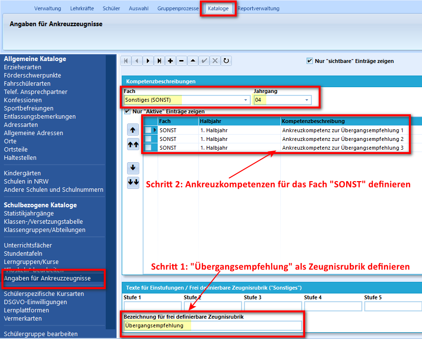
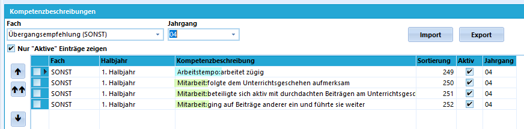
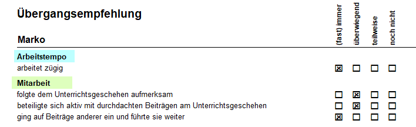

# Ankreuzkompetenzen (Schulbezogene Kataloge)

## Ankreuzkompetenzen anlegen

SchILD-NRW unterstützt zusammen mit dem passenden Report die Verwendung
von Ankreuzzeugnissen, bei denen definierte Kompetenzen in vier oder
fünf Stufen bewertet werden.Schauen Sie zur Verwendung in den Tutorial-Artikel zu
[Grundschul-Ankreuzzeugnissen](Grundschulzeugnisse_Ankreuzzeugnis_(Tutorial).md).

Die Ankreuzkompetenzen werden über *Kataloge* ➜ **Angaben für
Ankreuzzeugnisse** eingestellt.Hierbei werden für jeden **Jahrgang** und für jedes **Fach** die
Kompetenzen vergeben. Weiterhin gibt es zwei Pseudo-Fächer, für die wie
für die anderen Fächer Kompetenzen zugeordnet werden können.Zum einen ist so das *"Arbeits- und Sozialverhalten" - ASV* bewertbar.
Außerdem steht das Fach *Sonstiges* zur Verfügung, mit dem die *Frei
definierbare Zeugnisrubrik* verwendet werden kann.Neben dem **Fach** und dem **Jahrgang** ist das **Halbjahr** - oder
beide - einzustellen, in dem die entsprechende Kompetenz bewertet werden
soll.In der **Kompetenzbeschreibung** ist die sprachliche Beschreibung der
Kompetenz auszufüllen.Über die Zahlen in **Sortierung** wird festgelegt, in welcher
Reihenfolge die Kompetenzen auf dem Zeugnis erscheinen.

::: warning

Die der Bewertung zugrunde liegenden Kompetenzen werden
letztendlich über die entsprechenden Fach- und Schulkonferenzen
festgelegt.

:::

### Unterkategorien

 Es ist möglich, Unterkategorien festzulegen. Hierbei gilt,
dass in Doppelpunkt **:** die Unterkategorie von der Kompetenz trennt.
Für das *Arbeits- und Sozialverhalten* könnten die Kompetenzen zum
Beispiel in die Unterkategorien *Lern- und Leistungsbereitschaft*,
*Zuverlässigkeit und Sorgfalt* und *Soziales Miteinander* aufgeteilt
werden.Somit gilt dieses Schema:` "Unterkategorie": "Kompetenz"`Es können natürlich weiterhin Kompetenzen ohne Unterkategorie
eingetragen werden.  
Beispielsweise könnten diese Unterkategorien gesetzt werden:` Lern- und Leistungsbereitschaft: ... beteiligt sich zielorientiert und sachbezogen.`  
` Lern- und Leistungsbereitschaft: ... bearbeitet die Aufgaben konzentriert im Rahmen der Zeitvorgaben.`  
` Lern- und Leistungsbereitschaft: ... beteiligt sich am Unterricht.`  
` Soziales Miteinander: ... übernimmt Aufgaben für die Gemeinschaft.`  
` Soziales Miteinander: ... hält sich an vereinbarte Schul- und Klassenregeln.`  
` Soziales Miteinander: ... begegnet anderen mit Respekt und Höflichkeit`  
` Soziales Miteinander: ... reagiert in Konfliktsituationen angemessen.`  
` Zuverlässigkeit und Sorgfalt: ... strukturiert die Arbeits- und Lernprozesse eigenständig.`  
` Zuverlässigkeit und Sorgfalt: ... hält sich an vereinbarte Absprachen.`  

### Zeilenumbrüche

 Für lange mehrzeilig ausfallende Kompetenzen wird ein
automatischer Zeilenumbruch erzeugt. Dieser sieht aber mitunter nicht
gut aus, außerdem fehlt ein Versatz vor der neuen Zeile.Mit dem Doppelkreuz (der Raute) **\#** lässt sich ein Zeilenumbruch
erzwingen, der auch einen Versatz in der Folgezeile erzeugt.

Dieser erzwungene Zeilenumbruch funktioniert ebenfalls bei der
Beschreibung der Kompetenz**stufen** - siehe unten - um diese zweizeilig
ausfallen lassen.

::: warning

Werden keine Stufen benannt, werden nur vier Stufen zum
Ankreuzen angezeigt. Benennen Sie alle fünf Stufen, stehen auch alle
fünf zum Anklicken zur Auswahl.

:::

  

## Stufen definieren

Unterhalb der Kompetenzbeschreibungen werden die Stufen der Kompetenzen
schriftlich festgelegt. Auch hier können Zeilenumbrüche mit einem
Doppelkreuz **\#** definiert werden.Lassen Sie die fünfte Kompetenzstufe weg, werden auch nur vier Kästchen
zum Ankreuzen auf dem Zeugnis erzeugt.  

## Frei definierbare Zeugnisrubrik

 Über dieses Feld kann eine Rubrik frei benannt werden, die
auf dem Zeugnis auftauchen soll.Haben Sie zum Beispiel einen Schulbauernhof, Medientechnik oder ein an
der Schule tief verankertes aktives Musik- und Theaterleben, kann diese
Rubrik als Pseudo-Fach genutzt werden.Wurde hier etwas eingetragen, können über das **Fach** *Sonstiges* wie
üblich ankreuzbare Kompetenzen erzeugt werden.  

### Begründung der Übergangsempfehlung mit Ankreuzkompetenzen

 Das frei definierbare Feld bietet eine einfache
Möglichkeit, die Begründung der Übergangsempfehlung für den
Schulformwechsel im 4. Jahrgang durch Ankreuzen übersichtlich und
einfach umzusetzen. Sowohl das aktuelle Hybridzeugnis als auch der
Einzelreport für die Übergangsempfehlung wurden entsprechend angepasst,
sodass die hier definierten Übergangskompetenzen für den Jahrgang 4 an
der richtigen Stelle in der Anlage bzw. im Zeugnis abgebildet werden.

::: warnin

g
 Um die Begründung der Übergangsempfehlung mit
Ankreuzkompetenzen zu realisieren, muss in der
Klassen-/Versetzungstabelle für die 4. Klassen der Haken bei "In dieser
Klasse werden Ankreuzzeugnisse verwendet" gesetzt sein.

:::

Die Übergangskompetenzen können auch in weitere Unterkategorien

gegliedert werden. Möchte man beispielsweise die Überschrift "Mitarbeit"
und "Arbeitstempo" separat bei den Übergangskompetenzen abbilden, fügt
man bei der Kompetenzbeschreibung die entsprechende Überschrift gefolgt
von einem Doppelpunkt hinzu. Hinter dem Doppelpunkt folgen die
zugehörigen Beschreibungen.  

  

## Nutzung von Ankreuzkompetenzen

::: warning

Nutzen Sie hierzu die Anleitung für Ankreuzzeugnisse in
der Grundschule.

:::

**

Das Vorgehen in Kürze:**1.  Laden Sie einen Ankreuzkompetenzen nutzenden Zeugnisreport von de

r
    [Webseite für Schulverwaltungssoftware desMSB](https://www.svws.nrw.de) herunter und
2.  installieren Sie ihn im SchILD-Arbeitsverzeichnis im Ordner
    *Schild-Reports*.
3.  Schalten Sie die Klassen, in denen Ankreuzkompetenzen verwendet
    werden sollen, über *Kataloge ➜* **Klassen-/Versetzungstabelle**
    frei, in dem der entsprechende Haken gesetzt wird.
4.  Unter dem Karteireiter *Schüler ➜ Akt. Halbjahr* gibt es nun einen
    neuen Reiter für *Kompetenzen für Ankreuzzeugnisse*.
5.  Holen Sie per Klick in diesem Reiter oder über *Gruppenprozesse ➜
    Noten/Zeugnisvorbereitung ➜* **Ankreuzkompetenzen eintragen** die
    Kompetenzen zu den Schülern.
6.  Haken Sie nun bei den Schülern die jeweiligen Kompetenzen an.
7.  Führen Sie die übliche Zeugnisvorbereitung und den Zeugnisdruck mit
    den Reports für Ankreuzzeugnisse durch.