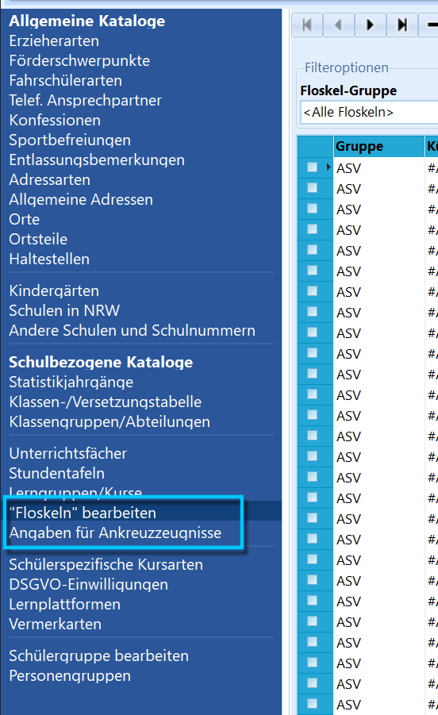
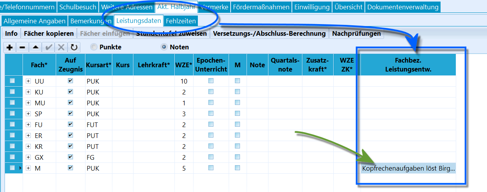

# Grundschulzeugnisse Hybridzeugnis (Tutorial)Nehmen Sie die Tutorials zu den Ankreuzzeugnissen und den
Floskelzeugnissen zur Kenntnis. Dort wird das Konfigurieren von
Ankreuzkompetenzen und Floskeln ausführlich beschrieben.

Dieser Artikel dient daher als verkürzte Übersicht für Hybridzeugnisse
in SchILD-NRW 3.

Die Vorlagen für das Hybridzeugnis finden sich im Bereich der
Grundschulzeugnisse auf der Webseite des MSB für
Schulverwaltungssoftware.

Hybridzeugnisse lassen sich wie die beiden anderen Typen der
Grundschulzeugnisse erzeugen. Je nach schulischer Festlegung werden
**Ankreuzkompetenzen** zu den Fächern sowie zum *Arbeits- und
Sozialverhalten* über *Kataloge ➜ Ankreuzkompetenzen definieren*
eingerichtet.

Die für die Fächer definierten Ankreuzkompetenzen werden anschließend
über *Gruppenprozesse ➜ Noten/Zeugnisvorbereitung ➜ Ankreuzkompetenzen
eintragen* den Schülerinnen und Schülern einer zuvor ausgewählten
Schülergruppe (zum Beispiel eines Jahrgangs) zugeordnet.Zusätzlich werden **Floskeln zu den Fächern** über *Kataloge ➜ Floskeln*
für die gewünschten Jahrgänge definiert.

Die Floskeln werden anschließend über *Schüler ➜ Leistungsdaten* im
*aktuellen Lernabschnitt* im Bereich **Fachbezogene
Leistungsentwicklung** eingetragen.Ein `Rechtsklick` auf **Fachbez. Leistungsentw.** öffnet den
Floskeleditor.Je nach Entscheidung der Schule sind in diesem Feld auch zusätzliche
oder ausschließlich manuelle Texteingaben ohne Floskeln möglich.Über die Webseite des MSB für Schulverwaltungssoftware kann im Bereich
*Downloads ➜ Zeugnisse* unter **Grundschulzeugnisse in Hybridform** das
Paket mit den Hybridzeugnisreports heruntergeladen werden.

Das Zeugnis wird über die Datei *HybridzeugnisEinstellungen.ini*
konfiguriert. Diese Konfigurationsdatei funktioniert wie in den anderen
Tutorials zum Zeugnisdruck beschrieben.Darüber lässt sich die Fächerreihenfolge festlegen, ebenso ab welchem
Jahrgang **Noten** ausgegeben werden und ob der Notenblock zweispaltig
dargestellt werden soll.