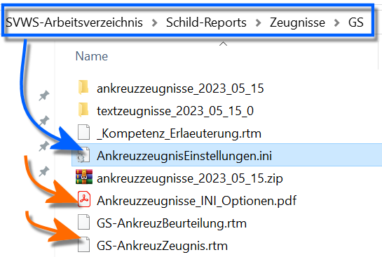
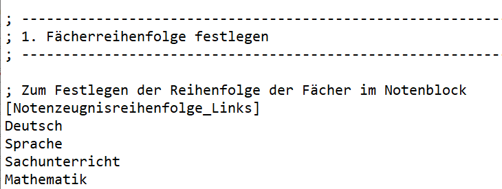
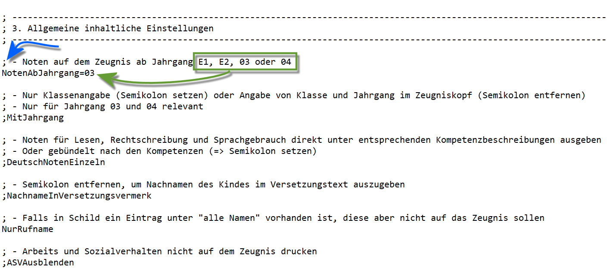

# Grundschulzeugnisse Konfiguration des Erscheinungsbildes von Zeugnissen (Tutorial) Nehmen Sie bitte die 

WIKILINK: Zeugnisse_Themenübersicht zur Kenntnis, wie
Zeugnisse zu installieren und über die *Zeugniseinstellungen.ini*
konfiguriert werden *könnten*.Bezüglich für die Grundschulzeugnisse ist dieses Tutorial hier eine
verkürzte, spezialisierte Übersicht.

## Der Speicherort der Dateien



 Die installierten Zeugnisformulare lassen sich in ihrem
Erscheinungsbild über eine Konfigurationsdatei einstellen. Diese Datei
wird mit einem Zeugnispaket mit heruntergeladen und ist somit enthalten.Bei den **Ankreuzzeugnissen** heißt die Datei
*AnkreuzzeugnisEinstellungen.ini*. Hierbei kann es sein, dass die
Dateiendung *".ini"* von Windows ausgeblendet wird und die Datei somit
lediglich als *AnkreuzzeugnisEinstellungen* angezeigt wird.Für die **normalen Zeugnisse** nutzen Sie die
*Zeugniseinstellungen.ini*, die bei den jeweiligen Zeugnissen
mitgeliefert wird. Für die **Hybridzeugnisse** heißt die Datei
entsprechend *HybridzeugnisEinstellungen.ini*.

Die Datei lässt sich **Bearbeiten**, indem Sie im Windows-Explorer oder
direkt aus dem Report-Explorer in ScHILD-NRW `doppelt angeklickt` wird.Bearbeiten Sie die Datei gewünscht und `speichern` Sie die gemachten
Einstellungen.Generieren Sie anschließend einen Zeugnis-Report, holt sich der Report
die Einstellungen automatisch aus der zugehörigen Konfigurationsdatei.  

## Aufbau der Konfigurationsdatei

Die Zeugnisdatei ist wie folgt aufgebaut:-   Zeilen, die mit einem *Semikolon (;)* beginnen sind für Menschen zu
    lesende Kommentare und werden vom Zeugnisformularbei der Verarbeitung ignoriert.-   Zusammengehörige Konfigurationen werden in Blöcken zusammengefasst,
    die mit eckigen Klammern umgeben sind.



 Soll zum Beispiel die Reihenfolge der Fächer im linken
Notenblock verändert werden, würde man` [Notenzeugnisreihenfolge_Links]`  
` Deutsch`  
` Sprache`  
` Sachunterricht`  
` Mathematik`zu der gewünschten Reihenfolge verändern` [Notenzeugnisreihenfolge_Links]`  
` Deutsch`  
` Mathematik`  
` Sprache`  
` Sachunterricht`  



 Soll verändert werden, ab welchem Jahrgang *Noten* gegeben
werden, wäre die Zeile` `*`NotenAbJahrgang=03`*so zu verändern, dass statt *03* eben *E1*, *E2* oder *04* steht.Hier ist zu sehen, dass die zur Eintragung zulässigen Werte immer in den
Kommentaren direkt bei der Zeile stehen.

::: warning

Beachten Sie, dass Änderungen, die in einem Jahr
vorgenommen werden, auch in allen Folgejahren in der dann neuen mit den
Zeugnissen ausgelieferten Konfigurationsdatei erneut einzutragen sind.*Bei der Fülle der Optionen sollte bedacht werden, dass man die meisten
Optionen in der Regel nicht verändern würde*. Bis auf ausgewählte
Felder, etwa mit welchen Namen unterzeichnet werden soll (Abschnitt 5)
beziehungsweise in Sonderfällen in Bezug auf einzelne Felder an der
eigenen Schule, kann der Standard belassen werden.

:::

## Inhalte der Datei und Felder zur KonfigurationIn der Datei werden folgende Aspekte konfiguriert. Wird ein Feld über
ein Semikolon ein- oder ausgeschaltet, ist das Semikolon hier in diesem
Artikel wie in der Datei als Standard entweder *gesetzt* oder
*entfernt*.

### 1. Fächerreihenfolge festlegenWie im Beispiel oben gezeigt werden die Bezeichnungen der Fächer *exakt
so geschrieben wie in der Datei vorgefunden* in die gewünschte
Reihenfolge gebracht.

### 2. Layout festlegen (Allgemein)Über die hier aufgeführten Schalter wird das allgemeine Layout mit
Schrift, Druck und Seitenumbrüchen gesteuert.| Steuerbefehl                                | Erklärung                                                                                                                                                                                                                                        |
|---------------------------------------------|--------------------------------------------------------------------------------------------------------------------------------------------------------------------------|
| **;Duplex=Vertikal**                        | aktiviert automatisch den doppelseitigen Druck durch Entfernen des Semikolons (**;**)                                                                                                                                                            |
| **Blocksatz**                               | Blocksatzdruck wird deaktiviert, wenn ein Semikolon gesetzt wird.                                                                                                                                                                                |
| **SchriftgroesseBemerkungen**=10            | steuert die Schriftgröße. Als Standard ist *10* gesetzt. Stellen Sie eine Schriftgröße "ähnlich groß wie 10" ein, um kleiner oder größer zu drucken.                                                                                             |
| **;ASVSeite2**                              | setzt das Arbeits- und Sozialverhalten erst auf die zweite Seite, wenn hier das Semikolon entfernt wird.                                                                                                                                         |
| **;FächerAufNeuerSeite**                    | steuert, ob die Fächer auf einer neue Seite begonnen werden. Steht das Semikolon, ist dieses Verhalten deaktiviert und die Fächer werden direkt auf der ersten Seite gedruckt.                                                                   |
| **BemerkungenAufNeuerSeite**=E1;E2;E3;03;04 | *BemerkungenAufNeuerSeite* steuert, vor welchen Jahrgängen ein Seitenumbruch für die Zeugnis- und Versetzungsbemerkungen erzeugt wird. Die Jahrgänge, *für die dies zutreffen soll*, folgen durch ein Semikolon aus Aufzählungszeichen getrennt. |
|                                             |                                                                                                                                                                                                                                                  |

### 3. Allgemeine inhaltliche EinstellungenHier werden generelle Einstellungen zu Inhalten vorgenommen.| Steuerbefehl                      | Erklärung                                                                                                                                                                                                               |
|-----------------------------------|-------------------------------------------------------------------------------------------------------------------------------------------------|
| **NotenAbJahrgang**=03            | NotenAbJahrgang lässt den Jahrgang setzen, *ab* dem Noten auf Zeugnissen gedruckt werden. Zulässige Start-Jahrgänge sind *E1, E2, 03* und *04*                                                                          |
| **;MitJahrgang**                  | wenn das Semikolon gesetzt ist, werden nur die Klassen im Zeugniskopf gedruckt. Wird das Semikolon entfernt, werden Klasse und Jahrgang ausgegeben. Diese Einstellung ist nur für die Jahrgänge *03* und *04* relevant. |
| **;DeutschNotenEinzeln**          | Noten für Lesen, Rechtschreibung und Sprachgebrauch direkt unter entsprechenden Kompetenzbeschreibungen **oder** gebündelt nach den Kompetenzen ausgeben. Für den letzteren Fall ist das Semikolon zu setzen.           |
| **;NachnameInVersetzungsvermerk** | Das Semikolon ist zu entfernen, um Nachnamen des Kindes im Versetzungstext auszugeben.                                                                                                                                  |
| **NurRufname**                    | Falls in SchILD-NRW ein Eintrag unter "alle Namen" vorhanden ist, diese aber nicht auf das Zeugnis gedruckt sollen, ist kein Semikolon zu setzen.                                                                       |
| **;ASVAusblenden**                | Arbeits und Sozialverhalten nicht auf dem Zeugnis drucken: Entfernen Sie das Semikolon.                                                                                                                                 |

### 4. Layout für Fächer und Kompetenzen festlegenÜber diese Schalter werden Layoutfunktionen wie Zeilenabstände,
Fächerposition, Linien zwischen Kompetenzen oder das verwendete
Ankreuzsymbol gesteuert.-| Steuerbefehl                                               | Erklärung                                                                                                                                                                                                                                                                                                                                                      |
|------------------------------------------------------------|----------------------------------------------------------------------------------------------------------------------------------------------------------------------------------------------------------------------------------------------------------------------------------------|
| **;Linien**                                                | Durch Weglassen des Semikolons werden Linien hinzugefügt                                                                                                                                                                                                                                                                                                       |
| **Vorname**                                                | Vorname des Kindes bei jedem Fach mit ausgeben, zum Deaktivieren der Linien ist das Semikolon setzen                                                                                                                                                                                                                                                           |
| **AbstandFaecher**=3                                       | Setzt den Abstand zwischen den Fächern                                                                                                                                                                                                                                                                                                                         |
| **;AbstandZuBemerkungen**=10                               | Setzt den Abstand zu den Bemerkungen                                                                                                                                                                                                                                                                                                                           |
| **KopfHoehe**=28                                           | Dieses Feld setzt die Breite der Fachkopfes in mm. Diese hängt auch von der Zahl gewählter Kompetenzstufen ab (immer, teilweise, überwiegend) und beeinflusst auch den Abstand zwischen Fach- und Kompetenzbeschreibung. Diese Einstellung wäre beim Wunsch auf individuelle Konfiguration durch Ausprobieren an das gewünschte Erscheinungsbild einzustellen. |
| **Zeilenhoehe**=5                                          | Höhe einer „Ankreuz-Zeile“ in mm. Erlaubte Werte sind *4* oder *5*.                                                                                                                                                                                                                                                                                            |
| **FachPosition**=Mitte                                     | Vertikale Position der Fächerbezeichnungen. Erlaubte Werte sind *Oben* und *Mitte*.                                                                                                                                                                                                                                                                            |
| **;Zusammmenhalten**                                       | Ist Fächer *zusammenhalten* per Auslassung des Semikolons aktiviert, werden innerhalb eines Faches keine Zeilenumbrüche erzeugt.                                                                                                                                                                                                                               |
| **;ZusammenhaltenE1**=Deutsch(einzeln);Englisch;Mathematik | Sollen nur einzelne Fächer zusammengehalten werden, lässt sich dies jeweils für die benannten Jahrgänge für die Jahrgänge über diese Schalter erzeugen. Die Option (einzeln) gilt nur für das Fach Deutsch.                                                                                                                                                    |
| **;ZusammenhaltenE2**=Deutsch(einzeln);Englisch;Mathematik |                                                                                                                                                                                                                                                                                                                                                                |
| **;Zusammenhalten03**=Deutsch(einzeln);Englisch;Mathematik |                                                                                                                                                                                                                                                                                                                                                                |
| **;Zusammenhalten04**=Deutsch(einzeln);Englisch;Mathematik |                                                                                                                                                                                                                                                                                                                                                                |
| **Ankreuzsymbol**=X                                        | Hier wird das Symbol für Ankreuzkästchen gewählt. Der Wert *X* setzt ein "X", *C* setzt einen Haken.                                                                                                                                                                                                                                                           |
| **LeereAnkreuzkompetenzen**=Z                              | Legt die Sichtbarkeit von nicht gesetzten Ankreuzkompetenzen fest. Beim Wert *Z* (=Zeigen) werden nicht gesetzte Kompetenzen auf dem Zeugnis ausgegeben, beim Wert *D* (Durchgestrichen) erscheinen nicht gesetzte Kompetenzen durchgestrichen auf dem Zeugnis, beim Wert *A* (Ausblenden) werden nicht gesetzte Kompetenzen ausgeblendet.                     |
| **FachKopfSichtbarE1**=SG;M;SP                             | Kompetenzstufen werden i.d.R. für jedes Fach mit gedruckt. Soll dies für bestimmte Jahrgänge genauer gesteuert werden, können hier die Fächer angegeben werden, für welche die Kompetenzstufen gedruckt werden. Wird die ganze Zeile per Semikolon deaktiviert, werden für alle Fächer Kompetenzstufen gedruckt.                                               |
| **;FachKopfSichtbarE2**=SG;M;SP                            |                                                                                                                                                                                                                                                                                                                                                                |
| **;FachKopfSichtbar03**=KR;RS;MU                           |                                                                                                                                                                                                                                                                                                                                                                |
| **;FachKopfSichtbar04**=D;E;M                              |                                                                                                                                                                                                                                                                                                                                                                |

### 5. Anpassungen der Unterschriften (Text und Layout)Über diese Schalter werden Art und Layout der Unterschriften gesteuert.
| Steuerbefehl | Erklärung |
| --- | --- |
| Unterschrift =VN | Über die unterschiedlichen Optionen wird die Art der<br>Unterschriften eingestellt. Zulässige Schalter sind VN = Vorname Nachname NV = Nachname, Vorname N = Nachname, KlassenlehrerIn ON = Klassenleitung |
| PositionSchulleitungText =R | Zulässige Optionen zur Positionierung der<br>Schulleitungsunterschrift sind R für rechts und L für<br>links. |
| ;SchulleitungText =Vertretung (Frau<br>Mustermann) | Falls nicht die in SchILD hinterlegte Schulleitung<br>unterschreibt, ```kann hier ein freier Text eingegeben werden, der unter der Linie zum unterschreiben gedruckt wird. 

Das Semikolon vor ``` ```';SchulleitungText=``` ``` muss in bei einem gewünschten Eintrag zusätzlich der Angabe des freien Textes entfernt werden.``` |
| UnterschriftMitStVertr =nein | Ist die Stellvertrende Klassenleitung auch anzeigen?<br>Optionen: ja , nein . |
| ;KlassenleitungText =Klassenleitung | Falls nicht die Klassenleitung aus SchILD-NRW unterschreiben<br>soll, kann hier ein Text eingegeben werden. |
| ;SonderpaedagogeText =Herr Mustermann | Der Name der sonderpädagogischen Lehrkraft wird i.d.R. aus<br>SchILD-NRW heraus generiert. Über diesen Schalter ein (freier) Name für<br>die Unterschrift eingetragen werden. |

### 6. Anpassen von Überschriften und Textpassagen
| Steuerbefehl | Erklärung |
| --- | --- |
| ASVText =Arbeitsverhalten | Hier lässt sich mit einem freien Text die Überschrift für das<br>Arbeits- und Sozialverhalten setzen. |
| LELSText = | Überschrift für den Leistungsstand. Das Feld kann wie im Standard<br>auch leer bleiben. |
| ;WiderspruchInEingangsphaseAusblenden | Per Standard ist der Widerspruchtstext für die Schuleingangsphase nicht ausgeblendet, wird also angezeigt. Ein Entfernen des<br>Semikolons führt somit dazu, dass der Widerspruchstext nicht angezeigt<br>wird. |
| ;Folgejahrgang | Steuert, ob bei einer "Versetzung" die neue Klasse oder<br>der neue Jahrgang angezeigt wird. Wird der Schalter Folgejahrgang über das Semikolon Deaktiviert wird ein Klassentext erzeugt: Max wird in die Klasse 03a versetzt Ist der Schalter aufgrund des entfernten Semikolons Aktiviert , wird ein Jahrgangstext erzeugt: Aktiviert => Max<br>wird in den Jahrgang 03 versetzt |
| BemerkungText =Bemerkung | Sofern hier ein Eintrag vorgenommen wird, ist dies die<br>Überschrift für weitere fachbezogene Bemerkungen (unterhalb der<br>Kompetenzen)). |
| ;BemerkungLeerText =-keine- | Ist keine Bemerkung eingetragen, soll der folgende freie<br>Text erscheinen. Wenn ein Text gesetzt wird, muss der Schalter auch noch<br>durch das Entfernen des Semikolons aktiviert werden. |
| ;SchulbesuchsjahrText =Schuleingangsphase $JAHR$.<br>Schulbesuchsjahr | Der Text für Schulbesuchsjahre im Zeugniskopf kann bei bei Bedarf<br>angepasst werden. Sofern ein Text gesetzt wird, ist der ganze Eintrag<br>zusätzlich durch Entfernen des Semikolons zu aktivieren. |
