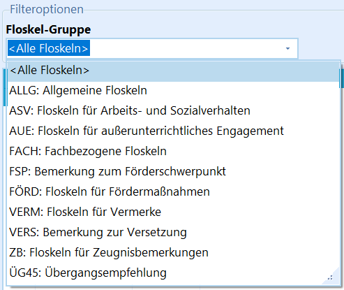
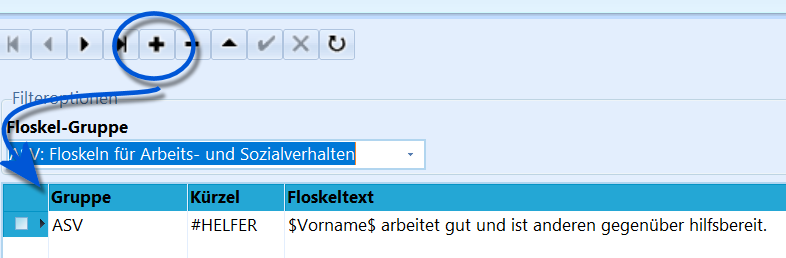
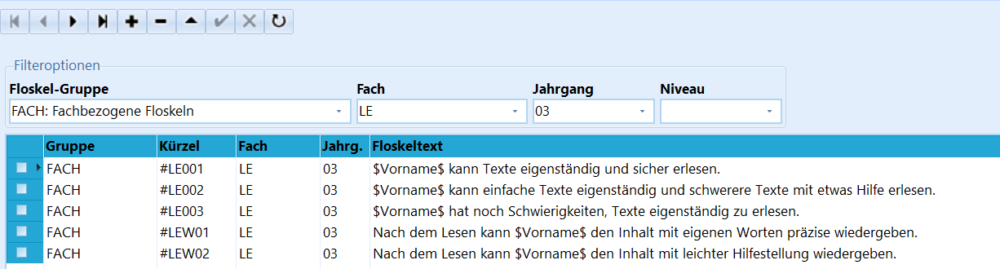
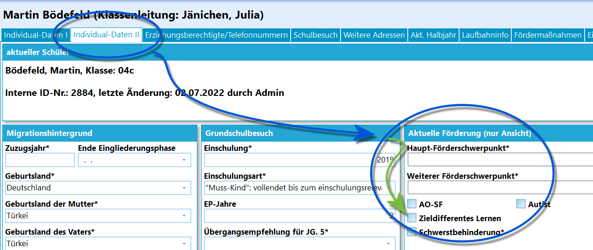
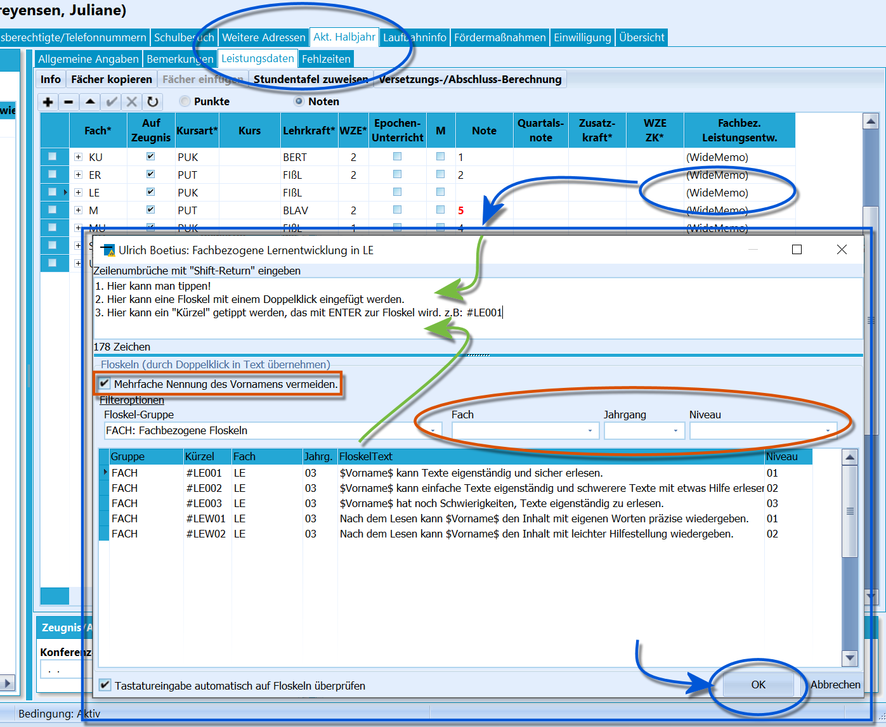
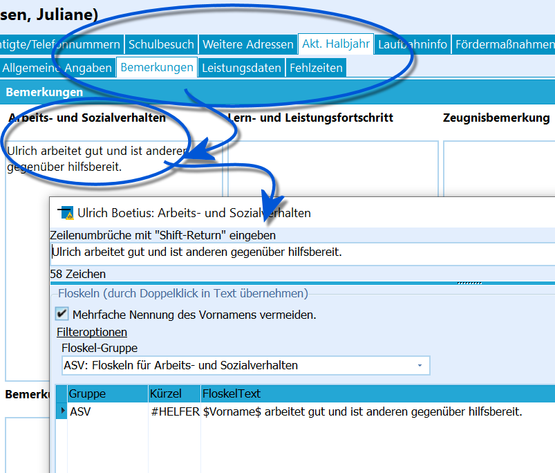
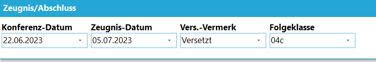
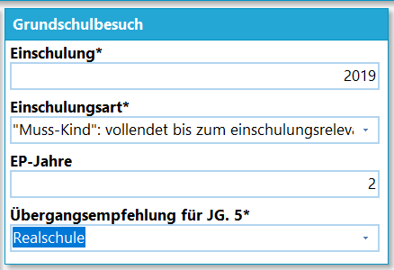
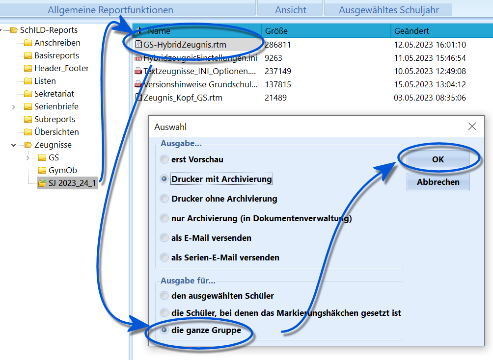

# Grundschulzeugnisse Textzeugnis (Tutorial)Schließen Sie die

WIKILINK: Grundschulzeugnisse_Vorbereitung_für_Text-_und_Ankreuzzeugnisse_(Tutorial)
in ihrer Schule ab.

## Floskeln anlegen

 Neben den Noten werden in der Grundschule je nach Jahrgang
auch Bemerkungen zu den Fächern, dem Leistungsstand und der
Lernentwicklung auf dem Zeugnis ausgegeben.Um diese bis einschließlich Jahrgang 3 zu erfassen und einheitlich zu
formulieren, können in SchILD-NRW vorformulierte Textbausteine,
sogenannte *Floskeln*, hinterlegt werden.Floskeln sind in *Gruppen* sortiert. Die Gruppe *AUE* enthält etwa die
Floskeln zum *Außerunterrichtlichen Engagement* und *FACH* die
*Fachbezogenen* Floskeln.

Die Floskeln stehen dann je nach Kontext zur Verfügung. Werden zum
Beispiel *Zeugnisbemerkungen* eingegeben, stehen nur die Floskeln dieser
Gruppe zur Auswahl.  

 Öffnen Sie den Floskeleditor über *Kataloge* ➜ **"Floskeln"
bearbeiten**.Es ist die `Gruppe` zu wählen, zu der eine Floskel gehört.Weiterhin muss ein in der Datenbank *eindeutiges* **Kürzel** vergeben
werden.Geben Sie den **Floskeltext**, falls gewünscht mit den entsprechenden
Platzhaltern, ein.

Diese Floskel kann nun verwendet werden.  

 Bei Floskeln zu *Fördermaßnahmen* und bei *Fachbezogenen
Floskeln* ist noch ein **Fach** anzugeben, für das die Floskel gilt. Bei
den *Fachbezogenen Floskeln* ist weiterhin noch der **Jahrgang** zu
definieren und es kann noch ein **Niveau** festgelegt werden.Auch während der Eingabe kann hier schon auf diese Felder gefiltert
werden.Einen gesetzten Filter können Sie entfernen, indem Sie den Eintrag im
Feld *markieren* und dann die `Entf`-Taste drücken.

### Import und Export

Verfügen Sie über eine Datei Excel-Datei mit Vorlagen zum Import,
klicken Sie auf `Import` und wählen Sie diese Datei aus. Die Kompetenzen
stehen nun in SchILD zur Verfügung.

Die hier verwendete Datei wurde im Zeugnisbereich auf der Seite des [MSBfür Schulverwaltungssoftware](https://www.svws.nrw.de) heruntergeladen.
An gleicher Stelle finden Sie ebenfalls eine leere Excel-Datei, die für
das Befüllen mit eigenen Einträgen vorbereitet wird.Entsprechend können Floskeln zur Weitergabe und -verarbeitung auch
**exportiert** werden.Klicken Sie hierzu auf `Export` und wählen Sie einen Dateispeicherort.

::: warning

Um Ankreuzkompetenzen beziehungsweise Textbausteine für
einen anderen Jahrgang einzugeben, können Sie die Arbeit sparen, indem
Sie die Eingabe einmal für einen Jahrgang vornehmen, dann exportieren
und in einem Tabellenverarbeitungsprogramm ihrer Wahl die Zeilen
kopieren beziehungsweise den Jahrgang ändern. Dann nehmen Sie einen
erneuten Export vor.

:::

::: warning

\* Fachfloskeln werden für den Jahrgang *E3* nicht
eingegeben. Hier werden die Floskeln des Jahrgangs *E2* verwendet.-   Sie können Floskeln mit einem Doppelklick direkt in das Textfenster
    übernehmen.
-   Wenn das *Kürzel* mit einem **\#** beginnt, kann eine Floskel auch
    über das Eintippen *"#KÜRZEL"* eingegeben werden.
-   Bei der Eingabe von Floskeln kann der Haken bei **Mehrfache Nennung
    des Vornamens vermeiden** gesetzt werden. Das erste Vorkommen des
    Platzhalters *$Vorname$* wird dann zum Vornamen, folgende Nennungen
    werden zu *er* oder *sie*.

:::

## Zeugnisse herunterladenLaden Sie die Textzeugnisse herunter und legen Sie diese im
SVWS-Arbeitsverzeichnis ab, wie es im Wiki-Artikel zur Vorbereitung des
Zeugnisdrucks beschrieben ist.

::: warning

Das Hybridzeugnis kann für Schülerinnen und Schüler aus
der Jahrgangsstufe 4, die zieldifferent unterrichtet werden, genutzt
werden.Dazu muss in SchILD die Auswahl **zieldifferentes Lernen** unter
*Schüler* ➜ **Individual-Daten II** aktiviert sein.

:::  

## Eingabe von Floskeln

### Fachleistungen

 Gehen Sie über *Schüler ➜ Akt. Halbjahr ➜ Leistungsdaten*
zu der Tabelle mit den Fächern der Schüler.Tragen Sie nun, sofern es diese gibt, die Noten ein.

::: warning

Diese Eintragungen werden in der Regel durch die
Fachlehrkräfte vorgenommen.

:::

Klicken Sie dann mit einem Doppelklick in der Spalte **Fachbez.

Leistungsentw.** auf *(WideMemo)* des entsprechenden Faches.Es öffnet sich der Editor. In diesem können Sie von Einträge vornehmen.-   Es ist die Eingabe von Hand möglich.
-   Ein Doppelklick auf eine Floskel fügt diese hinzu.
-   Schreiben Sie das *Kürzel* einer Floskel aus, wird dieses
    automatisch durch die entsprechende Floskel ersetzt (sofern unten
    *Texteingabe automatisch auf Floskeln überprüfen* gesetzt ist).Nutzen Sie auch die Filteroptionen, um die angezeigten Floskeln
einzuschränken.

::: warning

\* Einen Zeilenumbruch erzeugen Sie mit `Shift + Enter`.-   Einen fehlerhaften Eintrag entfernen Sie im Editorfenster, indem er
    markiert wird, dann drücken Sie `Entf`.

:::

Wurden Floskeln definiert, können diese auch in externen Tools verwendet

werden, zum Beispiel in SchILDweb oder dem Externen Notenmodul.**BETA: Das Notenmodul steht noch nicht zur Verfügung.**   

### Bemerkungen

 Unter Akt. Halbjahr Bemerkungen werden durch die
Klassenleitung oder Schulleitung an oder nach der Zeugniskonferenz noch
weitere Bemerkungen gesetzt.Weitere Bemerkungen sind zu diesen Feldern möglich:-   **Arbeits- und Sozialverhalten**
-   **Lern- und Leistungsfortschritt**
-   **Außerunterrichtlichem Engagement**
-   **Förderschwerpunkt**Weiterhin werden im Zuge von Versetzungen oder auch zum Abschluss von
Jahrgang 4 weitere Bemerkungen für das Zeugnis aufgenommen-   **Zeugnisbemerkungen**
-   **Bemerkungen zur Versetzung**
-   **Empfehlung für Fortsetzung der Schullaufbahn**

::: warning

**Lern- und Leistunggstand**: Eingaben bei den
grundsätzlichen Angaben zur *Lernentwicklung und zum Leistungsstand*
haben bei der Zeugnisgenierung Vorrang vor den fachbezogenen Eingaben.Wenn Sie also zu jedem Fach einen eigenen Bemerkungstext eingeben
wollen, so muss dies beim jeweiligen Fach auf dem Karteireiter
"Leistungsdaten" erfolgen. Somit wird dann bei *Lern- und
Leistungsfortschritt* nichts mehr eingegeben.Soll der Lern- und Leistungsstand zusammenfassend für alle Fächer auf
dem Zeugnis ausgeben werden, sind die Fachbezogenen Bemerkungen frei zu
lassen und die Zusammenfassung wird über *Lern- und
Leistungsfortschritt* erfasst. Hier lassen sich natürlich auch passende
Floskeln definieren und verwenden.

:::

Weiterhin wird der Bereich zum **Arbeits- und Sozialverhalten** auf dem

Zeugnis nur ausgegeben, wenn auch eine Bemerkung hierzu gesetzt wurde.

Das Feld **Empfehlung für Fortsetzung der Schullaufbahn** wird ab dem 1.
Halbjahr von Jahrgang 4 verwendet, um weitere Informationen zur
*Übergangsempfehlung* für den Jahrgang 5 auszugeben.  

## Weitere Ausgaben

 Befindet sich eine Schule im 2. Halbjahr, wird auch der
Versetzungsvermerk mit ausgegeben, der sich im Fuß des Reiters *Schüler
➜ Akt. Halbjahr* befindet.  

 Unter *Schüler ➜ Individual-Daten II* wird ab dem Zeugnis
des 1. Halbjahres von Jahrgang 4 die **Übergangsempfehlungen**
eingetragen.Tragen Sie unter dem Bemerkungsfeld **Empfehlung für die Fortsetzung der
Schullaufbahn** an dieser Stelle eine eventuelle Erläuterung ein.  

### Ankreuzkompetenzen von ASV im Jahrgang 4Mitunter wird das *Arbeits- und Sozialverhalten* im Jahrgang 4 über
Ankreuzkompetenzen ausgegeben.In diesem Fall wird das ASV nicht über einen Text erfasst, sondern über
die Kompetenzen erfasst. Das *Hybridzeugnis* ist in der Lage, diese
Situation bei Vorhandensein entsprechender Daten zu verarbeiten. Sollen
weitere Ankreuzkompetenzen anderer Fächer ausgegeben werden, wäre das
*Ankreuzzeugnis* zu verwenden.Beachten Sie hierzu bitte die Steuerungsoptionen durch die
*Zeugniseinstellungen.ini* aus dem Wiki-Artikel zur Vorbereitung der
Zeugnisse.

## Zeugnisdruck

 Drucken Sie die Zeugnisse über die Reportverwaltung.Wählen sie hierzu die Klasse bzw. den Jahrgang im Schülercontainer aus,
für die der Zeugnisdruck angestoßen werden soll.Dann Doppelklicken Sie auf das entsprechende Zeugnisformular. Hier im
Beispiel ist die *Dokumentenverwaltung* aktiv, wir erzeugen also einmal
einen Druck der Zeugnisse auf dem Drucker und dann wird noch eine Kopie
als .pdf bei dem jeweiligen Schüler abgelegt. Wichtig: Klicken Sie auf
*die ganze Gruppe*, um die gesamte Gruppe zu verarbeiten.Sind Sie nicht sicher, wie die Zeugnisse aussehen werden, wählen Sie
*erst Vorschau*, um sich das beispielhafte Ergebnis anzusehen.