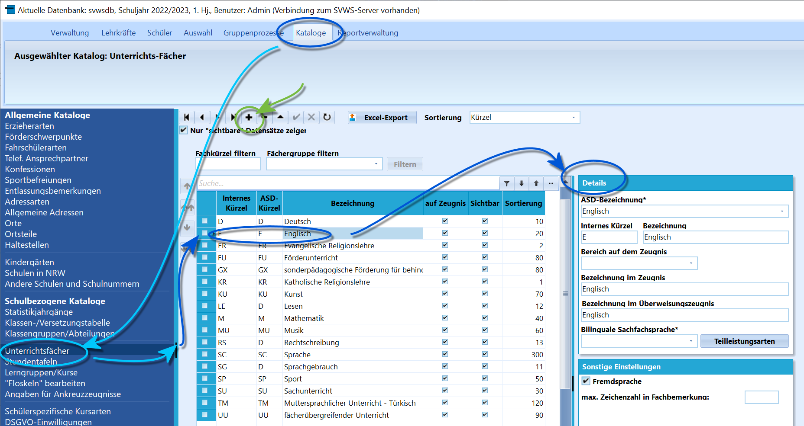
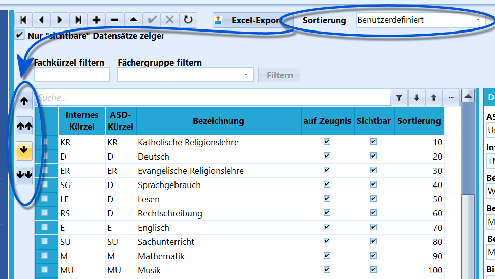
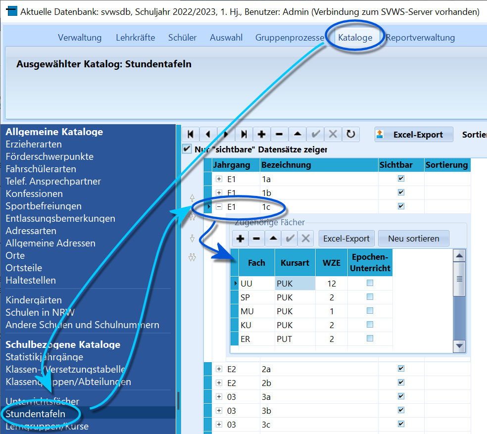
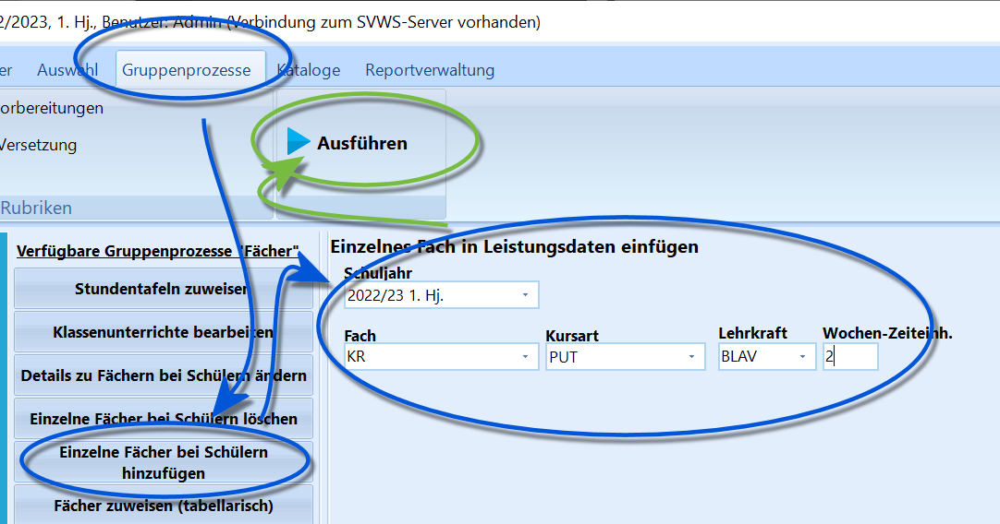
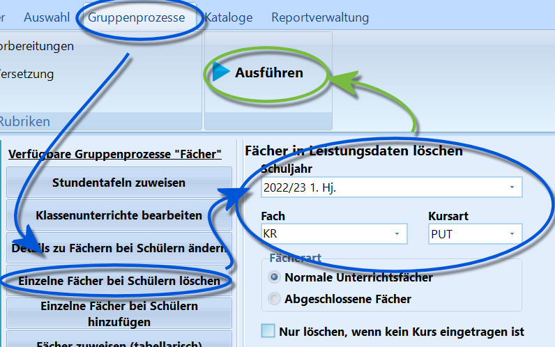
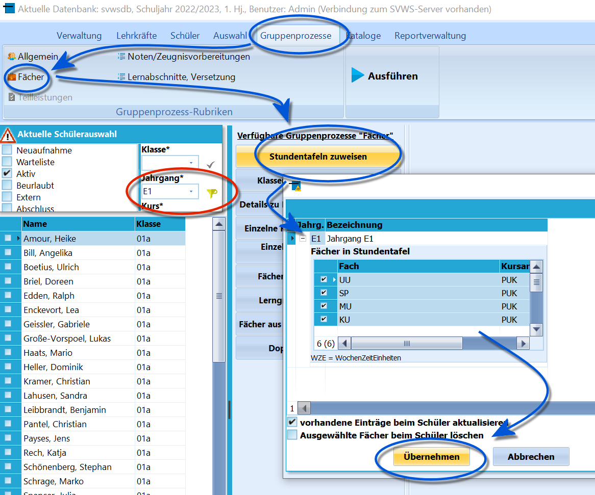
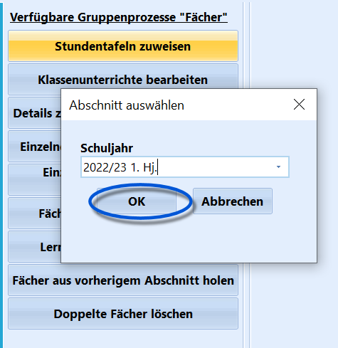
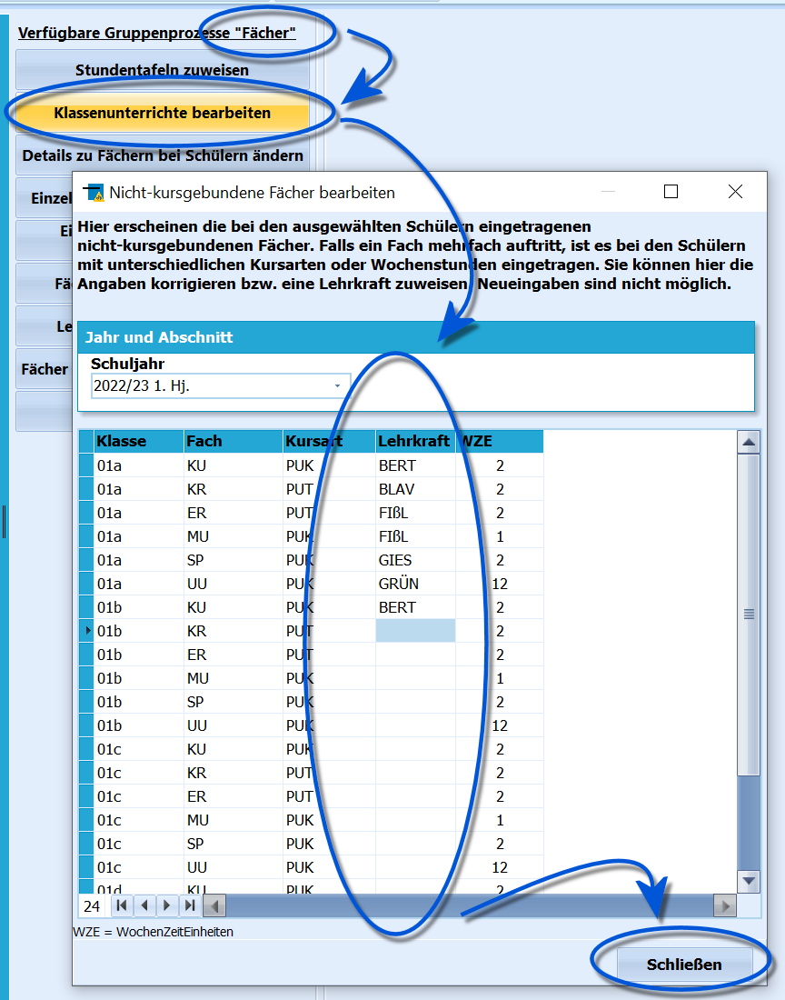
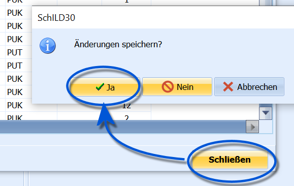
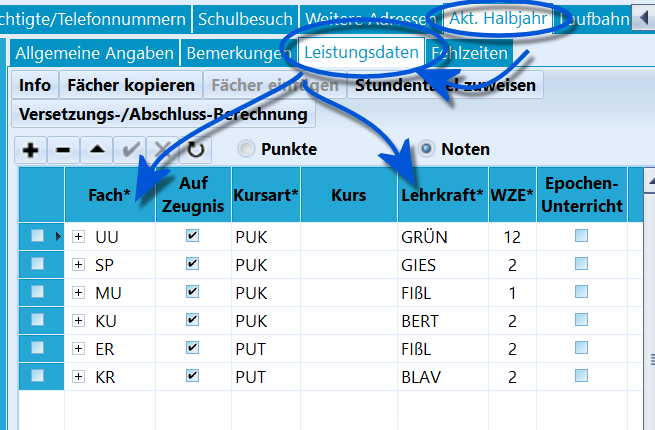

# Grundschulzeugnisse Vorbereitung für Text- und Ankreuzzeugnisse (Tutorial) Damit Leistungsdaten für die Grundschule erhoben werden
können, um *Textzeugnisse*, *Ankreuzzeugnisse* oder *Lernstandsberichte*
mit den bereitgestellten Formularen erzeugt werden können, müssen in
SchILD-NRW einige Vorbereitungen getroffen werden.

::: warning

Ein Nutzen für die Statistik ist, dass sofern die
notwendigen Daten in SchILD hinterlegt wurden, die Unterrichtsverteilung
(UVD) und die Lehrerdaten mit den zeitabhängigen Daten direkt für die
Statistik exportiert werden können. Somit muss die Eingabe in ASDPC
nicht (erneut) vorgenommen werden.

:::

Damit Schülern individuell Leistungsdaten eingetragen werden können,

müssen den Schülern passende Fächer mit Fachlehrkräften zugeordnet
werden.Hierzu sind folgende Schritt durchführen1.  **Fächerkatalog anlegen**: Einstellen, welche Fächer in der Schule
    existieren.
2.  **Stundentafel einrichten**: Vorlagen auf Jahrgangsbasis erzeugen,
    mit denen dann die Fächer Schülern zugeordnet werden.
3.  **Fächer den Schülern zuweisen**: Hier werden den Schülern, mittels
    der Stundentafel, ihre Fächer zugewiesen.
4.  **Lehrer den Fächern zuweisen**: Fächer brauchen auch LehrkräfteSchlussendlich können Leistungsdaten (Noten) erfasst werden
beziehungsweise es können Textzeugnisse und Ankreuzzeugnisse
konfiguriert werden.

## Fächerkatalog anlegen

 Öffnen Sie *Kataloge* ➜ **Unterrichtsfächer** die in der
Schule grundsätzlich vorliegenden Fächer.So können existierende Fächer bearbeiten, indem Sie ein Fach anklicken
und dann in den *Details* auf der rechten Seite die konkreten
Einstellungen vornehmenLegen Sie neue, benötigte Fächer mit einem Klick auf das **+** an und
stellen Sie dann auf der Rechten Seite die Details zu ihnen ein.Achten Sie darauf, für das Fach gültige **ASD-Bezeichnungen** zu wählen,
denn diese werden von der Statistik ausgewertet.Weiterhin wichtig ist, aus dem Dropdown-Menü **Bereich auf dem Zeugnis**
zu wählen, da hierüber eingestellt wird, wie die Fächer auf dem Zeugnis
gruppiert werden.Für jedes Fach kann ausgewählt werden, ob bei einem Haken bei *Auf
Zeugnis* auf dem Zeugnisformular ausgegeben wird.

### BasisfächerTypischerweise sollten mindestens folgende Basisfächer vorhanden sein:-   Deutsch
    -   Lesen
    -   Rechtschreibung
    -   Sprachgebrauch
-   Mathematik
-   Sachunterricht
-   Religion
    -   Katholische Religionslehre
    -   Evangelische Religionslehre
    -   Weitere Religionslehren (sofern vorhanden)
-   Englisch
-   Sport
-   Musik
-   Kunst

::: warning

In Bezug auf das Fach **Deutsch** ist zu beachten, dass
zusätzlich *Lesen*, *Rechtschreiben* und *Sprachgebrauch* auf dem
Zeugnis ausgebeben werden und daher auch als Fach angelegt werden
müssen.Ordnen Sie *Deutsch* in jedem Fall dem **Zeugnisbereich** *Deutsch* zu.Ordnen Sie *Lesen*, *Rechtschreiben* und *Sprachgebrauch* dann ebenfalls
dem Bereich *Deutsch* zu, wenn Sie jeweils individuelle Lern- und
Leistungsstände eintragen möchte. Ansonsten ordnen Sie diese drei
Teilfächer der Fächergruppe *Sprache* zu.

:::  

### Fächerreihenfolge

 Um einzustellen, in welcher Reihenfolge die Fächer auf dem
Zeugnis ausgegeben werden, wählen Sie die **Sortierung**
`Benutzerdefiniert`. Dann klicken Sie ein Fach an und nutzen die kleinen
Pfeile links,**🠕** bzw. **🠗**, um das Fach nach oben oder unten zu
schieben.Mit den *Doppelpfeilen* (**🠕🠕** beziehungsweise **🠗🠗**) wird ein Eintrag
jeweils um zehn Plätze verschoben.Sollte SchILD nachfragen, dass die Daten *reorganisiert* werden müssten,
bestätigten Sie diese Nachfragen.

::: warning

Der Fächerkatalog muss nur einmal angelegt und dann
lediglich bei Änderungen angepasst werden.

Die Fächern können über *Gruppenprozesse ➜ Fächer* ➜ **Fächer in
Leistungsdaten neu sortieren** kann die Neusortierung in einem zu
wählenden Lernabschnitt bei größeren Schülergruppen, auch in der ganzen
Schule, auf einmal durchgeführt werden.

:::

## Stundentafeln einrichten

 Damit die Fächer konkret einer Gruppe in einem
Lernabschnitt zugeordnet werden können, werden für diese Zuordnung
Vorlagen erstellt. Diese heißen *Stundentafeln*.

::: warning

Es gilt wie bei dem Fächerkatalog: Eine einmal
definierte Stundentafel kann für jeden Lernschabschnitt wiederverwendet
werden und muss nur bei Änderungen einmalig angepasst
werden.

:::

Hier im Beispiel wurde für jede Klasse eine Stundentafel mit den jeweils

im Lernabschnitt unterrichteten Fächerkombination angelegt.**WZE** steht hierbei für die "**W**ochen**z**eit**e**inheit" und die
Kursart bezeichnet, ob im Klassenverband (PUK) oder in Teilgruppen (PUT)
auf Kursbasis unterrichtet wird.

::: warning

Je nachdem, wie der Unterricht organisiert ist, kann es
ausreichen, Stundentafeln nicht wie im Beispiel *klassenweise*, sondern
auch nur *jahrgangsweise* zu definieren.

:::

Legen Sie erst eine Stundentafel mit dem oberen **+** an.Bei der Neuanlage muss eingegeben werden, für welchen **Jahrgang** die

Tafel gilt und es muss eine **Bezeichnung** gewählt werden.In der Stundentafel selbst legen Sie neue Fächer mit dem unteren **+**
an.

::: warning

Um Fächer für ähnliche Stundentafeln nicht immer neu
eingeben zu müssen, wählen Sie eine ähnliche Stundentafel als Vorlage
und klicken Sie mit der rechten Maustaste und wählen sie
`Fächer kopieren`.Sie können nun in einer neuen, leeren Tafel `Fächer einfügen` über die
rechte Maustaste aufrufen und die gerade kopierten Fächer
einfügen.

:::

### Sonderfall Religion

 

 Religion nimmt bei den Stundentafeln eine
Sonderrolle ein. Im Gegensatz zu den anderen Fächern wird katholische
und evangelische Religionslehre (und evtl. auch islamische
Religionslehre) nur einem Teil der Schüler des jeweiligen Jahrganges
zugewiesen.Es gibt zwei Optionen, mit den Religionsfächern umzugehen:-   **

Die Religionsfächer sind in den Stundentafeln enthalten**: Nach
    der Zuweisung der Stundentafeln muss dann bei den Schülern, die den
    betreffenden Religionsunterricht *nicht* besuchen, das Fach
    gelöscht, oder das Häkchen „auf Zeugnis“ deaktiviert, werden.
-   **

Die Religionsfächer sind in den Stundentafeln nicht enthalten**:
    Nach der Zuweisung der Stundentafeln muss das jeweilige
    Religionsfach individuell den jeweiligen Kindern zugewiesen werden.Für beide Vorgänge ist der Weg über Gruppenprozesse zu gehen. Im ersten
Fall handelt es sich um *Gruppenprozesse ➜ Fächer* ➜ **Einzelne Fächer
bei Schülern hinzufügen**.Im zweiten Fall wird *Gruppenprozesse ➜ Fächer* ➜ **Einzelne Fächer bei
Schülern löschen** genutzt.

::: warning

In beiden Fällen werden erst *die Schüler im
Schülercontainer ausgewählt*, für die der Gruppenprozess durchgeführt
werden soll, dann wird der Prozess gestartet.

:::  

### Stundentafeln zuweisen

 Die vorbereiteten Stundentafeln lassen sich nun
Schülergruppen, also klassen- oder jahrgangsweise, per Gruppenprozess
hinzufügen.Der Prozess wird über *Gruppenprozess ➜ Fächer* ➜ **Stundentafel
hinzufügen** angestoßen.Hier im Beispiel wurde erst der ganze Jahrgang *E1* ausgewählt, dann
wird diesem die für den ganzen Jahrgang definierte Stundentafel
*Jahrgang E1* hinzugefügt. Unsere Klassen haben alle die gleiche
Stundentafel.Klicken Sie auf `Übernehmen`.Beachten Sie, dass Sie über die entsprechenden Schalter hier auch die
Fächer der Stundentafel **aktualisieren** können, so dass keine
doppelten Fächer angelegt werden, sondern nur neu hinzugefügte.Auch ist es möglich, alle Fächer der gewählten Stundentafel zu
**löschen**.  

Wir wählen hier den aktuellen Lernabschnitt als den Abschnitt, in dem
die Fächer hinzugefügt werden sollen und klicken auf `OK`.

Die Stundentafel wurde verarbeitet.  

## Lehrkräfte hinzufügen

 Grundsätzlich können nun Leistungsdaten in die vorhandenen
Fächer eingetragen werden.

::: warning

**BETA**: Das Externe Notenmodul für SchILD3 befindet
sich noch in der Entwicklung. Aussagen hierzu werden bei
Veröffentlichung folgen.

:::

DEADLINK: `Kategorie: BETA` - Kategorie:_BETA.md

Es ist aber dennoch empfehlenswert, Lehrkräfte bei den Fächern

einzutragen.

::: warning

Wenn Sie die Lehrkräfte hier bei den Unterrichtsfächern
in SchILD-NRW für die Klassen eintragen und noch unter *Lehrkräfte* die
*zeitabhängigen Daten* pflegen, können Sie die *UVD.txt* und
*Lehrer.txt* für die Statistik direkt aus SchILD exportieren und in
ASDPC einlesen.Zumindest die zeitabhängigen Daten müssen dann nicht jedes Jahr komplett
neu in ASDPC händisch eingetragen werden, sondern werden in SchILD-NRW
nur jährlich aktualisiert und dann neu exportiert.

:::

Lehrkräfte werden klassenweise zugewiesen, denn in parallelen Klassen

werden gleiche Fächer möglicherweise von unterschiedlichen Lehrkräften
unterrichtet.Weisen Sie die Stundentafeln und die Lehrkräfte direkt nacheinander zu,
können Sie die Filterung auf den Jahrgang beibehalten.Starten Sie *Gruppenprozesse ➜ Fächer* ➜ **Klassenunterrichte
bearbeiten** und wählen Sie den aktuellen Abschnitt.Weisen Sie dann über das Dropdownmenü bei **Lehrkraft** die passende
Lehrkraft zu.Klicken Sie anschließend auf `Schließen`.  

 Bestätigen Sie mit `Ja`, um die gerade getätigten Eingaben
zu übernehmen.  

 Sie finden die eingetragenen Fächer und Lehrkräfte nun in
den Leistungsdaten der Schüler unter *Schüler ➜ Akt. Halbjahr ➜
Leistungsdaten*.  

## EinstellungenUm die Eingabe von Noten und Bemerkungen außerhalb des gewünschten
Zeitraums zu sperren, gehen Sie auf ''Verwaltung ➜ Globale Einstellungen
➜ Fächer, Noten" und setzen Sie den Haken bei **Noteneingabe
gesperrt**.  

## Zeugnisse herunterladen und die Reports ablegen

0 Laden Sie nun die Zeugnisse von der Webseite für 

DEADLINK: desMSB - https://www.svws.nrw.de%7CSchulverwaltungssofte

.Sie finden derzeit (Stand der Angabe Juli 2023) unter *Download ➜
Schild-Reports ➜ Zeugnisformulare* die für Ihre Schulform vorgesehenen
Zeugnisformulare.

::: warning

Hier im Beispiel werden *Textzeugnisse* installiert.

Die Installation der *Ankreuzzeugnisse* funktioniert genau gleich, nur
dass eine andere .zip-Datei heruntergeladen wird.

:::  

1 Die .zip-Datei muss in ihrem SVWS-Arbeitsverzeichnis in
den Ordner *Schild-Reports* **entpackt** werden.  

2    

## Anhang: Konfiguration des Erscheinungsbildes von ZeugnissenNehmen Sie im Rahmen der Vorbereitung von Grundschulzeugnissen den
Anhang zur 

WIKILINK: Grundschulzeugnisse_Konfiguration_des_Erscheinungsbildes_von_Zeugnissen_(Tutorial)
zur Kenntnis.