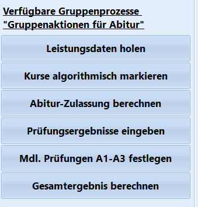
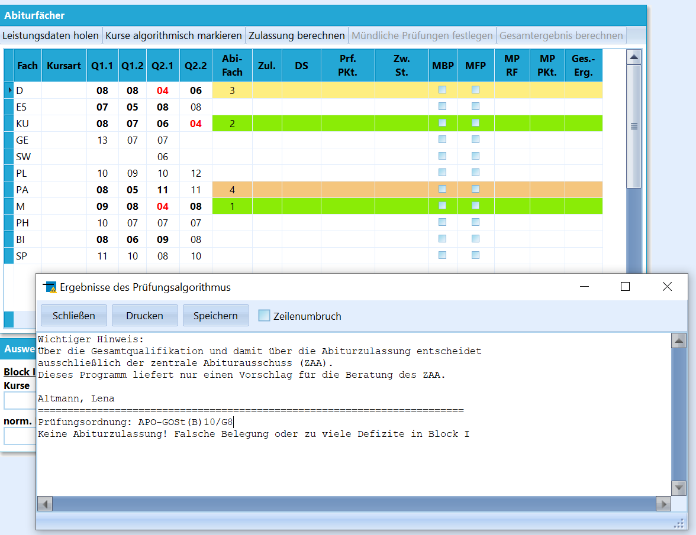
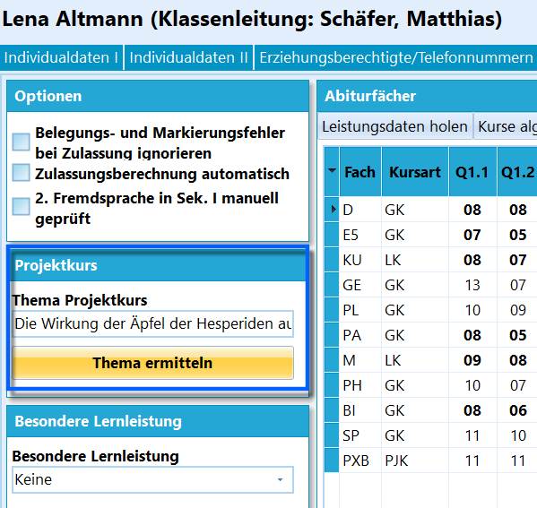
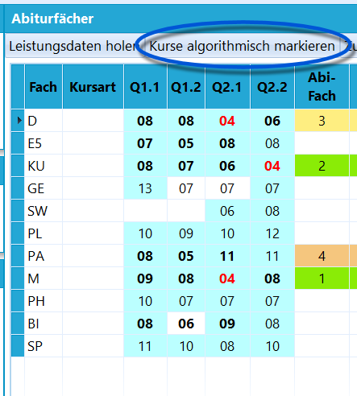
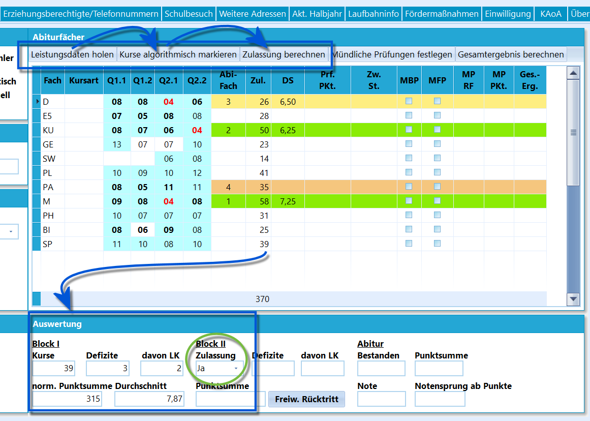
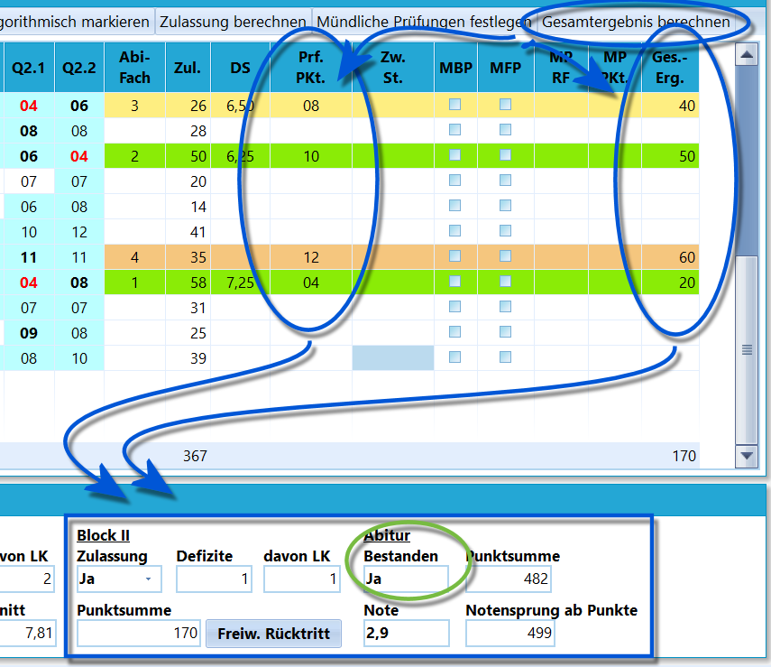
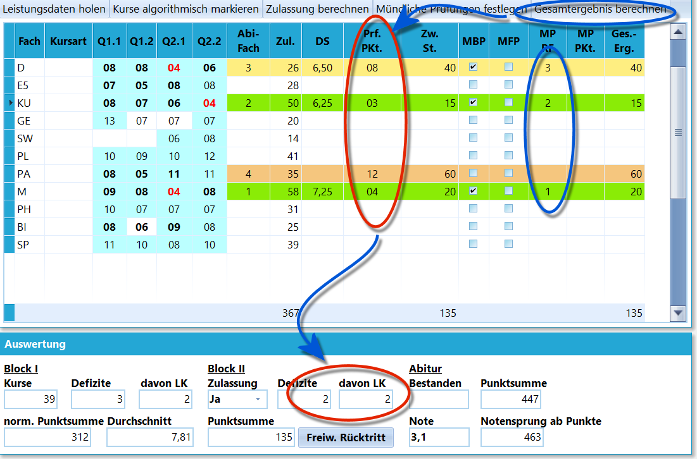

# Komplette Abiturberechnungen durchführen (Tutorial)

Dieses Tutorial soll helfen, die kompletten Abiturberechnungen
fehlerfrei durchzuführen.Dazu wird erläutert, welche Vorbereitungen für die Abiturberechnungen zu
treffen sind, in welcher Reihenfolge die Berechnungen durchgeführt
werden sollten und es wird auf mögliche Fehlerquellen hingewiesen.Vom Aufbau her werden erst die Aktionen anhand des Reiters *Schüler* ➜
**Abitur** erklärt, so dass einzelne Schüler individuell bearbeitet
werden. Dann wird auf die entsprechenden Gruppenprozesse verwiesen, mit
denen die gesamte Q2 beziehungsweise die betreffenden Teilmengen, zum
Beispiel Kurse, verarbeitet werden können.Grundsätzlich läuft das Abitur wie folgt ab:1.  Leistungsdaten der Q-Phase einsammeln
2.  Die in das Abitur einzubringenden und für die Zulassung relevanten
    Kurse markieren. Der Zentrale Abiturausschuss (ZAA) entscheidet
    basierend darauf über die Zulassung.
3.  Durchführen der Prüfungen und Eingeben der Prüfungsnoten
4.  Ansetzen eventuell notwendiger oder freiwilliger mündlicher
    Prüfungen in den drei schriftlichen Abiturfächern
5.  Endgültige Auswertung und Mitteilung der Ergebnisse und Druck der
    Zeugnisse

::: warning

Der Prozess wird für individuelle Schüler in *Schüler* ➜
**Abitur** durchgeführt.

Die jedem Schritt entsprechenden Gruppenprozesse finden sich unter
**Gruppenprozesse ➜ Abitur**. Hierbei ist zu beachten, dass die
Schaltfläche **Abitur** nur zur Verfügung steht, wenn im
Schülercontainer ausschließlich die Q2 ausgewählt wurde.

Die Gruppenprozesse werden in jeweils einem eigenen Wiki-Artikel
erklärt. Alle Artikel zusammen geben auch ein Bild des
Abiturdurchlaufs.

:::  

## Leistungsdaten holen und Zulassungsberechnung

### Leistungsdaten holen

 Sammeln Sie die Leistungsdaten der Q2.2 wie alle anderen
Leistungsdaten rechtzeitig ein.Der Prozess beginnt damit, dass über die Schaltfläche
`Leistungsdaten holen` die Leistungen der Q-Phase im Reiter **Abitur**
eingelesen werden.Liegen Belegungsfehler vor, wird ein Fehlerprotoll angezeigt.Beachten Sie, dass in dieser Phase keine "echten" Belegungsfehler
vorkommen dürfen, da an der Laufbahn nichts mehr zu ändern ist. Je
nachdem, wie SchILD gepflegt wurde, kann aber eine Kurszuordnung falsch
sein oder eine Note wurde noch nicht von der Fachlehrkraft geliefert und
muss erst nachgetragen werden.Bei den hier im Screenshot abgebildeten Leistungsdaten fehlten noch die
Noten für den *Zusatzkurs SW* und den *GK Geschichte*.  

### Facharbeitsthema erfassen

Konsultieren Sie das Tutorial *Thema von Projektkurs und Facharbeit
erfassen*, um Projektkurse und Projektkursarbeiten auf dem Abiturzeugnis
auszugeben.Wurde der Projektkurs mit dem Thema als *Fachbezogene
Leistungsentwicklung* erfasst, lässt sich dieses Thema mit einem Klick
auf `Thema ermitteln` in den Reiter *Schüler ➜ Abitur* übernehmen.  

### Kurse algorithmisch markieren

 Die Schaltfläche `Kurse algorithmisch markieren` markiert
die Kurse, die ins Abitur einzubringen sind und die damit auch für die
Zulassung relevant sind.Liegen Belegungsfehler vor, werden diese in einem Protokoll angezeigt
und bei diesen sind die Daten noch einmal zu betrachten. Üblicherweise
liegen in solchen Fällen Fehler in der Eintragung der Daten in SchILD
vor.Markierte Kurse sind türkis hervorgehoben, nicht-markierte Kurse bleiben
weiß.Sollte es nötig sein, an dieser Stelle den Algorithmus zu übersteuern,
so kann man jeweilige Punktezahl durchführen, um damit zwischen
Markierung des Kurses (türkis hinterlegt) und Nichtmarkierung des Kurses
(weiß hinterlegt) hin- und herzuschalten.Mitunter schlägt auch die Prüfung der 2. Fremdsprache, die in der
Sekundarstufe I abgeschlossen wurde, fehl. Dies kann etwa daran liegen,
dass ein Schüler erst in der EF in der Schule aufgenommen werden und
SchILD damit die Leistungsdaten der Sek. I nicht vorliegen hat. Die
Prüfung der Fremdsprache kann mit dem Schalter **2. Fremdsprache in Sek.
I manuell geprüft** übersteuert werden.Sind alternative Kurse einbringbar, versucht der Algorithmus, die
aufgrund der vorliegenden Bewertungen den für den Schüler
vorteilhafteren Kurs zu markieren.

Die Leistungskurse und beiden Abiturfächer sind farblich hervorgehoben.  

### Zulassung berechnen

 Im Anschluss wird basierend auf den markierten Kursen die
Zulassung berechnet. Klicken Sie auf `Zulassung berechnen`.Hierzu fließen die die Punkte der Halbjahresnoten in einfacher Wertung
beziehungsweise zweifacher Wertung für die LKs mit ein. Für die
Leistungskurse und das schriftliche Abiturfach wird der Durchschnitt
berechnet.Entsprechend der Vorgaben der APO GoSt werden die Defizite im GK und LK
mit einbezogen.

Die Ergebnisse finden sich im *Block I*. Am Ende wird die Zulassung zu
Beginn des *Blocks II* ausgegeben.Hier im Feld *Block II* wird unter **Zulassung** neben den automatisch
berechneten *Ja* und *Nein* auch ein **Rücktritt** von der Abiturprüfung
vermerkt.  

## Prüfungsergebnisse eintragen, weitere Prüfungen ansetzen und Berechnung des Bestehens

 Die zweite Phase der Abiturberechnungen findet statt,
sobald die Prüfungsergebnisse der schriftlichen und mündlichen Prüfungen
vorliegen.In der Regel liegen die mündlichen Ergebnisse zuerst vor und können auch
direkt eingegeben werden. Danach folgt die Eingabe der Ergebnisse der
schriftlichen Prüfungen.Eine sehr komfortable Möglichkeit bietet hier *Gruppenprozesse Abitur* ➜
**Prüfungsergebnisse eingeben**. Dort stehen mehrere Sortierung- und
Filtermöglichkeiten zur Verfügung, um die Eingabe der Ergebnisse
möglichst leicht zu gestalten. Genauere Erläuterungen findet man unter
dem entsprechenden Gruppenprozess.Ein Klick auf `Gesamtergebnis berechnen` führt dazu, dass die Spalte
*Zw. St.* (*Zwischenstand*) ausgefüllt wird, weiterhin wird der **Block
II** berechnet und das Gesamtergebnis wird anzeigt. Unten rechts ist zu
sehen, ab welcher Gesamtpunktsumme das nächste Zehntel in der Abiturnote
erreicht werden würde.  

 Sind die Ergebnisse der vier Abiturprüfungen eingegeben,
können mündliche Prüfungen in den drei schriftlichen Fächern A1 bis A3
angesetzt werden. Hierbei stehen zwei Optionen zur Verfügung-   **MBP**: Eine Bestehensprüfung, die basierend auf den aktuellen
    Ergebnissen wahrgenommen werden muss, um das Abitur zu bestehen.
    Werden der Reihe nach mehrere mündliche Prüfungen notwendig, kann
    nach jeder Bestehensprüfung das Gesamtergebnis neu berechnet werden,
    so dass bei einem Bestehen die übrigen Prüfungen nicht mehr
    notwendig wären beziehungsweise dass sich für Folgeprüfungen die zu
    zum Bestehen notwendigerweise zu erreichenden Punkte verändern.
-   **MFP**: Freiwillige Meldung zu einer Prüfung

::: warning

Die drei hier relevanten Gruppenprozesse sind-   **Prüfungsergebnisse eingeben**,
-   **Mündl. Prüfungen A1-A3 festlegen** und
-   **Gesamtergebnis berechnen**,wobei die mündlichen Prüfungen häufig auch in der individuellen
Betrachtung der jeweiligen Ergebnisse gesetzt werden.

:::

Bei der Verwendung der Gruppenprozesse wird in einer Textdatei

ausgegeben, welche Schüler zusätzliche Prüfungen ablegen müssen.Sollte bei einem Schüler doch noch eine Note im ersten bis dritten
Abiturfach fehlen, wird *"Abiturergebnisse unvollständig"* als Warntext
ausgegeben. Die gleiche Meldung wird ausgegeben, wenn das Abitur noch
nicht bestanden ist, aber weiterhin - eventuell noch nicht angesetzte -
mündliche Prüfungen möglich sind.

Die festgesetzten Prüfungen können dann unter dem Karteireiter *Schüler
➜ Abitur* eingesehen werden.In der Spalte **MP RF** *(Reihenfolge der mündlichen Prüfungen im 1. -
3. Fach)* muss die Reihenfolge der Prüfungen festgelegt werden, in der
sie stattfinden sollen.Tragen Sie nun bei den individuellen Schülern die mündlichen
Prüfungsergebnisse mit ihrem Bekanntwerden ein und berechnen Sie jeweils
oder per Gruppenprozess das Gesamtergebnis neu.Über die Druckausgabe und das passende Formular können im Anschluss die
Informationen für die Fachprüfungsausschüsse ausgedruckt werden.

::: warning

Ein erneutes Ausführen der Prozesse, mit denen
Leistungsdaten geholt, Prüfungen eingetragen oder das Gesamtergebnis
berechnet wurden, können zum Überschreiben schon vorhandener
Prüfungsdaten oder manuell eingetragener Prüfungsrücktritte führen.

Dies ist besonders bei den Gruppenprozessen zu beachten. Somit ist mit
dem Eintritt der Prüfungsphase mit dem Eintragen der normalen
Prüfungsergebnisse vom Ausführen der Gruppenprozesse
abzusehen.

:::

::: warning

Auch das Berechnen des Gesamtergebnisses ist als
softwaregestützte Unterstützung ohne Gewähr zu verstehen.

:::

## Nachbereitung und ZeugnisdruckKontrollieren Sie die Sprachenfolge. Tragen Sie dann ein, ob ein Latinum
(Graecum, Hebraicum) erreicht wurde, und berechnen Sie die
Referenzniveaus.Verwenden Sie hierzu die passenden Gruppenprozesse in der Gruppe
*Abitur*.

::: warning

Denken Sie daran, dass die Sprachenfolge eigentlich vor
dem Abitur überarbeitet werden musste und die Verwendung der
Gruppenprozesse zum Verändern der Sprachenfolge eventuell wieder Fehler
erzeugen könnte. Die Gruppenprozesse zum Setzen von Latinum, Graecum und
Hebraicum sind harmlos, da hier alle Änderungen manuell eingegeben
werden.

:::

Verwalten Sie nun die Schüler, indem Sie Abschluss- und Abgangsdaten

setzen, dann Abiturzeugnisse für die Bestehenden und Abgangszeugnisse
für die Abgänger drucken und ausschulen.Schüler, welche die Q2 an Ihrer Schule wiederholen möchten, bekommen
ihre Leistungsübersicht gedruckt.Nutzen Sie sofern noch nicht geschehen abschließend den Gruppenprozess
*Abitur* ➜ **Abitur-Jahr setzen (für Statistik)**, um den Abiturprozess
abzuschließen und die Schüler für die Statistik und den Export der
Abiturdaten korrekt zu erfassen.