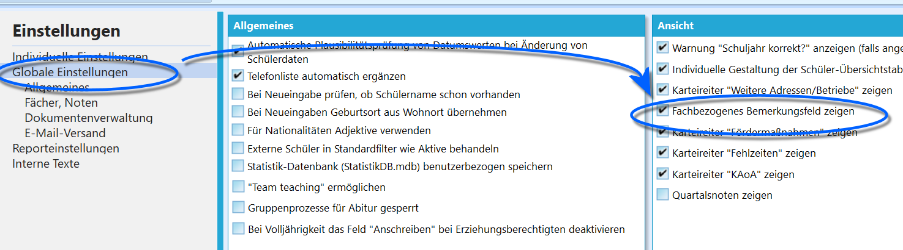
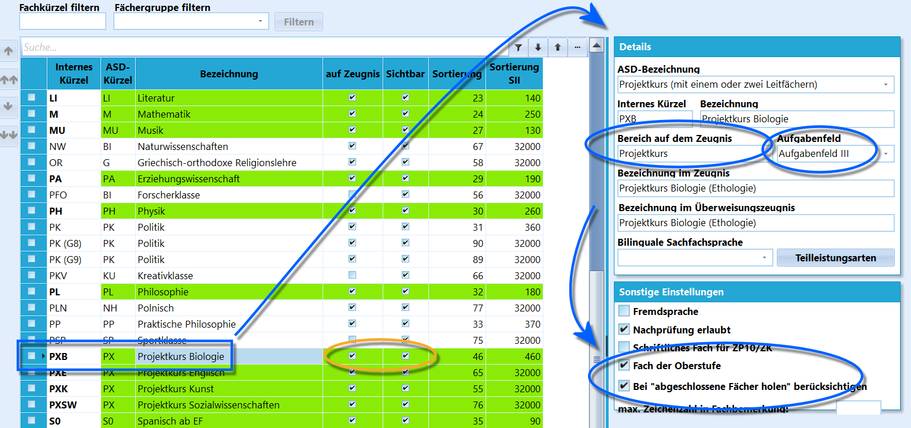
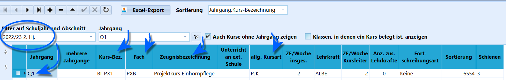
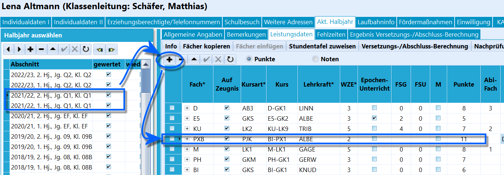
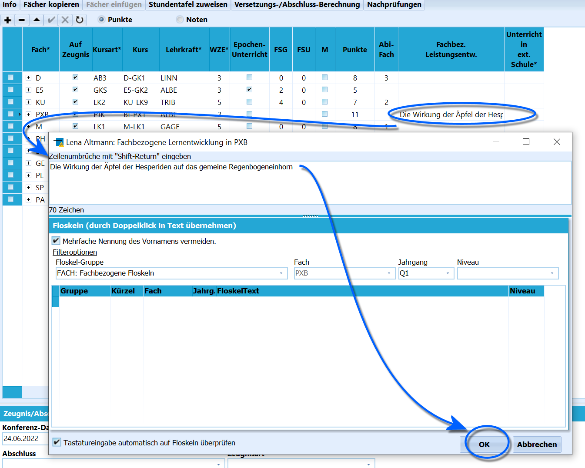

# Thema von Projektkurs und Facharbeit erfassen (Tutorial)

## Fachbezogene Bemerkungen aktivieren

Damit das Thema der Projektkursarbeit in den Leistungsdaten in einem
Kurs erfasst werden kann, muss in SchILD-NRW die Spalte mit den
*Fachbezogenen Bemerkungen* angezeigt werden.

Dieses lässt sich über *Verwaltung ➜ Einstellungen ➜ Globale
Einstellungen* mit einem Haken bei **Fachbezogenes Bemerkungsfeld
zeigen** aktivieren.  

## Projektkurse vorbereiten

### Ein Unterrichtsfach anlegen

 Für einen Projektkurs muss ein übergeordnetes *Fach* unter
*Kataloge ➜ Unterrichtsfächer* angelegt werden.Als **Internes Kürzel** bietet sich als Präfix *PX*, Projektkurse zu
Biologie könnte man als *PXB* anlegen. Kombiniert ein Projektkurs zwei
Leitfächer, zum Beispiel Biologie und Chemie, könnte ein Fach *PXBC*
angelegt werden.Setzen Sie als **ASD-Kürzel** den Eintrag *PX*.Vergeben Sie die Bezeichnung wie üblich und befüllen Sie die anderen
Felder ebenso nach den Vorgaben beziehungsweise die frei wählbaren
Felder wie gewünscht.Als **Bereich auf dem Zeugnis** ist *Projektkurs* zu wählen. Ordnen Sie
das **Aufgabenfeld** passend zu.Unter **Sonstige Einstellungen** sind die Haken bei **Fach der
Oberstufe** und **Bei "abgeschlossene Fächer holen" berücksichtigen**
anzuwählen, da der Projektkurs in der Q1 abgeschlossen wird.Achten Sie auch daran, dass das Fach bei *auf Zeugnis* und *Sichtbar*
angehakt ist.  

### Den Kurs anlegen

 Der Kurs ist über *Kataloge ➜ Kurse* anzulegen.Klicken Sie auf das **+**.  
Achten Sie darauf, den Kurs für das richtige Halbjahr anzulegen (Q1, 1.
beziehungsweise 2. Halbjahr).

Die Kursbezeichnung ist frei zu vergeben, hier wird *BI-PX1* gewählt.
Legen Sie einen Projektkurs mit zwei Leitfächern an, könnte der Kurs
*BiC-PX* oder *BC-PX1* genannt werden.Als **Fach** ist das eben angelegte Fach zu wählen, hier im Beispiel
*PXB*. Als **alg. Kursart** wird *PJK* gewählt. Wie Projektkurse aktuell
anzulegen sind, ist den Schlüsseltabellen für die Statistik zu
entnehmen, die an Ihrer Schule hierfür verantwortlich Person kann im
Zweifelsfall helfen.Tragen Sie die gewünschte **Zeugnisbezeichnung** ein.Legen Sie die übrigen Daten entsprechend der anderen Oberstufenkurse an.
Achten Sie auf die **Schienen**.Wählen Sie die bei Ihnen für Kurse der Oberstufe verwendete **Kursart**.
Achten Sie darauf, den Kurs nicht in der Q2 anzulegen.Bei Bedarf: Sie können den Kurs ganz links markieren, mit der rechten
Maustaste ein Kontextmenü aufrufen, um den Kurs zu kopieren. Nun kann er
in einem anderen Halbjahr, üblicherweise Q1, 2. Halbjahr, eingefügt
werden.  

## Den Projektkurs verwenden

### Kurs bei Schüler hinzufügen

Der Kurs wird individuell wie gewohnt unter *Schüler ➜ Akt. Halbjahr ➜
Leistungsdaten* aufgenommen.Verfahren Sie bei Gruppen oder dem Halbjahreswechsel wie mit anderen
Kursen auch, zum Beispiel durch Zuordnen per Gruppenprozesse, über die
Fortschreibungsart beim Abschnittswechsel oder durch einen Import aus
einem externen Blockungs- und Kursplanungsprogramm.Achten Sie darauf, den Kurs in beiden Halbjahren der Q1 zuzuordnen.  

### Thema der Projektkursarbeit erfassen

Das Projektkursthema wird unter **Fachbez. Leistungsentw.** erfasst.
Führen Sie einen `Doppelklick` auf das Feld aus.Im folgenden Fenster wird das Thema eingetragen.Bestätigen Sie mit einem Klick auf `OK`.Es reicht, das Thema in einem Halbjahr eintragen.

::: warning

Da die Arbeit im zweiten Halbjahr geschrieben wird,
bietet es sich an, per Konvention die Arbeiten immer im 2. Halbjahr der
Q1 zu erfassen.

:::

### Im Abitur

Im Zuge des Abiturs können Sie das Thema der Projektkursarbeit unter
**Projektkurs** frei eintragen.Wurde das Thema als *Fachbezogene Leistungsentwicklung* unter *Schüler
Akt. Halbjahr Leistungsdaten* in der Q1 beim Kurs erfasst, klicken Sie
auf `Thema ermitteln` um es einzulesen.  

### Note der Projektkursarbeit oder einer Facharbeit erfassenNoten von Projektkursarbeiten und Facharbeiten lassen sich als
*Teilleistung* bei den Daten des Faches erfassen.Legen Sie zuerst eine Teilleistung *Projektursarbeit* und/oder
*Facharbeit* über *Kataloge ➜ Teilleistungsarten* an.Dann können Sie Teilleistungen über *Gruppenprozesse ➜ Teilleistungen* ➜
**Teilleistungsarten individuell zuweisen** die Teilleistungen
*Projektkursarbeit* oder *Facharbeit* der ausgewählten Schülermenge
zuweisen.Wählen Sie passend *Fach*, *Kursart* und die *Teilleistung*.Klicken Sie dann auf `Ausführen`.Im Anschluss kann die Teilleistung über *Schüler Akt. Halbjahr
Leistungsdaten* beim zugeordneten Fach mit der Note in einem
Lernabschnitt hinzugefügt werden.

::: warning

Konsultieren Sie bei Bedarf die ausführlicheren Artikel
zu *Teilleistungen* in diesem Wiki.

:::