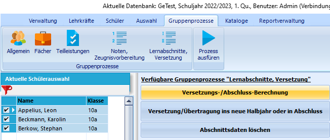
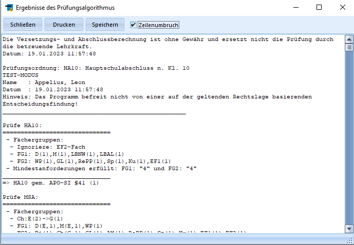

# Versetzungs-Abschluss-berechnungen (Gruppenprozesse Lernabschnitte, Versetzung)

 Dieser Gruppenprozess wird nach der Noteneingabe benötigt,
um für die aktuell ausgewählte Schülermenge die entsprechenden
Versetzungsberechnungen durchzuführen.

Nach Aufruf des Prozesses werden die Berechnungen automatisch
durchgeführt und die Ergebnisse werden in einem Mitteilungsfenster
angezeigt. Es gibt Informationen zu der Versetzung wie auch zu möglichen
Abschlüssen oder Nachprüfungsmöglichkeiten.Der Inhalt des Fensters kann als Textdatei gespeichert oder ausgedruckt
werden. Die Funktion *Drucken* sendet direkt einen Druckauftrag an den
Standarddrucker.

::: warning

Man sollte vorher unter *Gruppenprozesse ➜ Noten,
Zeugnisvorbereitung* den Gruppenprozess **Fächer ohne Noten suchen**
durchführen, um Fehlermeldungen aufgrund fehlender Noteneinträge zu
vermeiden.

:::