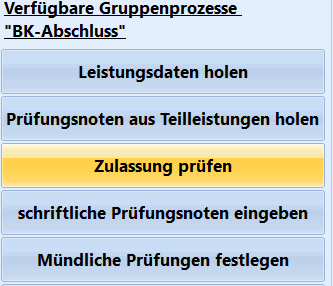

# Zulassung prüfen(Gruppenprozesse BK-Abschluss)

 Der Gruppenprozess **Zulassung Prüfen** stößt einen
gegebenfalls vorliegenden Zulassungsalgorithmus an und füllt im Reiter
*Schüler ➜ BK-Abschluss* das Feld *Zulassung* ➜ **Prüfung** mit *Ja*
oder *Nein* aus.Es wird ein Protokoll der Prüfung angezeigt.Sinnvolle Ergebnisse erhalten Sie in diesem Gruppenprozess nur, wenn
eine Schülergruppe ausgewählt wurde, für die nach ihrer Prüfungsordnung
eine Prüfung mit einer Zulassung vorgesehen ist.

::: warning

Wird ein Abitur als Abschluss angestrebt, ist das
Verfahren hierzu im Reiter *Schüler ➜ Abitur* durchführen.

:::